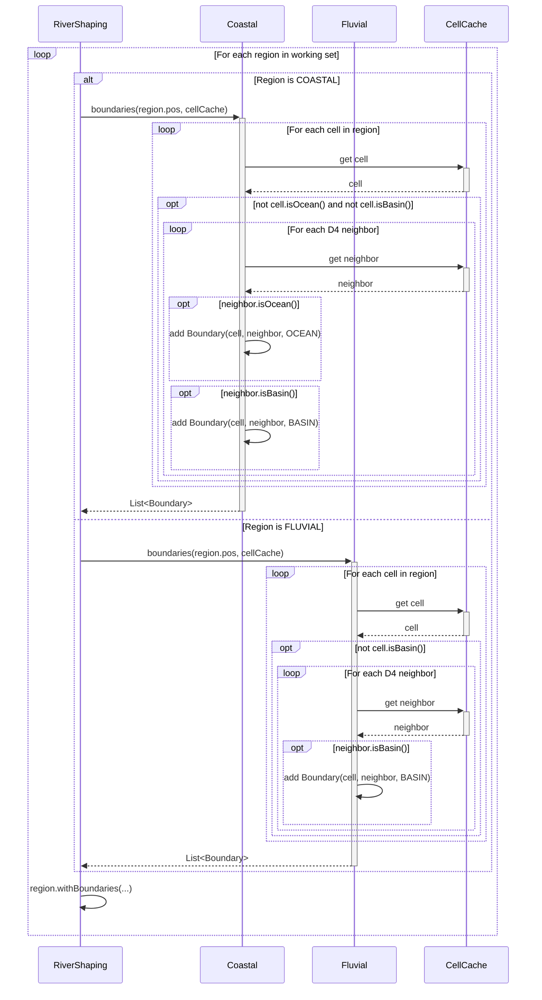
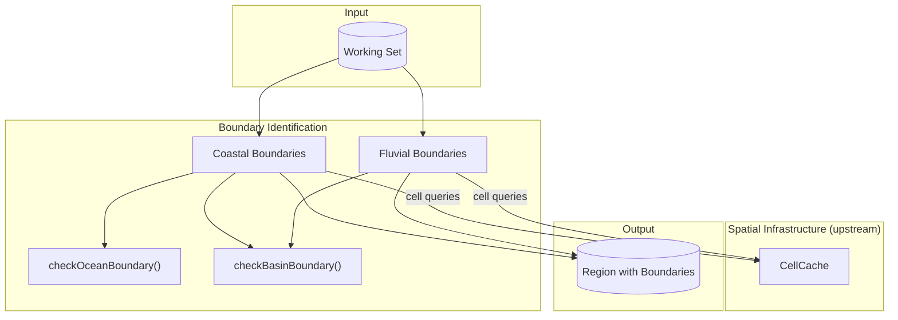

# Boundary Identification

Finds the faces where rivers can terminate within each region. A boundary is not a cell—it is the edge between two adjacent cells where land meets water. Ocean boundaries mark land-ocean faces in COASTAL regions. Basin boundaries mark faces where land above sea level meets land below sea level.

## Overview

Boundary Identification runs once per region in the working set, after Region Discovery and before Feature Classification. It produces terminus faces that Flowline Tracing uses as targets.

**Scope:** Identifying terminus faces only. Does not trace paths, compute elevations, or build watersheds.

**Inputs:**

- Working set of regions (from Region Discovery)
- Cached cell data (from Spatial Infrastructure)

**Outputs:**

- Ocean boundaries (COASTAL regions only)
- Basin boundaries (COASTAL and FLUVIAL regions)

Both boundary types are stored on the Region as a list of Boundary objects for use by Flowline Tracing.

## Sequence Diagram



## Structure and Ownership



### Coastal

**Purpose:** Identifies all boundary faces in COASTAL regions (both ocean and basin).

**Owns:**

- Single-pass iteration over cells in a COASTAL region
- Coordination of ocean and basin boundary checks

**Does:**

- For each land cell (not ocean, not basin), checks D4 neighbors
- Calls `checkOceanBoundary()` and `checkBasinBoundary()` for each neighbor
- Returns list of all boundary faces (or empty list if none)

**Does not:**

- Run on FLUVIAL regions
- Check diagonal neighbors (D4 only—rivers cross boundaries cardinally)
- Store results (caller stores on Region)

### Fluvial

**Purpose:** Identifies basin boundary faces in FLUVIAL regions.

**Owns:**

- Single-pass iteration over cells in a FLUVIAL region

**Does:**

- For each non-basin cell, checks D4 neighbors
- Calls `checkBasinBoundary()` for each neighbor
- Returns list of all basin boundary faces (or empty list if none)

**Does not:**

- Run on COASTAL regions
- Check for ocean boundaries (FLUVIAL regions have no ocean)
- Store results (caller stores on Region)

### Shared Helpers

```
checkOceanBoundary(cell, neighborPos, neighbor, boundaries):
    if neighbor.isOcean():
        boundaries.add(Boundary(cell, neighborPos, OCEAN))

checkBasinBoundary(cell, neighborPos, neighbor, boundaries):
    if neighbor.isBasin():
        boundaries.add(Boundary(cell, neighborPos, BASIN))
```

These helpers encapsulate the boundary creation logic and are shared between Coastal and Fluvial detection.

## Data Structures

See [[Spatial Infrastructure]] for the `Boundary` record definition:

```
record Boundary {
    land: CellPos            // the land cell (river terminus side)
    water: CellPos           // the water cell (ocean or basin)
    type: BoundaryType       // OCEAN or BASIN

    direction(): FlowDirection   // D4 direction from land to water
}
```

A Boundary is a **face**, not a cell. It represents the edge between two adjacent cells where a river can cross from land into water.

- For OCEAN boundaries: `land` is a non-ocean cell; `water` is an ocean cell
- For BASIN boundaries: `land` is a cell above sea level; `water` is a basin cell (below sea level, not ocean)

The `direction()` method returns the D4 direction from land to water, derived from the positions.

## Algorithm

### Coastal Boundary Detection

```
Coastal.boundaries(regionPos: RegionPos, cellCache: CellCache): List<Boundary>
    boundaries = new List<Boundary>()
    minCell = regionPos.getMinCell()
    cells = cellsPerRegion()

    for x in 0 to cells-1:
        for z in 0 to cells-1:
            cellPos = CellPos(minCell.x + x, minCell.z + z)
            cell = cellCache.getOrCompute(cellPos)

            if cell.isOcean() or cell.isBasin():
                continue

            for dir in D4:
                neighborPos = cellPos.relative(dir)
                neighbor = cellCache.getOrCompute(neighborPos)
                checkOceanBoundary(cellPos, neighborPos, neighbor, boundaries)
                checkBasinBoundary(cellPos, neighborPos, neighbor, boundaries)

    return boundaries
```

**Key behavior:**

- Single pass over all cells in the region
- Checks both ocean and basin for each neighbor
- Each face is a separate Boundary object
- A land cell with multiple water neighbors produces multiple boundaries
- Returns empty list if no boundary faces exist

### Fluvial Boundary Detection

```
Fluvial.boundaries(regionPos: RegionPos, cellCache: CellCache): List<Boundary>
    boundaries = new List<Boundary>()
    minCell = regionPos.getMinCell()
    cells = cellsPerRegion()

    for x in 0 to cells-1:
        for z in 0 to cells-1:
            cellPos = CellPos(minCell.x + x, minCell.z + z)
            cell = cellCache.getOrCompute(cellPos)

            if cell.isBasin():
                continue

            for dir in D4:
                neighborPos = cellPos.relative(dir)
                neighbor = cellCache.getOrCompute(neighborPos)
                checkBasinBoundary(cellPos, neighborPos, neighbor, boundaries)

    return boundaries
```

**Key behavior:**

- Single pass over all cells in the region
- Only checks basin boundaries (no ocean in FLUVIAL regions)
- Basin boundaries are the **shore** of the basin lake, not the lake itself

### Integration with Region

```
identifyBoundaries(region: Region, cellCache: CellCache): Region
    if region.type() == COASTAL:
        boundaries = Coastal.boundaries(region.pos(), cellCache)
    else if region.type() == FLUVIAL:
        boundaries = Fluvial.boundaries(region.pos(), cellCache)
    else:
        boundaries = []

    return region.withBoundaries(boundaries)
```

## Configuration

No configuration parameters. Uses `cell.isOcean()` and `cell.isBasin()` which encapsulate the underlying thresholds.

## Complexity

| Parameter            | Value                | Description                              |
| -------------------- | -------------------- | ---------------------------------------- |
| Cells per region     | cellsPerRegion²      | Single iteration per region              |
| D4 checks per cell   | 4                    | Neighbor checks for land cells           |
| Cell queries         | ~5 × cellsPerRegion² | Each cell + potential D4 neighbors       |
| Max boundaries       | 8 × cellsPerRegion²  | Theoretical max (4 ocean + 4 basin per cell) |

**Expected counts:**

- Ocean boundaries: proportional to coastline length (number of land-ocean faces)
- Basin boundaries: proportional to basin perimeter (number of land-basin faces)

A straight coastline crossing a region diagonally produces ~RegionSize boundaries. A jagged coastline produces more.

## Edge Cases

### Ocean Cell at Region Edge

**Cause:** Land cell at region edge has ocean neighbor outside the region.

**Detection:** `cellPos.relative(dir)` returns a cell in an adjacent region.

**Response:** The boundary is still recorded. The land cell is in this region; the ocean cell may be in another region. The boundary face belongs to whichever region contains the land cell.

### Adjacent Basin Cells

**Cause:** Multiple adjacent cells all have samples below sea level.

**Detection:** Multiple cells pass the `isBasin()` check.

**Response:** Boundaries are created at the **edge** of the basin—where non-basin cells meet basin cells. Interior basin cells (surrounded by other basin cells) produce no boundaries. This is correct: rivers terminate at the shore, not in the middle of the lake.

### Land Cell with Multiple Water Neighbors

**Cause:** A land cell borders two or more ocean cells (corner of a peninsula) or basin cells.

**Detection:** Multiple D4 neighbors pass the water check.

**Response:** Each face becomes a separate Boundary object. If a land cell has ocean to the north and east, it produces two boundaries. Flowline Tracing can route to either face.

### Cell Adjacent to Both Ocean and Basin

**Cause:** A land cell has an ocean neighbor in one direction and a basin neighbor in another.

**Detection:** Both `checkOceanBoundary()` and `checkBasinBoundary()` succeed for different neighbors.

**Response:** Both boundaries are recorded. The cell has two potential terminus faces of different types. This is rare but valid.

### Basin Inside FLUVIAL Region

**Cause:** A low-lying area (all samples below sea level) exists in a FLUVIAL region far from the ocean.

**Detection:** `cell.isBasin()` returns true for cells in the depression.

**Response:** Basin boundaries are detected at the edge of the depression. Rivers can terminate here, draining into the endorheic basin. This is intentional—inland lakes are valid river termini.

## Validation Criteria

### Unit Tests

| Test Case                             | Setup                                       | Expected Result                                    |
| ------------------------------------- | ------------------------------------------- | -------------------------------------------------- |
| Coastal empty when all ocean          | COASTAL region, all cells ocean             | Empty list                                         |
| Coastal empty when all land           | COASTAL region, all cells land, no water neighbors | Empty list                                  |
| Coastal finds ocean boundary          | COASTAL with land/ocean divide              | List with boundaries at each land-ocean face       |
| Coastal finds basin boundary          | COASTAL with below-sea-level depression     | List includes basin boundaries at depression edge  |
| Coastal finds both types              | COASTAL with ocean and inland depression    | List has both OCEAN and BASIN boundaries           |
| Boundary land is land                 | Any boundary                                | boundary.land cell is not ocean and not basin      |
| Ocean boundary water is ocean         | OCEAN boundary                              | boundary.water cell isOcean() == true              |
| Basin boundary water is basin         | BASIN boundary                              | boundary.water cell isBasin() == true              |
| Boundary direction correct            | Land cell with ocean to the north           | boundary.direction() == NORTH                      |
| Multiple boundaries per cell          | Land cell with ocean N and basin E          | Two boundaries for that land cell                  |
| Fluvial finds basin boundary          | FLUVIAL region with below-sea-level cells   | List with boundaries at basin edge                 |
| Fluvial has no ocean boundaries       | FLUVIAL region                              | No OCEAN type boundaries in result                 |
| OCEANIC skipped                       | OCEANIC region                              | Empty list (not processed)                         |
| INLAND skipped                        | INLAND region                               | Empty list (not processed)                         |

### Diagnostic Commands

| Command                         | Output                                          | Purpose                   |
| ------------------------------- | ----------------------------------------------- | ------------------------- |
| `/rivertale boundaries <x> <z>` | List of boundaries for region containing (x, z) | Verify boundary detection |
| `/rivertale vis boundaries`     | Orange lines for ocean, red lines for basin     | Visual verification       |

### Performance Verification

Instrumented via `Store.getTimer()`:

- `Store.getTimer(Coastal.class, "boundaries")`
- `Store.getTimer(Fluvial.class, "boundaries")`

Each method makes a single pass over all cells in the region. All cell lookups hit CellCache.

## Key Decisions

| Decision                             | Choice                                 | Rationale                                                                      |
| ------------------------------------ | -------------------------------------- | ------------------------------------------------------------------------------ |
| Boundary is a face, not a cell       | Boundary(land, water, type)            | A boundary is the edge between cells; this captures both sides and the crossing direction |
| Organize by region type              | Coastal/Fluvial, not Oceans/Basins     | Single loop per region; matches how we process (by region, not by boundary type) |
| Shared helper methods                | checkOceanBoundary, checkBasinBoundary | Avoids duplication; parallel structure for both boundary types                 |
| D4 for boundary detection            | Only cardinal neighbors                | Rivers cross region boundaries cardinally; matches flow direction constraints  |
| One Boundary per face                | No consolidation into lists            | Each face is a distinct terminus candidate; Flowline Tracing routes to specific faces |
| Basin boundaries are the shore       | Land cells adjacent to basin cells     | Rivers terminate at the water's edge, not in the water                         |
| Empty list, not null                 | Return empty list when no boundaries   | Simpler null handling for callers                                              |
| Direction derived from positions     | boundary.direction() computes from land/water | No redundant storage; direction is always consistent with positions            |
