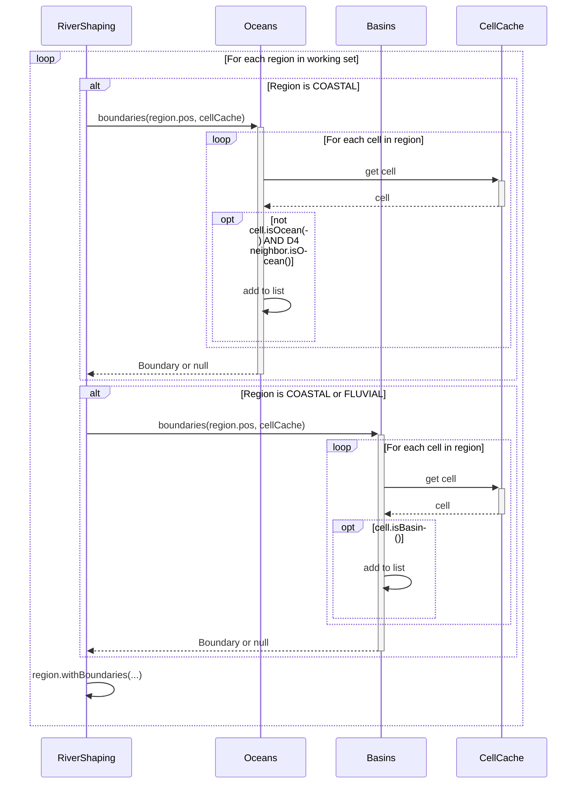
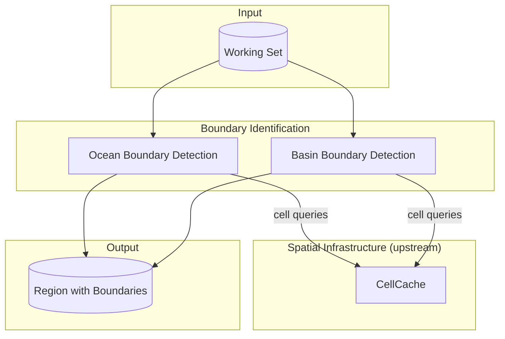

# Boundary Identification

Finds where rivers can terminate within each region. Ocean boundaries mark the land/ocean interface in COASTAL regions. Basin boundaries mark local minima where endorheic drainage collects.

## Overview

Boundary Identification runs once per region in the working set, after Region Discovery and before Feature Classification. It produces terminus candidates that Flowline Tracing uses as targets.

**Scope:** Identifying terminus cells only. Does not trace paths, compute elevations, or build watersheds.

**Inputs:**

- Working set of regions (from Region Discovery)
- Cached cell data (from Spatial Infrastructure)

**Outputs:**

- Ocean boundaries (COASTAL regions only)
- Basin boundaries (COASTAL and FLUVIAL regions)

Both boundary types are stored on the Region for use by Flowline Tracing.

## Sequence Diagram



## Structure and Ownership



### Oceans

**Purpose:** Identifies ocean boundaries in COASTAL regions.

**Owns:**

- Iteration over cells in a region
- D4 neighbor checking for ocean adjacency

**Does:**

- For each cell where `cell.isOcean()` is false, checks D4 neighbors
- If any D4 neighbor has `cell.isOcean()` true, adds to boundary
- Returns Boundary to caller (or null if no coastline)

**Does not:**

- Check diagonal neighbors (D4 only)
- Evaluate basin boundaries
- Store results (caller stores on Region)

### Basins

**Purpose:** Identifies basin boundaries in COASTAL and FLUVIAL regions.

**Owns:**

- Iteration over cells in a region

**Does:**

- For each cell where `cell.isBasin()` is true, adds to boundary
- Returns Boundary to caller (or null if no basins)

**Does not:**

- Check ocean status (that's Oceans)
- Trace downstream (that's Flowline Tracing)
- Store results (caller stores on Region)

## Data Structures

See [[Spatial Infrastructure]] for the `Boundary` record definition.

Ocean boundaries contain land cells that border ocean. The ocean direction is implicit—check D4 neighbors to find which one is ocean.

Basin boundaries contain local minimum cells. Elevation comes from querying the cell itself.

## Algorithm

### Ocean Boundary Detection

```
identifyOceanBoundaries(region, cellCache):
    if region.type != COASTAL:
        return null

    landCells = new List<CellPos>()
    minCell = region.pos.getMinCell()
    cells = cellsPerRegion

    for x in 0 to cells-1:
        for z in 0 to cells-1:
            cellPos = CellPos(minCell.x + x, minCell.z + z)
            cell = cellCache.getOrCompute(cellPos)

            if cell.isOcean():
                continue

            for dir in D4:
                neighborPos = cellPos.relative(dir)
                neighbor = cellCache.getOrCompute(neighborPos)

                if neighbor.isOcean():
                    landCells.add(cellPos)
                    break

    if landCells.isEmpty():
        return null

    return Boundary(landCells, OCEAN)
```

**Key behavior:**

- Only land cells become boundary entries
- Only D4 neighbors are checked (rivers cross boundaries cardinally)
- Returns a single Boundary containing all coastline cells, or null if none

### Basin Boundary Detection

```
identifyBasinBoundaries(region, cellCache):
    basinCells = new List<CellPos>()
    minCell = region.pos.getMinCell()
    cells = cellsPerRegion

    for x in 0 to cells-1:
        for z in 0 to cells-1:
            cellPos = CellPos(minCell.x + x, minCell.z + z)
            cell = cellCache.getOrCompute(cellPos)

            if cell.isBasin():
                basinCells.add(cellPos)

    if basinCells.isEmpty():
        return null

    return Boundary(basinCells, BASIN)
```

**Key behavior:**

- `cell.isBasin()` returns true if all samples are below sea level
- Returns a single Boundary containing all basin cells, or null if none

### Integration with Region

```
identifyBoundaries(region, cellCache):
    boundaries = new List<Boundary>()

    if region.type == COASTAL:
        oceanBoundary = Oceans.boundaries(region.pos, cellCache)
        if oceanBoundary != null:
            boundaries.add(oceanBoundary)

    if region.type == COASTAL or region.type == FLUVIAL:
        basinBoundary = Basins.boundaries(region.pos, cellCache)
        if basinBoundary != null:
            boundaries.add(basinBoundary)

    return region.withBoundaries(boundaries)
```

## Configuration

No configuration parameters. Uses `cell.isOcean()` and `cell.isBasin()` which encapsulate the underlying thresholds.

## Complexity

| Parameter            | Value                | Description                              |
| -------------------- | -------------------- | ---------------------------------------- |
| Cells per region     | cellsPerRegion²      | Full iteration for both boundary types   |
| D4 checks per cell   | 4                    | Ocean boundary neighbor checks           |
| Sample queries       | ~5 × cellsPerRegion² | Each cell + potential D4 neighbors       |
| Max ocean boundaries | 4 × cellsPerRegion   | Theoretical max (checkerboard pattern)   |
| Max basin boundaries | cellsPerRegion²      | Theoretical max (all cells below sea level) |

**Expected counts:**

- Ocean boundaries: proportional to coastline length within region
- Basin boundaries: proportional to below-sea-level terrain in region

## Edge Cases

### No Ocean Cells in COASTAL Region

**Cause:** Region classified as COASTAL but all sampled cells happen to be land.

**Detection:** `Oceans.boundaries()` returns empty set.

**Response:** No ocean boundaries stored. Rivers in this region trace toward ocean cells in adjacent regions (the COASTAL classification came from some cells being ocean—they just weren't adjacent to land cells within this region).

### Ocean Cell at Region Edge

**Cause:** Land cell at region edge has ocean neighbor outside the region.

**Detection:** `cellPos.relative(dir)` returns a cell in an adjacent region.

**Response:** The boundary is still recorded. The land cell borders an ocean cell regardless of which region the ocean cell belongs to.

### Adjacent Basin Cells

**Cause:** Multiple adjacent cells all have samples below sea level.

**Detection:** Multiple cells pass the sea level check.

**Response:** All qualify as basin boundary cells. They're collected into a single Boundary. Flowline Tracing routes water toward whichever cell flow directions favor.

## Validation Criteria

### Unit Tests

| Test Case                             | Setup                                       | Expected Result                                    |
| ------------------------------------- | ------------------------------------------- | -------------------------------------------------- |
| Ocean boundary null when all ocean    | COASTAL region, all cells ocean             | null                                               |
| Ocean boundary null when all land     | COASTAL region, all cells land              | null                                               |
| Ocean boundary at transition          | COASTAL with land/ocean divide              | Boundary with coastline cells                      |
| Ocean boundary cells are land         | COASTAL with land/ocean divide              | All cells in boundary are land, not ocean          |
| Basin boundary null when above sea    | All cells have samples above sea level      | null                                               |
| Basin boundary found below sea level  | Cell with all samples below sea level       | Boundary contains that cell                        |
| Basin partial samples above sea level | Cell with some samples above, some below    | Cell not in basin boundary                         |
| FLUVIAL has basin boundaries          | FLUVIAL region with below-sea-level cells   | Boundary with those cells                          |
| FLUVIAL has no ocean boundaries       | FLUVIAL region (no ocean cells)             | Ocean detection returns null                       |
| OCEANIC skipped                       | OCEANIC region                              | Not processed for boundaries                       |
| INLAND skipped                        | INLAND region                               | Not processed for boundaries                       |

### Diagnostic Commands

| Command                         | Output                                          | Purpose                   |
| ------------------------------- | ----------------------------------------------- | ------------------------- |
| `/rivertale boundaries <x> <z>` | List of boundaries for region containing (x, z) | Verify boundary detection |
| `/rivertale vis boundaries`     | Particles at ocean and basin boundary cells     | Visual verification       |

### Performance Verification

Instrumented via `Store.getTimer()`:

- `Store.getTimer(Oceans.class, "boundaries")`
- `Store.getTimer(Basins.class, "boundaries")`

Both iterate all cells in a region. Ocean detection also checks D4 neighbors. All cell lookups hit CellCache.

## Key Decisions

| Decision                             | Choice                                 | Rationale                                                                      |
| ------------------------------------ | -------------------------------------- | ------------------------------------------------------------------------------ |
| D4 for ocean boundaries              | Only cardinal neighbors                | Rivers cross region boundaries cardinally; matches flow direction constraints  |
| All samples for basin detection      | Every sample must be below sea level   | Partial coverage means the cell has some land; not a true basin                |
| Store land cells for ocean           | Not ocean cells                        | Land cell is the terminus target; ocean direction derived from D4 neighbors    |
| Run on all working set regions       | Not just center                        | FLUVIAL regions need basin boundaries; COASTAL neighbors need ocean boundaries |
| Ocean detection skips ocean cells    | Look for land cells with ocean neighbor| We want land cells that touch ocean, not ocean cells that touch land           |
