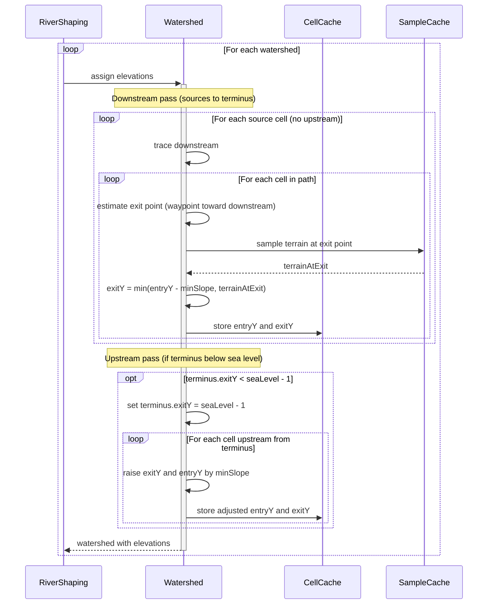
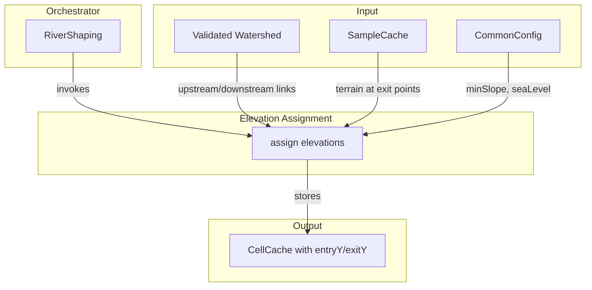

# Elevation Assignment

Determines entryY and exitY for each cell in the watershed, ensuring water flows downhill with a minimum slope. Adjacent cells share boundary values (upstream's exitY = downstream's entryY). How the Y profile varies within the cell is feature-specific and handled during spline building.

## Overview

Elevation Assignment runs once per watershed after validation, in parallel with Flow Accumulation. RiverShaping orchestrates this step, invoking it on each validated watershed. The algorithm samples terrain at each cell's exit point, follows terrain downward (dropping at least minSlope per cell), then normalizes back up from the terminus if the path went below sea level.

**Scope:** entryY and exitY computation, terrain-following descent, upstream normalization. Does not compute width/depth (that's [[Flow Accumulation]]), classify features (that's [[Feature Classification]]), or generate geometry (that's [[Spline Building]]).

**Inputs:**

- Validated watershed with upstream/downstream links (from [[Watershed Validation]])
- Terrain elevation at exit points (sampled on demand)
- `minSlope` configuration parameter

**Outputs:**

- Cells with entryY and exitY assigned, stored in CellCache
- Adjacent cells satisfy: `upstream.exitY == downstream.entryY`
- Terminus exitY is at or above seaLevel - 1

## Sequence Diagram



## Structure and Ownership



**RiverShaping** orchestrates the pipeline, invoking elevation assignment on each watershed after validation.

**Elevation Assignment** operates on the watershed's cell graph, sampling terrain and computing boundary elevations. The logic may live as a method on Watershed or as a separate utility—either way, RiverShaping drives the invocation.

## Data Structures

### Cell Elevation Fields

```
record Cell {
    // ... existing fields ...

    entryY: int    // elevation where water enters the cell
    exitY: int     // elevation where water exits the cell
}
```

**entryY:** The water surface elevation at the upstream boundary of the cell. For source cells, this is derived from terrain at the source. For other cells, this equals the upstream neighbor's exitY.

**exitY:** The water surface elevation at the downstream boundary of the cell. Computed by following terrain down, dropping at least minSlope from entryY.

### Exit Point Estimation

The exit point is where the river path crosses the cell boundary toward the downstream neighbor. It's estimated from the waypoint (cell center + noise offset) and the direction to the downstream cell.

```
estimateExitPoint(cell, downstream):
    waypoint = cell.waypoint
    direction = directionFrom(cell.pos, downstream)

    // Project waypoint toward cell boundary in the downstream direction
    // The exact calculation depends on cell geometry
    exitX = waypoint.x + direction.dx * (cellSize / 2)
    exitZ = waypoint.z + direction.dz * (cellSize / 2)

    return BlockPos(exitX, 0, exitZ)  // Y is what we're computing
```

## Algorithm

### Downstream Pass

The downstream pass follows terrain downward from each source, dropping at least minSlope per cell. No sea level clamping happens here—we might go below sea level.

```
assignDownstream(watershed):
    sources = findSources(watershed)
    visited = new Set<CellPos>()

    for source in sources:
        assignDownstreamFromSource(watershed, source, visited)

assignDownstreamFromSource(watershed, source, visited):
    queue = new Queue<CellPos>()
    queue.add(source)

    while not queue.isEmpty():
        current = queue.poll()

        if visited.contains(current):
            continue
        visited.add(current)

        cell = CellCache.get().getOrCompute(current)
        upstreamSet = watershed.upstream(current)
        downstream = watershed.downstream(current)

        // Compute entryY
        if upstreamSet.isEmpty():
            // Source cell: derive from terrain at source
            entryY = cell.averageEstimatedTerrainHeight()
        else:
            // Non-source: inherit from upstream exitY
            entryY = getUpstreamExitY(upstreamSet)

        // Compute exitY
        if downstream == null:
            // Terminus: exitY = entryY - minSlope (will normalize in upstream pass if needed)
            exitY = entryY - minSlope
        else:
            exitPoint = estimateExitPoint(current, downstream)
            terrainAtExit = SampleCache.get().getOrCompute(exitPoint).estimatedHeight()
            exitY = min(entryY - minSlope, terrainAtExit)

        // Store results
        CellCache.get().put(cell.withElevations(entryY, exitY))

        // Continue to downstream
        if downstream != null:
            queue.add(downstream)
```

### Getting Upstream Exit Y

At confluences, multiple upstream cells feed into one cell. Their exitY values should match (they're exiting to the same boundary). Take the minimum to satisfy the strictest constraint.

```
getUpstreamExitY(upstreamSet):
    minExitY = MAX_INT
    for upstreamPos in upstreamSet:
        upstreamCell = CellCache.get().getOrCompute(upstreamPos)
        minExitY = min(minExitY, upstreamCell.exitY)
    return minExitY
```

### Upstream Pass

After the downstream pass, check if the terminus ended up below sea level. If so, raise elevations back up from the terminus, incrementing by minSlope as we walk upstream.

```
normalizeFromTerminus(watershed):
    terminus = findTerminus(watershed)
    terminusCell = CellCache.get().getOrCompute(terminus)
    waterLevel = WorldSettings.get().seaLevel() - 1  // water surface is one below seaLevel

    if terminusCell.exitY >= waterLevel:
        return  // no normalization needed

    // Raise terminus to water level
    newExitY = waterLevel
    newEntryY = max(terminusCell.entryY, newExitY + minSlope)

    CellCache.get().put(terminusCell.withElevations(newEntryY, newExitY))

    // Walk upstream and propagate
    propagateUpstream(watershed, terminus)

propagateUpstream(watershed, start):
    stack = new Stack<CellPos>()
    for upstream in watershed.upstream(start):
        stack.push(upstream)

    while not stack.isEmpty():
        current = stack.pop()
        cell = CellCache.get().getOrCompute(current)
        downstream = watershed.downstream(current)
        downstreamCell = CellCache.get().getOrCompute(downstream)

        // Our exitY must equal downstream's entryY
        requiredExitY = downstreamCell.entryY

        if cell.exitY < requiredExitY:
            newExitY = requiredExitY
            newEntryY = max(cell.entryY, newExitY + minSlope)

            CellCache.get().put(cell.withElevations(newEntryY, newExitY))

        // Continue upstream
        for upstream in watershed.upstream(current):
            stack.push(upstream)
```

### Main Entry Point

```
assignElevations(watershed):
    Timer.Record record = Store.getTimer(Watershed.class, "assignElevations").start()

    assignDownstream(watershed)
    normalizeFromTerminus(watershed)

    record.stop()
```

## Configuration

| Parameter | Type | Default | Range | Description |
|-----------|------|---------|-------|-------------|
| minSlope | int | 1 | 0-10 | Minimum descent in blocks between cell entry and exit |

**minSlope:** Controls how steeply rivers must descend. Higher values create more dramatic drops. Lower values allow gentler rivers. A value of 0 allows flat river segments.

The effective gradient depends on cell size. With a 48-block cell and minSlope=1, the minimum gradient is approximately 1:48 (about 2%). Rivers often descend faster when terrain drops steeply.

## Edge Cases

### Source at High Elevation

**Cause:** Source cell terrain is significantly above sea level.

**Detection:** `terrainEntry > seaLevel` when computing source entryY.

**Response:** Use terrain elevation. The river starts high and follows terrain down. This is normal and expected for highland sources.

### Terrain Drops Steeply

**Cause:** Terrain at exit point is much lower than entryY - minSlope.

**Detection:** `terrainAtExit < entryY - minSlope`.

**Response:** Use terrainAtExit. The river follows terrain down, dropping faster than minSlope. This creates natural steep sections where terrain is steep.

### Terminus Below Sea Level

**Cause:** Following terrain led the river below sea level.

**Detection:** `terminusCell.exitY < seaLevel - 1` after downstream pass.

**Response:** Upstream pass raises terminus to seaLevel - 1 and propagates adjustment back up the network. The river "floats" back up to water level.

### Confluence with Mismatched Upstream Exit

**Cause:** Multiple upstream cells have different exitY values.

**Detection:** `getUpstreamExitY()` finds varying values.

**Response:** Take the minimum. Higher tributaries drop faster to match the lower one.

### Very Long River

**Cause:** Path from source to terminus is very long; minSlope accumulation exceeds available drop.

**Detection:** River would need to start unreasonably high to maintain minSlope all the way down.

**Response:** The downstream pass just follows terrain. The upstream pass may raise the entire river if it ended up too low. In extreme cases, the river may be flatter than minSlope would prefer near the source.

### Single-Cell Watershed

**Cause:** Watershed contains only the terminus cell after validation.

**Detection:** `findSources()` returns the same cell as `findTerminus()`.

**Response:** Set entryY from terrain, exitY = max(entryY - minSlope, seaLevel - 1). The single cell represents water emerging at the coast.

## Validation Criteria

### Unit Tests

| Test Case | Setup | Expected Result |
|-----------|-------|-----------------|
| Simple linear path | 5 cells, terrain descending | Each exitY follows terrain, dropping at least minSlope |
| Steep terrain | Terrain drops 10 per cell, minSlope=1 | exitY follows terrain (drops 10), not just minSlope |
| Flat terrain | Terrain constant, minSlope=1 | exitY = entryY - minSlope each cell |
| Below sea level | Path goes 20 below sea level | Upstream pass raises to seaLevel - 1 |
| Confluence | Two tributaries meeting | Both have same exitY at confluence |
| Source high, terminus at sea | Normal river | Follows terrain down, ends at water level |
| Single-cell | Only terminus cell | entryY from terrain, exitY at water level |

### Diagnostic Commands

| Command | Output | Purpose |
|---------|--------|---------|
| `/rivertale cell <x> <z>` | Cell entryY, exitY, terrain | Debug specific cell elevations |
| `/rivertale watershed <x> <z>` | Elevation range (min/max) | Overview of watershed elevation |
| `/rivertale vis elevation` | Particles at entry/exit boundaries | Visual verification |
| `/rivertale metrics elevation` | Assignment timing, normalization counts | Performance monitoring |

### Performance Verification

Instrumented via `Store.getTimer()`:

- `Store.getTimer(Watershed.class, "assignElevations")` — total time
- `Store.getTimer(Watershed.class, "assignDownstream")` — downstream pass
- `Store.getTimer(Watershed.class, "normalizeFromTerminus")` — upstream normalization

**What matters:**

- Every cell has entryY >= exitY + minSlope (after normalization)
- Adjacent cells share boundary elevations
- Terminus exitY >= seaLevel - 1
- No perceptible lag during chunk generation

## Key Decisions

| Decision | Choice | Rationale |
|----------|--------|-----------|
| Sample at exit point | Estimate waypoint→boundary intersection | More accurate than cell center; follows actual river path |
| Follow terrain, then normalize | Downstream: terrain-following; Upstream: raise if below sea level | Simple two-pass; matches existing algorithm |
| No sea level clamp in downstream | Let river go below, fix in upstream pass | Cleaner separation of concerns; terrain-following is pure |
| minSlope is minimum, not maximum | Rivers can drop faster when terrain is steep | Natural behavior; steep terrain creates steep rivers |
| Boundary-based elevations | entryY and exitY, not center Y | Explicit constraint at boundaries; cleaner for spline building |
| RiverShaping orchestrates | Elevation assignment invoked by RiverShaping | Consistent pipeline architecture; Watershed is data, RiverShaping is control |
| Min exitY at confluence | Take minimum of upstream exitY values | Strictest constraint wins; simple handling of multi-tributary junctions |
