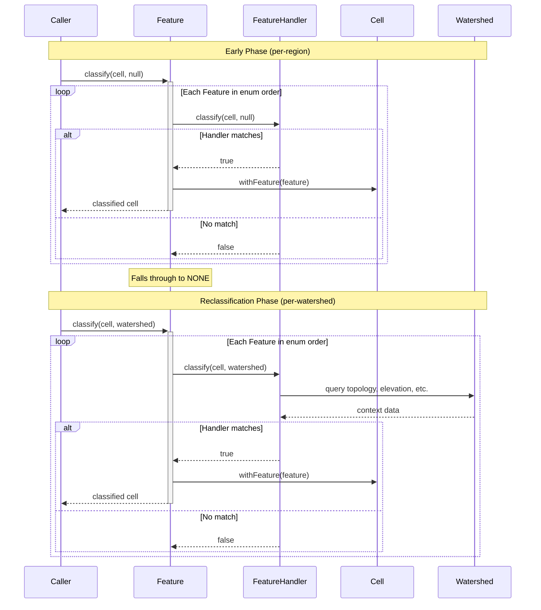
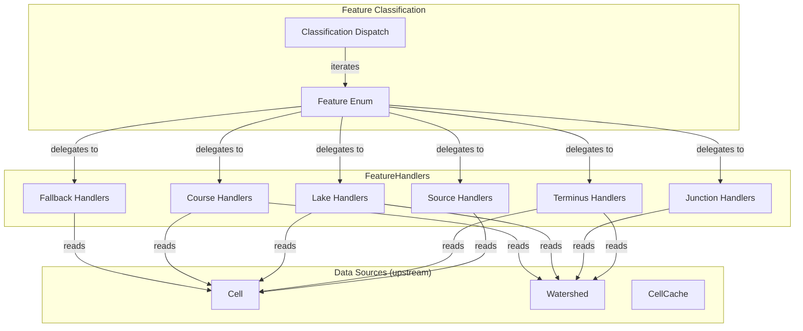

# Feature Classification

Feature Classification assigns a Feature label to each cell based on its role in the river network. Every cell in a watershed receives exactly one Feature, which determines how that cell is shaped during terrain generation and how water flows through it.

## Overview

Classification runs in two phases:

1. **Early phase** (per-region): Before flowlines are traced. Identifies SOURCE cells (potential river origins) and DIVIDE cells (local maxima where water flows away). Runs with no watershed context.

2. **Reclassification phase** (per-watershed): After watershed structure is known. Assigns final features (Run, Waterfall, Confluence, etc.) using full context including elevation, accumulation, and topology.

The same dispatch mechanism handles both phases. The difference is whether a Watershed is available—handlers that require watershed context return `false` when called without one.

**Scope:** Classification dispatch, handler interface, feature ordering, phase-specific constraints. Individual feature criteria live in separate spike documents.

## Sequence Diagram



## Structure and Ownership



### Feature Enum

**Purpose:** Defines all possible features and their ordering for classification dispatch.

**Owns:**
- Feature constants with associated CellType and FeatureHandler
- Enum ordering (determines classification priority)
- Static `classify()` dispatch method

**Does:**
- Iterates handlers in enum order until one matches
- Returns cell with assigned feature
- Falls through to NONE if no handler matches

**Does not:**
- Implement classification logic (that's handlers)
- Know about terrain shaping or water placement (that's downstream)

### FeatureHandler Interface

**Purpose:** Defines the contract handlers must implement to participate in classification.

**Owns:**
- `classify(cell, watershed)` signature
- Access pattern for cell and watershed data

**Does:**
- Returns `true` if this handler claims the cell
- Returns `false` to pass to next handler
- Handles null watershed gracefully (early phase)

**Does not:**
- Modify cell directly (returns boolean; Feature.classify does mutation)
- Access caches directly (uses provided cell and watershed)

### Classification Dispatch

**Purpose:** Coordinates the classification process.

**Owns:**
- Phase detection (watershed present or null)
- Handler iteration and short-circuit on match
- NONE fallback when no handler matches

**Does:**
- Calls each handler in order
- Stops at first match
- Returns NONE if all handlers return false

**Does not:**
- Know specific classification rules (that's handlers)
- Manage cell lifecycle (that's CellCache)

## Interface

```
enum Feature {
    // Sources
    SNOWMELT(CellType.SOURCE, handler, color),
    RESURGENCE(CellType.SOURCE, handler, color),
    SEEP(CellType.SOURCE, handler, color),
    CRATER(CellType.SOURCE, handler, color),
    SPRING(CellType.SOURCE, handler, color),

    // Termini
    DELTA(CellType.TERMINUS, handler, color),
    ESTUARY(CellType.TERMINUS, handler, color),
    WETLAND(CellType.TERMINUS, handler, color),
    MOUTH(CellType.TERMINUS, handler, color),

    // Junctions
    CONFLUENCE(CellType.JUNCTION, handler, color),
    BIFURCATION(CellType.JUNCTION, handler, color),
    BRAID(CellType.JUNCTION, handler, color),

    // Lakes
    ENDORHEIC(CellType.LAKE, handler, color),
    KETTLE(CellType.LAKE, handler, color),
    SINKHOLE(CellType.LAKE, handler, color),
    LAGOON(CellType.LAKE, handler, color),
    TECTONIC(CellType.LAKE, handler, color),

    // Courses
    PLUNGE_POOL(CellType.COURSE, handler, color),
    WATERFALL(CellType.COURSE, handler, color),
    CASCADE(CellType.COURSE, handler, color),
    RAPIDS(CellType.COURSE, handler, color),
    RUN(CellType.COURSE, handler, color),

    // Fallback
    DIVIDE(CellType.NONE, handler, color),
    NONE(CellType.NONE, handler, color)

    type: CellType
    handler: FeatureHandler
    color: float[4]  // RGBA for debug rendering

    static classify(cell: Cell, watershed: Watershed?): Cell
}

interface FeatureHandler {
    classify(cell: Cell, watershed: Watershed?): boolean
    shape(cell: Cell, watershed: Watershed, chunkPos: ChunkPos): Shape[16][16]?
    fill(): void
}

enum CellType {
    SOURCE,    // River origin
    TERMINUS,  // River end
    JUNCTION,  // Merge or split point
    LAKE,      // Standing water body
    COURSE,    // Flowing river segment
    NONE       // Not part of river network
}
```

## Algorithm

### Classification Dispatch

```
Feature.classify(cell, watershed):
    for feature in Feature.values():
        if feature.handler.classify(cell, watershed):
            return cell.withFeature(feature)
    return cell.withFeature(NONE)
```

The algorithm is simple: iterate features in enum order, return on first match. Order matters—more specific features must precede less specific ones within each category.

### Ordering Constraints

Features are ordered within the enum to ensure correct classification:

**Within Sources:** Most specific terrain conditions first. A cell matching SNOWMELT criteria should not fall through to SPRING.

**Within Termini:** Specific terminus types before generic MOUTH fallback.

**Within Junctions:** Order matters if junction types have overlapping criteria.

**Within Courses:** Ordered by elevation drop (largest first). PLUNGE_POOL before WATERFALL before CASCADE before RAPIDS before RUN. This ensures dramatic drops aren't misclassified as gentle runs.

**Between Categories:** Sources → Termini → Junctions → Lakes → Courses → Fallback. This order ensures:
- Sources are identified before anything else (they define network entry points)
- Termini are identified before courses (terminus cells shouldn't become RUN)
- Junctions are identified before courses (confluences shouldn't become RUN)
- Lakes are identified before courses (standing water shouldn't flow)
- Courses are the fallback for cells in a watershed
- DIVIDE and NONE catch everything else

### Phase Behavior

**Early Phase (watershed = null):**

Handlers that require watershed context must return `false` when watershed is null. Only handlers that can classify from cell data alone should match:
- SOURCE handlers: Can check terrain density, flow directions, upstream status
- DIVIDE: Can check terrain density thresholds
- NONE: Catches unclassified cells

**Reclassification Phase (watershed present):**

All handlers have access to:
- Cell data (flowDirections, entryY, exitY, width, depth, upstreamCount, downstreamCount)
- Watershed topology (upstream/downstream links, terminus)
- Neighbor classifications (for context-dependent features like PLUNGE_POOL)

### Handler Contract

```
handler.classify(cell, watershed):
    if watershed == null:
        // Early phase: can only use cell.flowDirections, cell.sample()
        return earlyPhaseCheck(cell)

    // Reclassification phase: full context available
    return fullContextCheck(cell, watershed)
```

Handlers must not throw when watershed is null. They must return `false` if they cannot classify without watershed context.

## Data Structures

### Cell Data Available During Classification

| Field | Available Early | Available Reclassify | Description |
|-------|-----------------|---------------------|-------------|
| pos | Yes | Yes | Cell position |
| sample() | Yes | Yes | Terrain density values |
| flowDirections | Yes | Yes | Sorted by steepness |
| feature | Yes (previous) | Yes (previous) | Current classification |
| entryY | No | Yes | Elevation entering cell |
| exitY | No | Yes | Elevation exiting cell |
| width | No | Yes | River width from accumulation |
| depth | No | Yes | River depth from accumulation |
| upstreamCount | No | Yes | Number of immediate upstream cells |
| downstreamCount | No | Yes | Number of immediate downstream cells |

### Watershed Data Available During Reclassification

| Method | Returns | Description |
|--------|---------|-------------|
| upstream(cellPos) | Set<CellPos> | Cells that flow into this cell |
| downstream(cellPos) | CellPos? | Cell this flows into |
| terminus(cellPos) | CellPos? | Final cell of this cell's drainage |
| contains(cellPos) | boolean | Whether cell is in this watershed |

### Sample Data Available

| Field | Range | Description |
|-------|-------|-------------|
| continents | -1.0 to 1.0 | Land vs ocean |
| depth | -1.0 to 1.0 | Terrain height factor |
| erosion | -1.0 to 1.0 | Terrain roughness |
| ridges | -1.0 to 1.0 | Ridge/valley pattern |
| temperature | -1.0 to 1.0 | Climate data |
| vegetation | -1.0 to 1.0 | Vegetation density |

Note: erosion, ridges, temperature, and vegetation require enriched samples (see [[Spatial Infrastructure]]).

## Edge Cases

### No Flow Directions

**Cause:** Cell is a local minimum with no downhill neighbors.

**Detection:** `cell.flowDirections().isEmpty()`

**Response:** May indicate a lake or basin terminus. Handlers for LAKE types or TECTONIC can match this. During early phase, such cells won't match source handlers (sources must have outflow).

### Null Watershed in Reclassification

**Cause:** Bug—reclassification should always have watershed.

**Detection:** `watershed == null` when called from Watershed.reclassify()

**Response:** Defensive handlers return `false`. Classification falls through to NONE.

### Cell Not in Watershed

**Cause:** Cell passed to classify() but not part of the provided watershed.

**Detection:** `!watershed.contains(cell.pos())`

**Response:** Handlers should check containment before using watershed topology. Return `false` for cells outside the watershed.

### Multiple Upstream (Junction Detection)

**Cause:** Cell has more than one upstream neighbor in the watershed.

**Detection:** `watershed.upstream(cell.pos()).size() > 1`

**Response:** Junction handlers (CONFLUENCE, BIFURCATION, BRAID) may match. Courses should not match cells with multiple upstream.

### Previously Classified Cell

**Cause:** Cell already has a feature from early phase.

**Detection:** `cell.feature() != NONE`

**Response:** Reclassification ignores previous classification. The dispatch iterates all handlers; the previous feature is overwritten by the new result.

### Handler Iteration Performance

**Cause:** Many features to check, most return `false`.

**Detection:** Classification visibly slow during profiling.

**Response:** Handlers should fail fast. Check cheapest conditions first (null checks, enum comparisons) before expensive lookups.

## Validation Criteria

### Unit Tests

| Test Case | Setup | Expected Result |
|-----------|-------|-----------------|
| Early phase with null | Call classify(cell, null) | Only SOURCE/DIVIDE/NONE can match |
| Reclassify with watershed | Call classify(cell, watershed) | Full handler set evaluated |
| Enum order sources | Cells matching multiple sources | First matching source wins |
| Enum order courses | Cell with 10-block drop | WATERFALL, not RAPIDS |
| NONE fallback | Cell matching no handlers | Feature.NONE assigned |
| Handler returns false early | Handler can't classify without watershed | Returns false, not exception |
| Junction detection | Cell with 2+ upstream | CONFLUENCE or similar junction |
| Terminus detection | Cell at watershed terminus | MOUTH or similar terminus |

### Diagnostic Commands

| Command | Output | Purpose |
|---------|--------|---------|
| `/rivertale cell <x> <z>` | Feature, CellType, classification phase | Debug classification result |
| `/rivertale vis features` | Color-coded cells by feature | Visual verification |
| `/rivertale metrics` | Classification timing per feature | Performance monitoring |

### Performance Verification

**Metrics to observe:**
- Time per Feature.classify() call (per-cell average)
- Time spent in each handler's classify() method
- Early exit rate (how often OCEANIC/INLAND skip classification entirely)

Use `/rivertale metrics` to collect timing data. Compare across builds to detect regressions.

## Key Decisions

| Decision | Choice | Rationale |
|----------|--------|-----------|
| Enum order as priority | First match wins | Simple, predictable. Order is explicit in source. |
| Single handler per feature | One FeatureHandler instance | Stateless classification. No per-cell handler state. |
| Null watershed for early phase | Pass null explicitly | Clear contract. Handlers know the phase. |
| Reclassification overwrites | Previous feature ignored | Simplifies logic. Early classification is provisional. |
| Handler returns boolean | Dispatch does mutation | Handlers are pure predicates. Easier to test. |
| CellType per feature | Stored in enum | Enables category-level queries without handler calls. |
| Color per feature | Stored in enum | Debug rendering without feature-specific code. |

