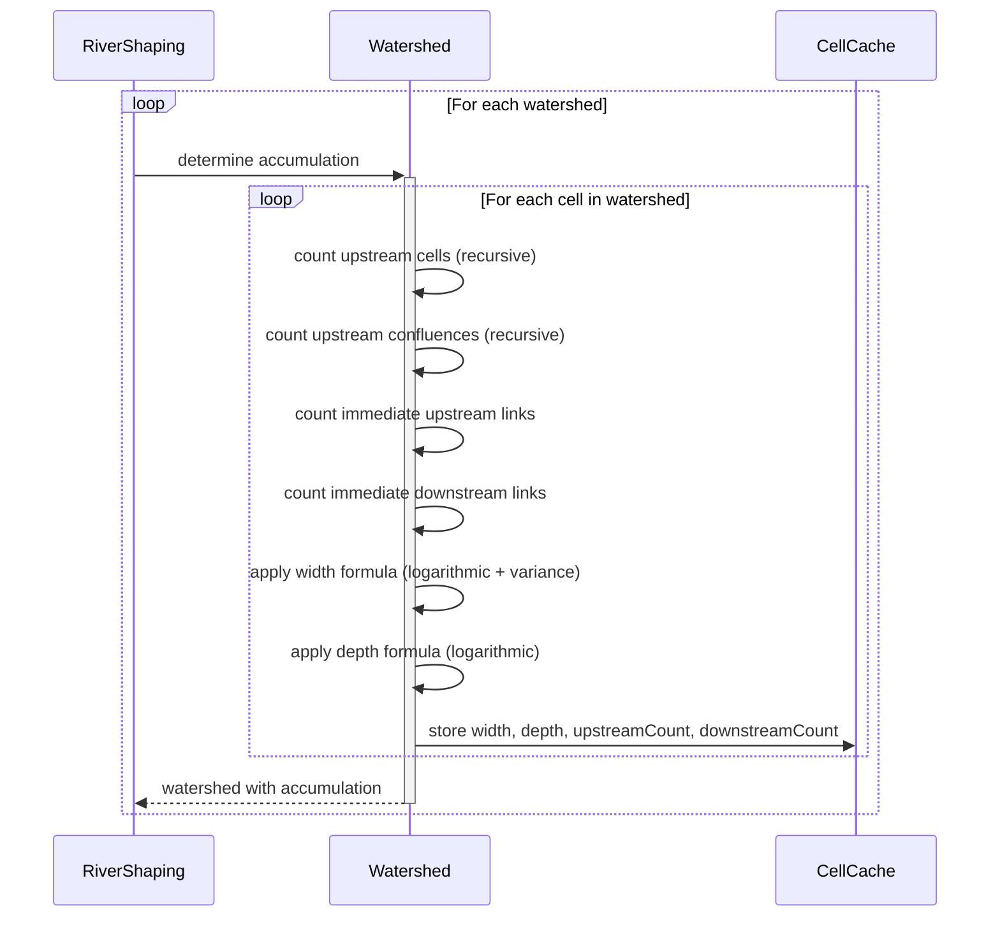
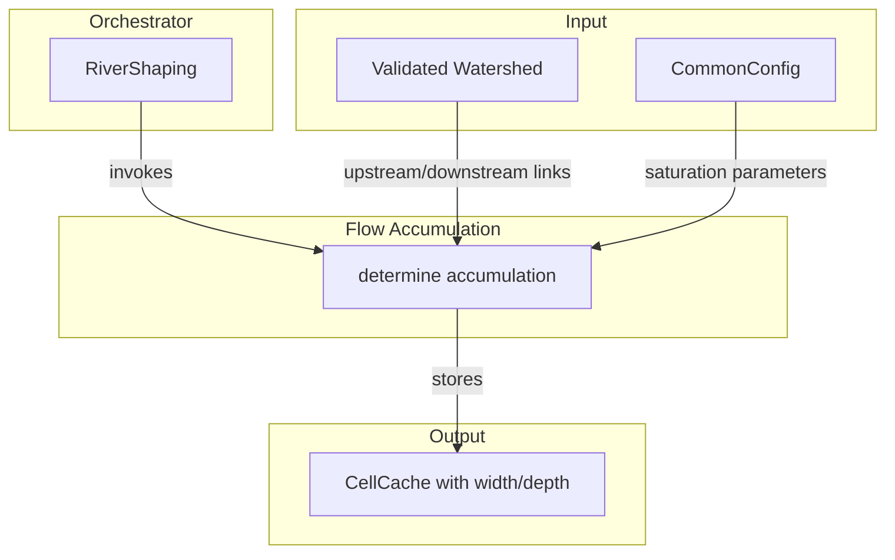

# Flow Accumulation

Calculates the width and depth of the river at each cell based on upstream accumulation. Width derives from total upstream cell count; depth derives from upstream confluence count. Also stores topology counts for feature classification.

## Overview

Flow Accumulation runs once per watershed after validation, in parallel with Elevation Assignment. RiverShaping orchestrates this step, invoking it on each validated watershed. The algorithm traverses the watershed graph, counting upstream cells and confluences, then applies saturation formulas to compute river dimensions.

**Scope:** Upstream counting, width/depth computation, topology counts. Does not compute elevations (that's [[Elevation Assignment]]), classify features (that's [[Feature Classification]]), or generate geometry (that's [[Spline Building]]).

**Inputs:**

- Validated watershed with upstream/downstream links (from [[Watershed Validation]])
- Configuration parameters for saturation formulas

**Outputs:**

- Cells with width, depth, upstreamCount, and downstreamCount assigned, stored in CellCache
- Width increases with upstream cell count (more tributaries = wider river)
- Depth increases with upstream confluence count (more merges = deeper channel)

## Sequence Diagram



## Structure and Ownership



**RiverShaping** orchestrates the pipeline, invoking flow accumulation on each watershed after validation.

**Flow Accumulation** traverses the watershed graph to count upstream contributions and compute river dimensions.

## Data Structures

### Cell Accumulation Fields

```
record Cell {
    // ... existing fields ...

    // Set during Flow Accumulation
    width: int              // river width in blocks
    depth: int              // channel depth in blocks
    upstreamCount: int      // number of immediate upstream neighbors
    downstreamCount: int    // number of immediate downstream neighbors (0 or 1)
}
```

**width:** How wide the river is at this cell, in blocks. Derived from total upstream cell count via logarithmic saturation. Includes seeded random variance.

**depth:** How deep the carved channel is below terrain, in blocks. Derived from upstream confluence count via logarithmic saturation.

**upstreamCount:** Number of cells that flow directly into this cell (0 for sources, 2+ for confluences). Used by Feature Classification to identify junctions.

**downstreamCount:** Number of cells this cell flows into (0 for terminus, 1 for all others). Used by Feature Classification.

### Accumulation Cache

To avoid redundant traversals, upstream counts are memoized during processing.

```
record AccumulationResult {
    cellCount: int          // total cells upstream (including self)
    confluenceCount: int    // total confluences upstream (including self if confluence)
}
```

## Algorithm

### Main Entry Point

```
determineAccumulation(watershed):
    Timer.Record record = Store.getTimer(Watershed.class, "determineAccumulation").start()

    memo = new Map<CellPos, AccumulationResult>()

    for cell in watershed.allCells():
        computeAccumulation(watershed, cell, memo)

    record.stop()
```

### Computing Accumulation

Recursively counts upstream cells and confluences, memoizing results.

```
computeAccumulation(watershed, cellPos, memo):
    if memo.contains(cellPos):
        return memo.get(cellPos)

    cell = CellCache.get().getOrCompute(cellPos)
    upstreamSet = watershed.upstream(cellPos)
    downstream = watershed.downstream(cellPos)

    // Count immediate neighbors
    upstreamCount = upstreamSet.size()
    downstreamCount = downstream == null ? 0 : 1

    // Recursively count all upstream
    totalCells = 1  // count self
    totalConfluences = upstreamCount >= 2 ? 1 : 0  // self is confluence if 2+ upstream

    for upstream in upstreamSet:
        upstreamResult = computeAccumulation(watershed, upstream, memo)
        totalCells += upstreamResult.cellCount
        totalConfluences += upstreamResult.confluenceCount

    // Apply saturation formulas
    width = computeWidth(totalCells, cellPos)
    depth = computeDepth(totalConfluences)

    // Store results
    CellCache.get().put(cell.withAccumulation(width, depth, upstreamCount, downstreamCount))

    result = AccumulationResult(totalCells, totalConfluences)
    memo.put(cellPos, result)
    return result
```

### Width Formula

Width uses logarithmic saturation with seeded random variance.

```
computeWidth(cellCount, cellPos):
    // Logarithmic saturation
    baseWidth = minWidth + log(cellCount) * widthScale

    // Clamp to bounds (max must be less than cell size)
    clampedWidth = clamp(baseWidth, minWidth, maxWidth)

    // Apply seeded variance (±variancePercent)
    variance = seededRandom(worldSeed, cellPos) * 2 - 1  // range [-1, 1]
    adjustedWidth = clampedWidth * (1 + variance * variancePercent)

    // Final clamp after variance
    return clamp(round(adjustedWidth), minWidth, maxWidth)
```

**Logarithmic saturation:** Rivers widen quickly at first (small streams joining), then growth slows (large rivers don't double in width when a small tributary joins). This matches natural river behavior.

**Seeded variance:** Adds organic feel—rivers aren't uniformly wide. The random value is deterministic from world seed and cell position.

### Depth Formula

Depth uses logarithmic saturation from confluence count.

```
computeDepth(confluenceCount):
    if confluenceCount == 0:
        return minDepth

    // Logarithmic saturation
    baseDepth = minDepth + log(confluenceCount) * depthScale

    // Clamp to bounds
    return clamp(round(baseDepth), minDepth, maxDepth)
```

**Why confluences, not cells?** Channel depth reflects the river's erosive history. Each confluence represents a significant addition of water volume. A river with many tributaries joining has carved deeper than one with the same length but fewer joins.

### Seeded Random

Deterministic random value from world seed and cell position.

```
seededRandom(worldSeed, cellPos):
    // Combine seed and position into deterministic hash
    hash = mixHash(worldSeed, cellPos.x, cellPos.z)
    return hashToFloat(hash)  // returns 0.0 to 1.0
```

Same seed + same cell = same random value. Different cells get different values.

## Configuration

| Parameter | Type | Description |
|-----------|------|-------------|
| minWidth | int | Minimum river width in blocks (smallest streams) |
| maxWidth | int | Maximum river width in blocks (must be < cell size) |
| widthScale | double | Multiplier for logarithmic width growth |
| variancePercent | double | Width variance as fraction (e.g., 0.2 = ±20%) |
| minDepth | int | Minimum channel depth in blocks |
| maxDepth | int | Maximum channel depth in blocks |
| depthScale | double | Multiplier for logarithmic depth growth |

**Width constraints:** maxWidth must be less than cell size to ensure the river fits within its cell. At default cell size of 48 blocks, maxWidth should be at most 47.

**Variance:** Applied after logarithmic scaling but before final clamping. A river at computed width 20 with ±20% variance ranges from 16-24 before final clamp.

## Edge Cases

### Source Cell (No Upstream)

**Cause:** Cell has no upstream neighbors.

**Detection:** `upstreamSet.isEmpty()`

**Response:** cellCount = 1 (just self), confluenceCount = 0. Width and depth are at their minimum values. This is correct—headwater streams are narrow and shallow.

### Terminus Cell

**Cause:** Cell has no downstream neighbor.

**Detection:** `downstream == null`

**Response:** downstreamCount = 0. Otherwise processed normally. The terminus is typically the widest/deepest point in the watershed.

### Single-Cell Watershed

**Cause:** Watershed contains only the terminus cell.

**Detection:** Cell is both source and terminus.

**Response:** upstreamCount = 0, downstreamCount = 0, cellCount = 1, confluenceCount = 0. Width and depth at minimum. A single cell is a tiny coastal outlet.

### Very Large Watershed

**Cause:** Thousands of cells upstream.

**Detection:** cellCount is very high.

**Response:** Logarithmic saturation prevents width from growing unboundedly. Even a watershed with 10,000 upstream cells produces a manageable width (log(10000) ≈ 9.2, so width grows by about 9× widthScale above minimum).

### Confluence of Unequal Tributaries

**Cause:** Large river meets small stream.

**Detection:** One upstream branch has much higher cellCount than another.

**Response:** Total cellCount is the sum. The large tributary dominates. Width reflects total drainage area, not the number of tributaries.

### Width Exceeds Cell Size

**Cause:** Computed width before clamping exceeds maxWidth.

**Detection:** `baseWidth > maxWidth`

**Response:** Clamped to maxWidth. This is expected for large rivers—the logarithmic formula might compute wider values, but we cap at the physical limit.

### Variance Pushes Beyond Bounds

**Cause:** Random variance pushes width below minWidth or above maxWidth.

**Detection:** `adjustedWidth < minWidth` or `adjustedWidth > maxWidth`

**Response:** Final clamp after variance ensures bounds are respected. A narrow stream with negative variance still can't go below minWidth.

## Validation Criteria

### Unit Tests

| Test Case | Setup | Expected Result |
|-----------|-------|-----------------|
| Source cell | Cell with no upstream | width = minWidth, depth = minDepth, upstreamCount = 0 |
| Linear path | 5 cells in sequence | Each cell has cellCount = position from source |
| Simple confluence | Two tributaries meeting | Confluence has upstreamCount = 2, cellCount = sum of tributaries + 1 |
| Nested confluences | Confluence feeding another confluence | confluenceCount increments correctly |
| Width saturation | 1000 upstream cells | Width is clamped at maxWidth |
| Depth from confluences | 10 confluences upstream | Depth reflects log(10) * depthScale |
| Variance determinism | Same cell, same seed | Same width every time |
| Variance range | Many cells | All widths within ±variancePercent of base |
| Terminus | Cell with downstream = null | downstreamCount = 0 |

### Diagnostic Commands

| Command | Output | Purpose |
|---------|--------|---------|
| `/rivertale cell <x> <z>` | Cell width, depth, upstreamCount, downstreamCount | Debug specific cell |
| `/rivertale watershed <x> <z>` | Width/depth range across watershed | Overview of accumulation |
| `/rivertale vis width` | Color-coded width visualization | Visual verification |
| `/rivertale metrics accumulation` | Computation timing, cell counts | Performance monitoring |

### Performance Verification

Instrumented via `Store.getTimer()`:

- `Store.getTimer(Watershed.class, "determineAccumulation")` — total time
- Cache hit rate on memoization — should approach 100% after first pass

**What matters:**

- Width increases downstream (wider near terminus)
- Depth increases with confluences
- Variance produces natural-looking variation
- No perceptible lag during chunk generation

## Key Decisions

| Decision | Choice | Rationale |
|----------|--------|-----------|
| Logarithmic saturation | log(count) * scale | Rivers widen quickly then plateau; matches natural behavior |
| Width from cell count | Total upstream cells | Drainage area determines water volume and river size |
| Depth from confluence count | Number of merges upstream | Confluences represent erosive events; more joins = deeper channel |
| Seeded variance on width | ±configurable percent | Organic feel; rivers aren't uniformly wide |
| No variance on depth | Depth purely from formula | Depth is structural; width is visual. Keep depth predictable. |
| Memoization | Cache AccumulationResult per cell | Avoid redundant recursive traversals |
| Max width < cell size | Hard constraint | River must fit within its cell for terrain shaping to work |
| Immediate neighbor counts | upstreamCount, downstreamCount | Feature Classification needs topology, not just dimensions |
