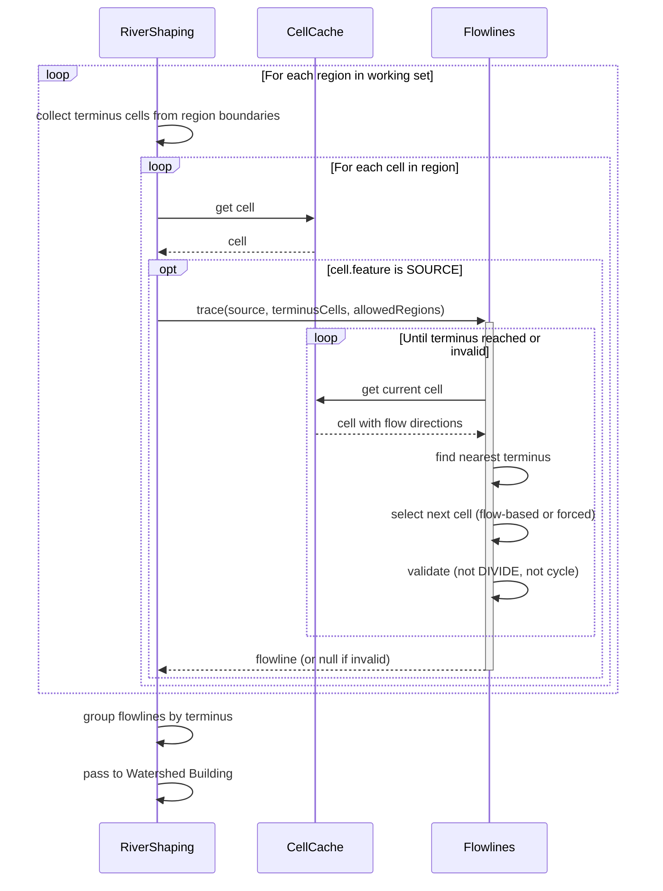
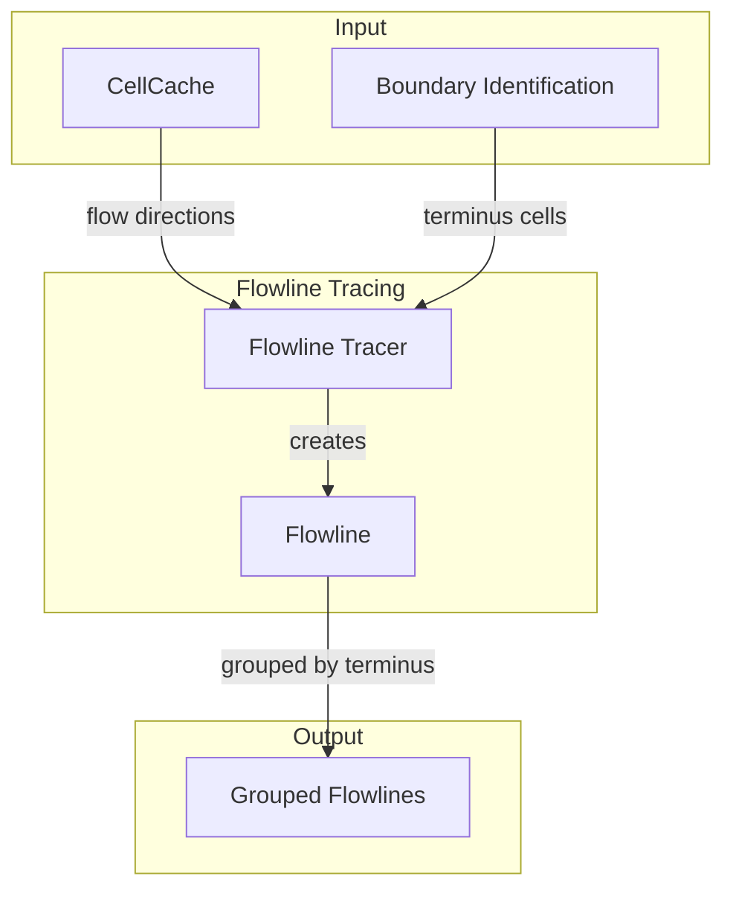

# Flowline Tracing

Traces paths from source cells to termini. Each flowline is traced independently, following flow directions while making progress toward the nearest terminus. Valid flowlines are grouped by terminus for watershed building.

## Overview

Flowline Tracing runs once per region in the working set, after Feature Classification identifies SOURCE cells. It produces complete paths from each source to either an ocean cell or a basin cell.

**Scope:** Path-following algorithm, termination conditions, terminus targeting, invalid path detection. Does not merge paths (that's [[Watershed Building]]) or validate path lengths (that's [[Watershed Validation]]).

**Inputs:**

- Cells with flow directions (from [[Spatial Infrastructure]])
- Cells classified as SOURCE (from [[Feature Classification]])
- Boundaries containing ocean and basin terminus cells (from [[Boundary Identification]])

**Outputs:**

- Flowlines grouped by terminus cell, passed to Watershed Building
- Invalid flowlines are discarded (not passed downstream)

## Sequence Diagram



## Structure and Ownership



### Flowline Tracer

**Purpose:** Coordinates tracing from all SOURCE cells in a region.

**Owns:**

- SOURCE cell iteration
- Terminus cell collection from region boundaries
- Flowline grouping by terminus

**Does:**

- Collects ocean and basin cells from region boundaries into a terminus set
- Creates a Flowline for each SOURCE cell
- Discards invalid flowlines
- Groups valid flowlines by their terminus cell

**Does not:**

- Classify cells (that's upstream)
- Merge flowlines (that's Watershed Building)
- Validate path length (that's Watershed Validation)

### Flowline

**Purpose:** Traces a single path from source to terminus.

**Owns:**

- Path state (visited cells, current position, validity)
- Next-cell selection algorithm
- Termination detection
- Cycle and DIVIDE detection

**Does:**

- Starts at source cell, traces until reaching a terminus or invalidation
- Selects next cell based on flow directions and terminus proximity
- Forces progress toward terminus when flow directions don't help
- Returns complete path or null if invalid

**Does not:**

- Know about other flowlines
- Modify cell state
- Store itself anywhere (returned to caller)

## Data Structures

### Flowline Record

```
record Flowline {
    cells: List<CellPos>      // ordered from source to terminus
    terminus: CellPos         // final cell (ocean or basin)
    isValid: boolean          // false if trace failed
}
```

The `cells` list always starts with the source and ends with the terminus. For invalid flowlines, `cells` contains the path up to where tracing stopped.

### Tracing State

```
class FlowlineTracer {
    terminusCells: Set<CellPos>       // ocean + basin cells from boundaries
    allowedRegions: Set<RegionPos>    // regions flowline may traverse

    trace(source: CellPos): Flowline
}

class TracingState {
    cells: List<CellPos>              // path so far
    visited: Set<CellPos>             // cycle detection
    valid: boolean                    // false once invalidated
}
```

`allowedRegions` is derived from the working set of regions constructed during [[Region Discovery]]. Flowlines may only traverse cells within these regions.

## Algorithm

### Collecting Terminus Cells

Before tracing, collect all potential terminus cells from the working set's boundaries:

```
collectTerminusCells(regions):
    terminusCells = new Set<CellPos>()

    for region in regions:
        for boundary in region.boundaries:
            for cell in boundary.cells:
                terminusCells.add(cell)

    return terminusCells
```

Ocean boundaries contribute ocean cells (from [[Boundary Identification]]). Basin boundaries contribute basin cells.

### Main Trace Loop

```
trace(source, terminusCells, allowedRegions):
    state = new TracingState()
    state.cells.add(source)
    state.visited.add(source)
    state.valid = true

    while state.valid:
        current = state.cells.last()

        // Termination: reached a terminus
        if terminusCells.contains(current):
            return Flowline(state.cells, current, true)

        // Find target
        nearest = findNearestTerminus(current, terminusCells)
        if nearest == null:
            state.valid = false
            continue

        // Select next cell
        next = selectNextCell(current, nearest, allowedRegions)
        if next == null:
            state.valid = false
            continue

        // Validate next cell
        nextCell = CellCache.get().getOrCompute(next)
        if nextCell.feature == Feature.DIVIDE:
            state.valid = false
            continue

        // Cycle detection
        if state.visited.contains(next):
            state.valid = false
            continue

        state.visited.add(next)
        state.cells.add(next)

    return Flowline(state.cells, null, false)
```

### Finding Nearest Terminus

```
findNearestTerminus(from, terminusCells):
    if terminusCells.isEmpty():
        return null

    nearest = null
    nearestDist = MAX_DOUBLE

    for terminus in terminusCells:
        dist = euclideanDistance(from, terminus)
        if dist < nearestDist:
            nearestDist = dist
            nearest = terminus

    return nearest
```

Uses Euclidean distance in cell-space. The nearest terminus becomes the tracing target.

### Selecting Next Cell

Next-cell selection uses a two-mode strategy based on distance to terminus:

```
selectNextCell(current, nearestTerminus, allowedRegions):
    cell = CellCache.get().getOrCompute(current)
    currentDist = distance(current, nearestTerminus)

    // Mode 1: Near terminus (within merge threshold)
    // Brute-force toward terminus - we've done the hard work, just close the gap
    if currentDist <= mergeThreshold:
        return forceTowardTerminus(current, nearestTerminus, currentDist, allowedRegions)

    // Mode 2: Far from terminus
    // Respect terrain: take steepest downhill that makes progress toward terminus
    for dir in cell.flowDirections:    // sorted steepest-first
        next = current.relative(dir)

        if not allowedRegions.contains(next.getRegion()):
            continue

        if distance(next, nearestTerminus) < currentDist:
            return next

    // Fallback: Nudge flow directions toward terminus
    return nudgeTowardTerminus(current, cell, nearestTerminus, currentDist, allowedRegions)
```

**Mode 1 (near terminus):** When within `mergeThreshold` cells of the terminus, brute-force toward it. We've already done the terrain-respecting work to get this close; now just close the gap by picking whichever D8 neighbor is closest to the terminus.

**Mode 2 (far from terminus):** Take the steepest downhill direction that also moves closer to the terminus. This follows natural drainage while ensuring progress.

**Fallback:** If no flow direction directly makes progress, rotate each flow direction toward the terminus and try again. This respects terrain while nudging toward the goal. If even rotated directions don't help, the flowline is marked invalid.

### Forcing Toward Terminus (Mode 1)

```
forceTowardTerminus(current, terminus, currentDist, allowedRegions):
    best = null
    bestDist = currentDist

    for dir in FlowDirection.D8:
        next = current.relative(dir)

        if not allowedRegions.contains(next.getRegion()):
            continue

        dist = distance(next, terminus)
        if dist < bestDist:
            bestDist = dist
            best = next

    return best    // null only if completely surrounded by disallowed regions
```

Used when close to terminus (within `mergeThreshold`). Ignores flow directions and picks whichever D8 neighbor is closest to the terminus. At this point we've already navigated the terrain to get close; now we just need to reach the finish line.

### Nudging Flow Toward Terminus (Mode 2 Fallback)

```
nudgeTowardTerminus(current, cell, terminus, currentDist, allowedRegions):
    towardTerminus = FlowDirection.toward(current, terminus)

    for dir in cell.flowDirections:
        rotated = dir.rotateToward(towardTerminus)
        next = current.relative(rotated)

        if not allowedRegions.contains(next.getRegion()):
            continue

        if distance(next, terminus) < currentDist:
            return next

    return null    // no progress possible, will be marked invalid
```

Takes each flow direction and rotates it toward the terminus direction, then checks if the rotated direction makes progress. This respects terrain while nudging toward the goal. If no rotated direction makes progress, returns null and the flowline is marked invalid.

### Grouping by Terminus

After tracing all sources in a region:

```
groupByTerminus(flowlines):
    groups = new Map<CellPos, List<Flowline>>()

    for flowline in flowlines:
        if not flowline.isValid:
            continue

        terminus = flowline.terminus
        if not groups.containsKey(terminus):
            groups.put(terminus, new List<Flowline>())

        groups.get(terminus).add(flowline)

    return groups
```

All flowlines reaching the same terminus will be merged into one watershed by [[Watershed Building]].

## Configuration

| Parameter       | Type | Default | Range | Description                                             |
| --------------- | ---- | ------- | ----- | ------------------------------------------------------- |
| mergeThreshold  | int  | 10      | 0-32  | Distance in cells at which alignment mode activates     |

**mergeThreshold:** Controls when flowlines switch from slope-following to alignment-following. Lower values cause rivers to follow terrain longer before aligning to coastline. Higher values produce more direct approaches to the ocean.

## Edge Cases

### No Terminus Cells

**Cause:** Working set regions have no ocean or basin boundaries.

**Detection:** `terminusCells.isEmpty()` after collecting from all regions.

**Response:** No flowlines can be traced. All SOURCE cells produce invalid flowlines. This shouldn't happen in normal operation—Region Discovery ensures the working set includes COASTAL regions with boundaries.

### Terminus Unreachable

**Cause:** All paths from source are blocked by DIVIDE cells or leave allowed regions.

**Detection:** `selectNextCell()` returns null on all attempts.

**Response:** Flowline marked invalid. This can happen when a SOURCE is surrounded by high ridges that block all flow toward the terminus.

### Cycle Detection

**Cause:** Flow directions lead back to a previously visited cell.

**Detection:** `visited.contains(next)` before adding to path.

**Response:** Flowline marked invalid. Cycles indicate terrain that doesn't drain toward the terminus—the path loops instead of progressing.

### DIVIDE Blocking

**Cause:** Next cell is classified as DIVIDE (local maximum).

**Detection:** `nextCell.feature == Feature.DIVIDE` after selecting next cell.

**Response:** Flowline marked invalid. Rivers cannot cross mountain ridges. The DIVIDE classification from Feature Classification prevents paths from climbing over high terrain.

### Cross-Region Flow

**Cause:** Flow direction points into adjacent region.

**Detection:** `next.getRegion()` differs from `current.getRegion()`.

**Response:** Check if target region is in `allowedRegions`. FLUVIAL regions may flow through COASTAL regions to reach the ocean. The working set includes both, so cross-region flow is valid within the working set.

### Diagonal Neighbors

**Cause:** Steepest flow is diagonal (NE, NW, SE, SW).

**Detection:** Flow direction has both dx != 0 and dz != 0.

**Response:** Diagonal flow is allowed during tracing. Diagonal crossing conflicts (where two diagonal paths would cross) are resolved during [[Watershed Building]], not here.

### Source at Terminus

**Cause:** A SOURCE cell is also in the terminus set.

**Detection:** `terminusCells.contains(current)` on first iteration.

**Response:** Returns a single-cell flowline immediately. This is valid—the watershed will contain just this terminus cell.

## Validation Criteria

### Unit Tests

| Test Case                        | Setup                                              | Expected Result                              |
| -------------------------------- | -------------------------------------------------- | -------------------------------------------- |
| Simple downhill                  | SOURCE with clear flow to ocean terminus           | Valid flowline, source to terminus           |
| Cycle detection                  | Flow directions create loop                        | Invalid flowline                             |
| DIVIDE blocking                  | Next cell classified as DIVIDE                     | Invalid flowline                             |
| No terminus cells                | Empty terminus set                                 | Invalid flowline                             |
| Brute-force mode activation      | Source within mergeThreshold of terminus           | Uses forceTowardTerminus, ignores flow       |
| Nudge toward terminus            | Flow directions don't make progress (far)          | Rotated flow direction used                  |
| Nudge fails, marked invalid      | Even rotated directions don't make progress        | Flowline marked invalid                      |
| Cross-region valid               | FLUVIAL source flows into COASTAL                  | Valid flowline crossing region boundary      |
| Cross-region blocked             | Flow direction points outside working set          | Direction skipped, tries next                |
| Multiple flowlines same terminus | Two sources flow to same ocean cell                | Both grouped under same terminus             |
| Source at terminus               | SOURCE cell is in terminus set                     | Single-cell valid flowline                   |
| Diagonal flow                    | Steepest descent is diagonal                       | Diagonal neighbor selected                   |
| Nearest terminus selection       | Multiple terminus cells, different distances       | Targets nearest one                          |

### Diagnostic Commands

| Command                        | Output                                    | Purpose                    |
| ------------------------------ | ----------------------------------------- | -------------------------- |
| `/rivertale flowline <x> <z>`  | Flowline from cell, shows path and status | Debug specific source      |
| `/rivertale vis flowlines`     | Particles along all flowline paths        | Visual verification        |
| `/rivertale metrics flowlines` | Trace counts, invalid rates, timing       | Performance monitoring     |

### Performance Verification

Instrumented via `Store.getTimer()`:

- `Store.getTimer(Flowlines.class, "trace")` — time per flowline trace
- `Store.getTimer(Flowlines.class, "findNearestTerminus")` — terminus search time
- `Store.getTimer(Flowlines.class, "selectNextCell")` — next-cell selection time

**Expected patterns:**

- Most flowlines complete in under 50 iterations
- Invalid rate < 10% (most sources should reach terminus)
- Terminus search dominates time when many terminus cells exist

## Key Decisions

| Decision                          | Choice                                       | Rationale                                                                      |
| --------------------------------- | -------------------------------------------- | ------------------------------------------------------------------------------ |
| Independent tracing               | Each flowline traced without knowledge of others | Simpler algorithm. Merging happens in Watershed Building.                    |
| Two-mode selection                | Terrain-respecting far, brute-force near     | Respect terrain during the journey; just close the gap at the end.            |
| Nudge fallback (far)              | Rotate flow directions toward terminus       | Still respects terrain. Invalid if even nudging doesn't help.                 |
| Brute-force (near)                | D8 neighbor closest to terminus              | We've done the hard work; now just reach the finish line.                     |
| Euclidean distance for nearest    | Not Manhattan or path distance               | Simple, effective. Actual path length varies but direction matters more.      |
| Pre-identified terminus cells     | Ocean + basin cells from Boundary Identification | Unified handling. Basin terminates like ocean terminates.                   |
| Invalid flowlines discarded       | Not passed to Watershed Building             | Invalid paths contribute nothing. Clean up early.                             |
| Cycle = invalid                   | Not break-and-continue                       | Cycles indicate unfavorable terrain. Don't try to salvage.                    |
| DIVIDE = invalid                  | Not route around                             | DIVIDE is a ridge. Routing around would require backtracking and search.      |
| Group by terminus                 | Map<CellPos, List<Flowline>>                | Natural input structure for Watershed Building.                               |
