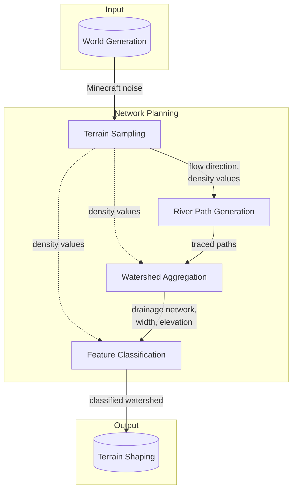

Network Planning determines flow direction, connectivity, width, and water elevation across the world, producing a complete watershed for River Shaping to carve into terrain.

## System Diagram

Terrain Sampling outputs (flow direction, density values) are available to downstream subsystems beyond just River Path Generation (shown as dashed lines).

## Subsystems

### Terrain Sampling

Reads Minecraft's terrain data to determine where rivers should be planned and how water flows across the landscape.

**Owns:**

- Ocean location detection
- Area classification (which areas need river planning)
- Terrain density values
- Flow direction computation

**Does not:**

- Trace paths
- Build network structure
- Compute width or water elevation

**Outputs:**

- Flow direction
- Density values

### River Path Generation

Identifies potential river sources and traces complete paths from those sources toward the ocean. Each path is traced in isolation, without knowledge of other paths.

**Owns:**

- Source identification
- Path tracing
- Path validation
- Terminus selection

**Does not:**

- Know about other paths
- Handle path merging
- Compute width or elevation

**Outputs:**

- Complete traced paths (source to terminus)

### Watershed Aggregation

Transforms individual river paths into a unified drainage network. Where paths meet, they merge into larger rivers. Computes segment width from upstream tributary count and assigns water surface elevations that flow monotonically downhill.

**Owns:**

- Path merging
- Conflict resolution (larger drainage wins)
- Tributary relationships
- Network structure
- Segment width (derived from upstream tributary count)
- Water surface elevation (derived from terrain, corrected for monotonic downhill flow)

**Does not:**

- Classify segments
- Trace original paths
- Access terrain directly (receives paths)

**Outputs:**

- Drainage network with computed values (structure, width, elevation, flow relationships)

### Feature Classification

Examines each segment of the drainage network and assigns a classification label based on its role in the network. This annotation tells Terrain Shaping what kind of terrain modification each segment needs.

Classification labels fall into categories based on network role:

- **Sources** — where rivers originate; network entry points
- **Courses** — river segments between junctions
- **Confluences** — junctions where channels merge or split
- **Termini** — where rivers end; network exit points (ocean, larger river)
- **Lakes** — enclosed water bodies in endorheic basins
- **Barrens** — areas without rivers but within influence of nearby drainage

Specific features within each category are defined at the specification level.

**Owns:**

- Segment classification labels

**Does not:**

- Modify network structure
- Modify computed values (width, elevation)
- Trace paths or build network

**Outputs:**

- Complete watershed with classification annotations

## Key Decisions

| Decision                 | Choice                                        | Rationale                                                            |
| ------------------------ | --------------------------------------------- | -------------------------------------------------------------------- |
| Worldgen phase           | Noise generation (not features/decoration)    | Terrain density available; surface rules decorate our modifications  |
| Terrain discretization   | Local units with flow computed from neighbors | Enables detailed paths without global optimization                   |
| Ocean-directed paths     | Force progress toward ocean                   | Guarantees rivers reach coast even on flat terrain                   |
| Two-phase classification | Early pass without network, late pass with    | Source detection doesn't need context; course features do            |
| Conflict resolution      | Larger drainage wins                          | Prevents crossings; matches natural river behavior                   |
| Width computation        | Derived from upstream tributary count         | Reflects natural river behavior; network structure already available |
| Elevation correction     | Post-process to ensure monotonic downhill     | Terrain may have local rises; water must always flow down            |

## Integration Points

**Depends on:**

- Minecraft noise functions for terrain density
- Configuration for thresholds and sizes

**Provides to:**

- Terrain Shaping system: Complete annotated watershed (network structure, width, elevation, classifications)
- Debug rendering: River locations, segment classifications, flow relationships

**Potential conflicts:**

- Ocean boundary detection must align with Minecraft's ocean biome placement

## Emergent Behaviors

**Tributaries:** Rivers naturally form tributary systems where paths converge into larger drainage networks.

**Determinism:** All computation derives from world seed. Same seed produces identical river networks regardless of exploration order.

**Graceful degradation:** Continental interiors far from oceans simply have no rivers planned. The system doesn't fail; it just produces fewer rivers where drainage to the ocean isn't feasible.
