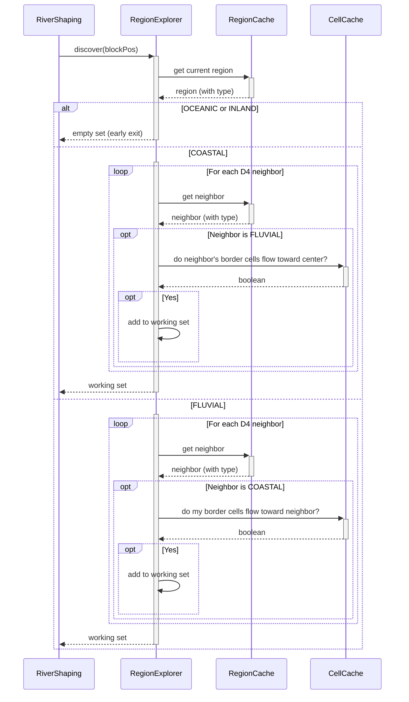
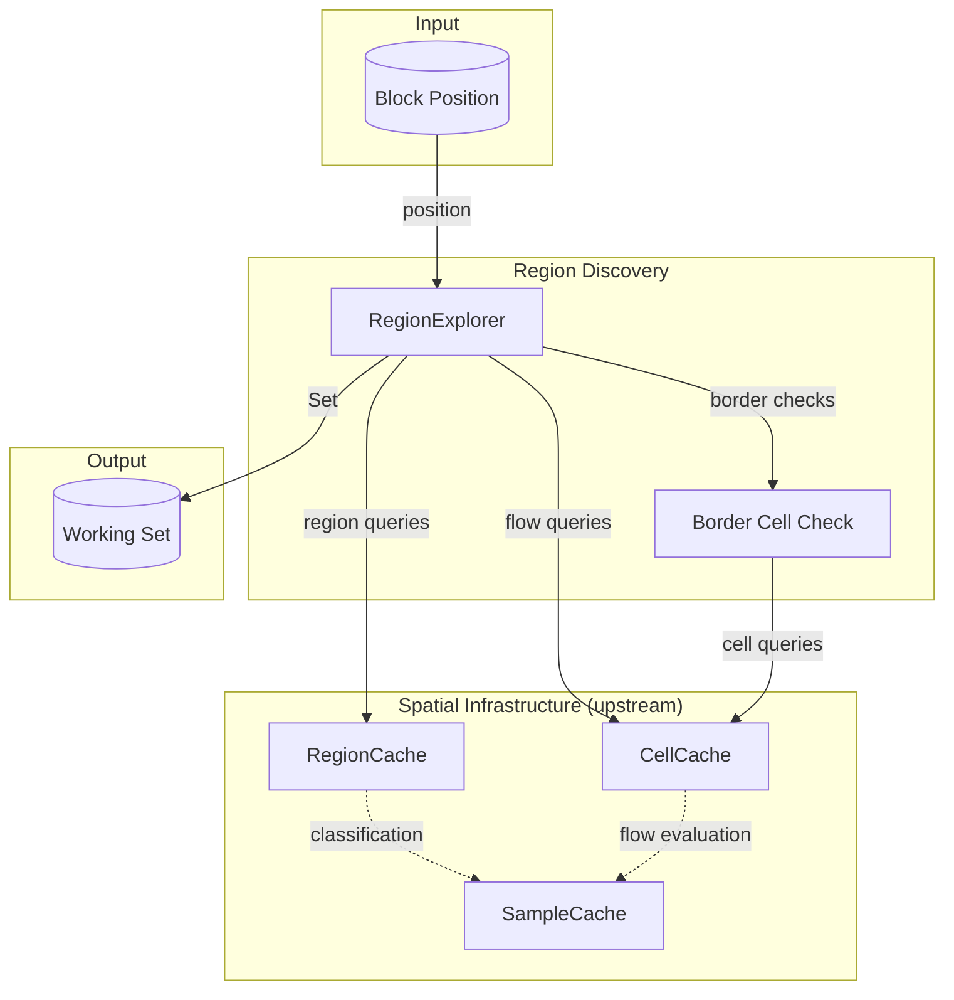

# Region Discovery

## Overview

Region Discovery determines which regions need processing for a given chunk and returns a working set to RiverShaping. It filters out chunks that cannot contain rivers (ocean, deep inland) and identifies which neighboring regions contribute to or receive drainage from the current chunk.

The system takes a block position and produces a set of Region objects. RiverShaping iterates this set for subsequent per-region phases (Boundary Identification, Early Feature Classification, Flowline Tracing).

**Scope:** Working set construction only. Region classification, flow direction computation, and ocean boundary detection are upstream concerns owned by Spatial Infrastructure.

## Sequence Diagram



## Structure and Ownership



### RegionExplorer

**Purpose:** Builds the working set of regions that contribute to river processing for a chunk.

**Owns:**

- Early exit logic (OCEANIC and INLAND detection)
- Working set construction algorithm
- Neighbor filtering by flow direction
- Border cell identification for flow checks

**Does:**

- Identifies current region from block position
- Returns empty set for non-river regions (early exit)
- Queries D4 neighbors and filters by type
- Checks border cell flow directions to determine relevance
- Returns complete working set to RiverShaping

**Does not:**

- Classify regions (that's RegionCache via RegionType.classify())
- Compute flow directions (that's CellCache via Flow Evaluation)
- Identify ocean boundaries (that's Region.createSkeleton())
- Trace flowlines or build watersheds (that's downstream)

### RegionCache (upstream)

**Purpose:** Provides Region objects with type already classified.

**Provides to RegionExplorer:**

- Region objects via `getOrCompute(regionPos, cellCache, sampleCache)`
- Region type (OCEANIC, COASTAL, FLUVIAL, INLAND) already computed

**Does not:**

- Filter regions by relevance (that's RegionExplorer)
- Know about working sets (that's RegionExplorer)

### CellCache (upstream)

**Purpose:** Provides Cell objects with flow directions already computed.

**Provides to RegionExplorer:**

- Cell objects via `getOrCompute(cellPos)`
- Flow directions (List<FlowDirection>) sorted by steepness

**Does not:**

- Know about region boundaries (that's RegionExplorer)
- Interpret flow directions in region context (that's RegionExplorer)

## Interface

```
class RegionExplorer {
    discover(blockPos): Set<Region>

    // Internal
    borderCellsFlowToward(sourceRegion, targetRegion, edgeDirection): boolean
}
```

Caches are accessed via their singleton `.get()` methods internally.

Border cell computation lives on RegionPos (see [[Spatial Infrastructure]]):

```
record RegionPos {
    // ... existing methods ...
    getBorderCells(edgeDirection): List<CellPos>
}
```

**Returns:**

- Empty set if center is OCEANIC or INLAND
- Non-empty set containing center + relevant neighbors if center is COASTAL or FLUVIAL

## Algorithm

### Step 1: Identify Center Region

```
regionPos = RegionPos(blockPos)

if regionPos.containsOutOfBoundsCells():
    return empty set

currentRegion = RegionCache.get().getOrCompute(regionPos)
```

The current region is determined by floor division of block coordinates by region size. If any cells in that region fall outside world bounds, we treat the region as invalid and return early.

### Step 2: Early Exit

```
if currentRegion.type == OCEANIC:
    return empty set

if currentRegion.type == INLAND:
    return empty set
```

**OCEANIC:** All cells are ocean. No land for rivers. True early exit—classification only examined this region's cells.

**INLAND:** All cells are land, but no D4-adjacent COASTAL region. Rivers here couldn't drain to ocean. Note: determining INLAND required sampling D4 neighbor cells during classification, so this exit is "early" only in that we skip flow direction checks and working set construction—neighbor cells were already touched.

### Step 3: Build Working Set

```
workingSet = new Set<Region>()
workingSet.add(currentRegion)

for dir in D4:
    neighborPos = regionPos.relative(dir)

    if neighborPos.containsOutOfBoundsCells():
        continue

    neighbor = RegionCache.get().getOrCompute(neighborPos)

    if currentRegion.type == COASTAL:
        if neighbor.type == FLUVIAL:
            if borderCellsFlowToward(neighbor, currentRegion, dir.opposite()):
                workingSet.add(neighbor)

    else if currentRegion.type == FLUVIAL:
        if neighbor.type == COASTAL:
            if borderCellsFlowToward(currentRegion, neighbor, dir):
                workingSet.add(neighbor)

return workingSet
```

**COASTAL center:** Add FLUVIAL neighbors whose border cells flow toward us.

**FLUVIAL center:** Add COASTAL neighbors that we flow toward.

### Step 4: Border Cell Flow Check

```
borderCellsFlowToward(sourceRegion, targetRegion, edgeDirection):
    borderCells = sourceRegion.pos.getBorderCells(edgeDirection)

    for cellPos in borderCells:
        cell = CellCache.get().getOrCompute(cellPos)

        for flowDir in cell.flowDirections:
            neighborPos = cellPos.relative(flowDir)
            if targetRegion.pos.contains(neighborPos):
                return true

    return false
```

Checks if any cell along the source region's border has a flow direction pointing into the target region. Flow directions are D8 (cells can flow diagonally), but we only check borders with D4 neighbors (rivers cross region boundaries cardinally).

### Step 5: Border Cell Computation

`RegionPos.getBorderCells(edgeDirection)` returns the cells along the specified cardinal edge. See [[Spatial Infrastructure]] for the algorithm.

Returns exactly `cellsPerRegion` cells.

## Data Structures

### Working Set

**Type:** `Set<Region>`

**Contents:**

- Empty set: OCEANIC or INLAND center (no rivers)
- 1 region: Center only (no qualifying neighbors)
- 2-5 regions: Center plus 1-4 D4 neighbors

**Invariants:**

- Never contains OCEANIC or INLAND regions
- Always contains current region (if non-empty)
- Maximum size is 5 (center + 4 cardinal neighbors)

### Border Cell List

**Type:** `List<CellPos>`

**Contents:** Cells along one edge of a region.

**Size:** Exactly `cellsPerRegion`

**Ordering:**

- NORTH/SOUTH edges: West to East (increasing X)
- EAST/WEST edges: North to South (increasing Z)

## Complexity

| Parameter             | Value              | Description                           |
| --------------------- | ------------------ | ------------------------------------- |
| Border cells per edge | cellsPerRegion     | One row/column of cells               |
| Max neighbors checked | 4                  | D4 directions only                    |
| Max border checks     | 4                  | One per FLUVIAL/COASTAL neighbor pair |
| Max cells examined    | 4 × cellsPerRegion | All border cells across all neighbors |
| Max working set size  | 5                  | Center + 4 cardinal neighbors         |
| Cells per region      | cellsPerRegion²    | For classification sampling           |

**Typical working set sizes:**

- Ocean chunks: 0 regions (early exit)
- Inland chunks: 0 regions (early exit, but classification already sampled 5 regions)
- Coastal chunks: 1-3 regions
- Fluvial chunks: 1-2 regions

## Performance Expectations

| Metric                | Notes                                                                                          |
| --------------------- | ---------------------------------------------------------------------------------------------- |
| Time per invocation   | Called once per chunk during noise generation                                                  |
| RegionCache hit ratio | Regions are large; many chunks share a region                                                  |
| CellCache hit ratio   | Border cells are reused across adjacent chunks                                                 |
| Early exit rate       | Ocean biomes exit early. INLAND exits but has already sampled neighbors during classification. |

**Worst case:** INLAND classification. To determine no D4 neighbor is COASTAL, classification must sample all cells in center + 4 neighbors = 5 × cellsPerRegion² cell samples. After all that, we return an empty set. The "early exit" saves only the flow direction checks.

## Edge Cases

### OCEANIC Center

**Cause:** Chunk is in open ocean.

**Detection:** `currentRegion.type() == RegionType.OCEANIC`

**Response:** Return empty set. No river processing.

### INLAND Center

**Cause:** Chunk is deep in continental interior with no path to coast.

**Detection:** `currentRegion.type() == RegionType.INLAND`

**Response:** Return empty set. No river processing. This is intentional—see Key Decisions.

### COASTAL with No FLUVIAL Neighbors

**Cause:** Coastal region is surrounded by ocean, other coastal regions, or inland.

**Detection:** No D4 neighbors have type FLUVIAL.

**Response:** Working set contains only current region. Rivers originate within the coastal region itself.

### FLUVIAL with No Valid Drainage to Coast

**Cause:** FLUVIAL region's border cells don't flow toward any COASTAL neighbor.

**Detection:** `borderCellsFlowToward()` returns false for all COASTAL neighbors.

**Response:** Working set contains only current region. This is expected—the region may still contain rivers that drain to internal basins rather than the coast. Flowline Tracing handles this.

### FLUVIAL with Multiple COASTAL Neighbors

**Cause:** FLUVIAL region borders multiple COASTAL regions (e.g., peninsula or isthmus).

**Detection:** Multiple COASTAL neighbors pass the flow direction check.

**Response:** All qualifying COASTAL regions are added to working set. Each drainage path is traced independently.

### Region at World Border

**Cause:** Region is at coordinate extremes.

**Detection:** Region contains cells outside world bounds.

**Response:**

- If current region contains out-of-bounds cells, return empty set immediately (treat as invalid).
- If a neighbor region is out-of-bounds, skip it—no cache query, no work.

### Corner Cell Diagonal Flow

**Cause:** A corner cell's flow direction points diagonally toward an intercardinal neighbor region.

**Detection:** `cellPos.relative(flowDir)` lands in a region that is not the D4 target.

**Response:** The flow direction is ignored for this check. Rivers cannot cross region boundaries diagonally—only cardinally. The cell may still contribute if it has other flow directions pointing cardinally.

## Validation Criteria

### Unit Tests

| Test Case                   | Setup                                                    | Expected Result                          |
| --------------------------- | -------------------------------------------------------- | ---------------------------------------- |
| OCEANIC center              | All cells in current region are ocean                    | Empty set                                |
| INLAND center               | No ocean cells, no D4 COASTAL neighbors                  | Empty set                                |
| COASTAL, no FLUVIAL         | Center is COASTAL, all D4 neighbors are OCEANIC/COASTAL  | Set of size 1 (center only)              |
| COASTAL, FLUVIAL flows in   | FLUVIAL north neighbor with south-flowing border cells   | Set of size 2 (center + north)           |
| COASTAL, FLUVIAL flows away | FLUVIAL north neighbor with north-flowing border cells   | Set of size 1 (center only)              |
| FLUVIAL, drains to COASTAL  | Center border cells flow toward COASTAL south neighbor   | Set of size 2 (center + south)           |
| FLUVIAL, no drainage        | Center border cells flow toward INLAND/FLUVIAL neighbors | Set of size 1 (center only)              |
| FLUVIAL, multiple drainage  | Border cells flow toward COASTAL east and west           | Set of size 3 (center + east + west)     |
| World border                | Center at X=-2^30, west neighbor out of bounds           | West neighbor not in set                 |
| Corner diagonal flow        | Corner cell flows NORTHEAST, target is NORTH             | Cell does not qualify (diagonal ignored) |

### Diagnostic Command

`/rivertale regionset <x> <z>` — Prints the working set for the region containing block (x, z):

- Current region position and type
- Each included neighbor: position, type, and which edge connects them
- Total working set size

### Performance Verification

`/rivertale metrics` — Shows:

- Average time per invocation
- Early exit rate
- Cache hit ratios for RegionCache and CellCache

Compare across builds to detect regressions.

## Key Decisions

| Decision                       | Choice                | Rationale                                                                                                                                                          |
| ------------------------------ | --------------------- | ------------------------------------------------------------------------------------------------------------------------------------------------------------------ |
| Region traversal               | D4 only               | Rivers cross region boundaries cardinally. Matches FLUVIAL definition (D4-adjacent to COASTAL).                                                                    |
| Cell flow directions           | D8                    | Cells can flow diagonally within a region. Only the region crossing is restricted.                                                                                 |
| INLAND exclusion               | No rivers             | Performance: would require 2-3 region hops to find drainage. Legibility: INLAND rivers don't indicate ocean direction. May revisit for endorheic basins.           |
| Include COASTAL in FLUVIAL set | Yes                   | Rivers crossing FLUVIAL→COASTAL may fail validation. Including target enables complete path validation before committing.                                          |
| Filter by flow direction       | Yes                   | Data already cached from Region Classification. Using it costs ~nothing and avoids processing irrelevant regions.                                                  |
| Early exit order               | OCEANIC before INLAND | OCEANIC is a true early exit (own cells only). INLAND already sampled 5 regions' worth of cells during classification—the "exit" just skips flow direction checks. |
| Working set type               | Set<Region>           | Order doesn't matter. Set prevents duplicates if algorithm changes.                                                                                                |
| Border cell iteration          | Early exit            | Return on first qualifying flow. No value in checking remaining cells once one qualifies.                                                                          |
| Flow direction check           | All directions        | Check all flow directions per cell, not just steepest. Any qualifying direction counts.                                                                            |
