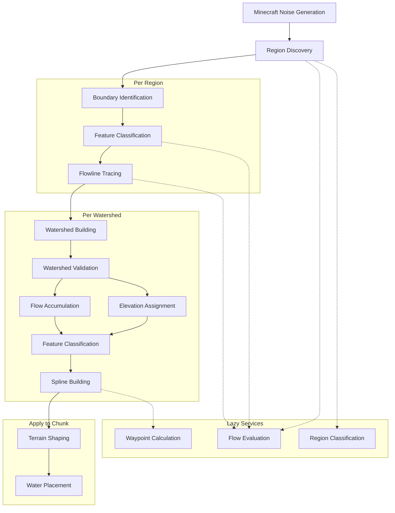
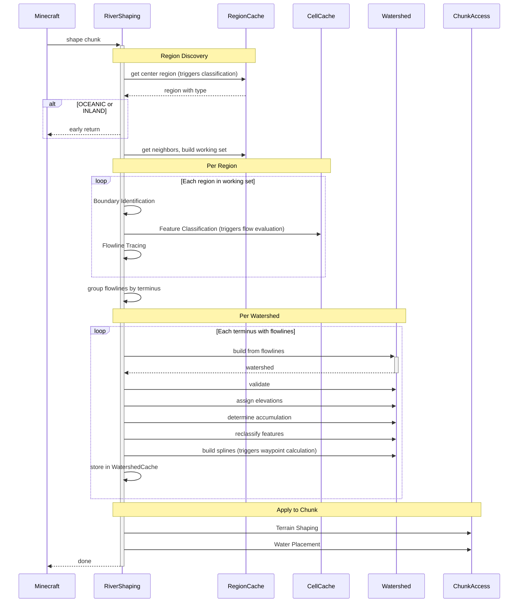

# River Shaping Architecture

Rivers are managed by the RiverShaping pipeline. Minecraft invokes RiverShaping once per chunk during the noise generation phase. RiverShaping orchestrates all river computation—discovering relevant regions, tracing flowlines, building watersheds, and applying the results to terrain.

This document describes the architecture: what components exist, what they own, and how they connect. Each component's algorithmic detail lives in its own Level 4 specification.

## Pipeline Overview



Note: Feature Classification appears twice—once per region (early classification to identify sources and divides) and once per watershed (reclassification with full context).

## Pipeline Execution



## Component Responsibilities

**[[Spatial Infrastructure]]** — The data layer everything else builds on. Owns cells, regions, samples, caching strategy. Provides lazy services (Waypoint Calculation, Flow Evaluation, Region Classification). Does not make decisions about rivers; just provides spatial data.

**[[Region Discovery]]** — Determines which regions need processing for a given chunk. Owns working set construction and type-based branching logic. Provides set of regions to process. Does not identify boundaries or trace paths.

**[[Boundary Identification]]** — Finds where rivers can terminate within each region. Owns ocean boundary detection and basin boundary detection. Provides terminus candidates for flowline tracing. Does not trace paths or build watersheds.

**[[Feature Classification]]** — Classifies cells by their role in the river network. Runs twice: early phase identifies SOURCE and DIVIDE cells before tracing; reclassification phase assigns final features (Run, Waterfall, Confluence, etc.) after watershed context is available. Owns classification rules and feature assignment. Does not trace paths or compute elevations.

**[[Flowline Tracing]]** — Traces paths from sources to termini. Owns the path-following algorithm and termination conditions. Provides complete flowlines grouped by terminus. Does not merge flowlines or compute river properties.

**[[Watershed Building]]** — Merges flowlines into unified drainage networks. Owns flowline merging and diagonal crossing resolution. Provides watershed graph with upstream/downstream links. Does not validate, compute elevation, or build splines.

**[[Watershed Validation]]** — Prunes invalid or too-short river segments. Owns minimum path length rules and iterative pruning. Provides cleaned watershed ready for property computation. Does not compute properties or geometry.

**[[Elevation Assignment]]** — Computes entryY and exitY for each cell in the watershed. Owns the downstream constraint pass and upstream propagation pass. Provides elevation data ensuring water flows downhill. Does not compute width/depth or generate geometry.

**[[Flow Accumulation]]** — Computes width and depth from upstream cell counts and tributary counts. Owns saturation formulas and topology counting. Provides river dimensions for terrain shaping. Does not assign elevations or classify features.

**[[Spline Building]]** — Generates smooth Catmull-Rom curves from the cell-based watershed. Owns waypoint calculation, curve generation, Y profiles per feature, and coarse point sampling. Provides spline geometry for terrain shaping. Does not shape terrain or place water.

**[[Terrain Shaping]]** — Carves river channels and assigns biomes. Owns Shape opinions, cross-section profiles, weight calculation, blending, and biome assignment. Provides modified terrain blocks and biome data. Does not place water blocks.

**[[Water Placement]]** — Fills carved channels with water. Owns Fill opinions, waterY calculation, flowLevel, and flowDirection. Provides water blocks with correct flow behavior. Does not shape terrain.

## Key Architectural Decisions

| Decision | Choice | Rationale |
|----------|--------|-----------|
| Single entry point | RiverShaping orchestrates all | Keeps complexity contained; Minecraft only calls one thing |
| Lazy services | Compute on demand, cache results | Avoids computing data for regions that don't need rivers |
| Region-scoped processing | FLUVIAL and COASTAL only | Rivers only exist where they can reach water; skip OCEANIC and INLAND entirely |
| Flowline-first, merge-second | Trace paths individually, then merge | Simpler tracing logic; merging handles conflicts |
| Watershed as unit of work | Process each drainage network together | Natural boundary for elevation/accumulation computation |
| Separate terrain and water passes | Shape first, fill second | Terrain must exist before water can fill it |
| Two-phase feature classification | Early (sources/divides) then reclassify (full context) | Can't know final features until watershed structure is complete |

## Specifications

Each component has a Level 4 specification document with algorithmic detail.

```dataview
TABLE status AS "Status"
FROM "RiverTale/features/rivers"
WHERE level = 4 AND parent = "[[River Shaping]]"
SORT file.name ASC
```

## Reference Material

- [[Rough Diagrams]] — Comprehensive pipeline diagrams and data structures
- `archive/` — Previous documentation attempts, preserved for historical reference
