RiverShaping is invoked by Minecraft's noise generation phase, once per chunk, to compute river data before terrain is finalized.

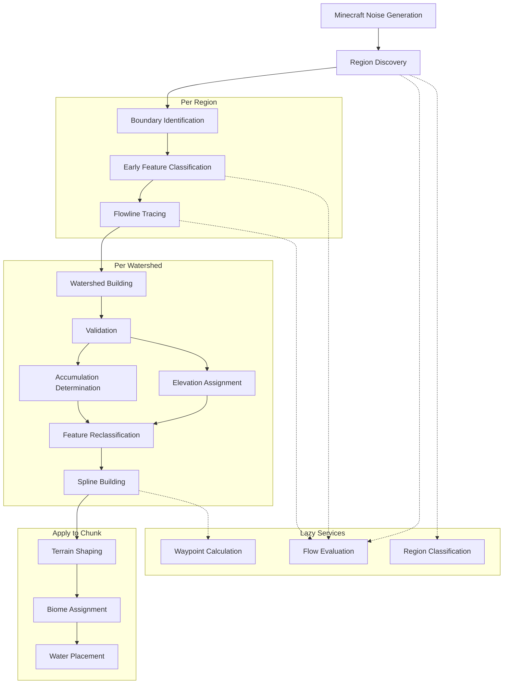
```mermaid
flowchart TD
	N[Minecraft Noise Generation]

	D[Region Discovery]

	subgraph "Lazy Services"
		WP[Waypoint Calculation]
		FE[Flow Evaluation]
		RC[Region Classification]
	end

	subgraph "Per Region"
		R1[Boundary Identification] --> R2[Early Feature Classification]
		R2 --> R3[Flowline Tracing]
	end

	subgraph "Per Watershed"
		W1[Watershed Building] --> W2[Validation]
		W2 --> W3a[Elevation Assignment]
		W2 --> W3b[Accumulation Determination]
		W3a --> W4[Feature Reclassification]
		W3b --> W4
		W4 --> W5[Spline Building]
	end

	subgraph "Apply to Chunk"
		C1[Terrain Shaping] --> C2[Biome Assignment]
		C2 --> C3[Water Placement]
	end

	N --> D
	D --> R1
	R3 --> W1
	W5 --> C1

	D -.-> RC
	D -.-> FE
	R2 -.-> FE
	R3 -.-> FE
	W5 -.-> WP

```

The same flow as a sequence diagram, showing execution order and RiverShaping's orchestration role:

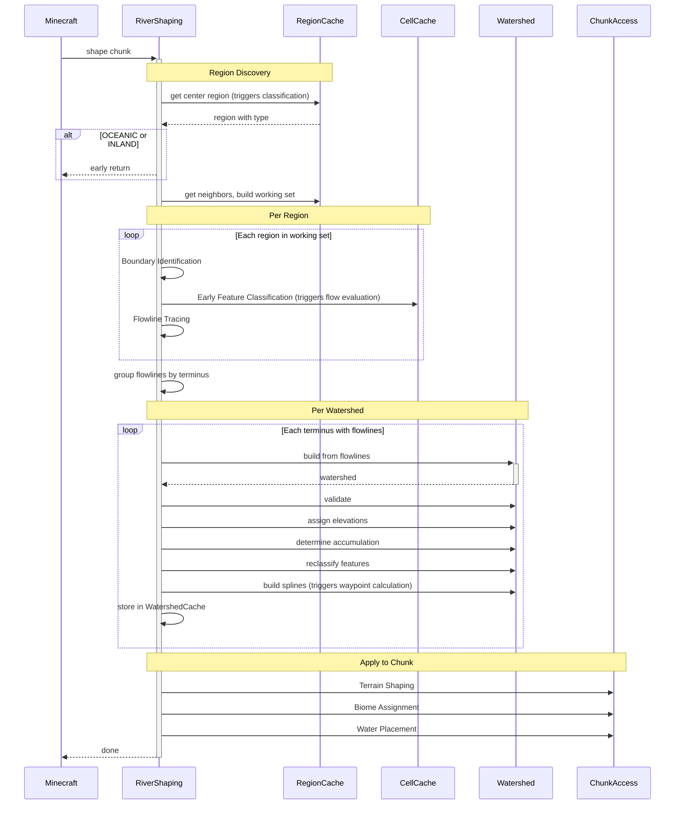
```mermaid
sequenceDiagram
    participant Minecraft
    participant RiverShaping
    participant RegionCache
    participant CellCache
    participant Watershed
    participant ChunkAccess

    Minecraft ->>+ RiverShaping: shape chunk

    Note over RiverShaping,RegionCache: Region Discovery
    RiverShaping ->> RegionCache: get center region (triggers classification)
    RegionCache -->> RiverShaping: region with type

    alt OCEANIC or INLAND
        RiverShaping -->> Minecraft: early return
    end

    RiverShaping ->> RegionCache: get neighbors, build working set

    Note over RiverShaping,CellCache: Per Region
    loop Each region in working set
        RiverShaping ->> RiverShaping: Boundary Identification
        RiverShaping ->> CellCache: Early Feature Classification (triggers flow evaluation)
        RiverShaping ->> RiverShaping: Flowline Tracing
    end

    RiverShaping ->> RiverShaping: group flowlines by terminus

    Note over RiverShaping,Watershed: Per Watershed
    loop Each terminus with flowlines
        RiverShaping ->>+ Watershed: build from flowlines
        Watershed -->>- RiverShaping: watershed
        RiverShaping ->> Watershed: validate
        RiverShaping ->> Watershed: assign elevations
        RiverShaping ->> Watershed: determine accumulation
        RiverShaping ->> Watershed: reclassify features
        RiverShaping ->> Watershed: build splines (triggers waypoint calculation)
        RiverShaping ->> RiverShaping: store in WatershedCache
    end

    Note over RiverShaping,ChunkAccess: Apply to Chunk
    RiverShaping ->> ChunkAccess: Terrain Shaping
    RiverShaping ->> ChunkAccess: Biome Assignment
    RiverShaping ->> ChunkAccess: Water Placement

    RiverShaping -->>- Minecraft: done
```

## Lazy Services

### Waypoint Calculation

Waypoint Calculation determines the meandering offset for a cell's river path. Waypoint = cell center + deterministic noise offset (seeded by world seed + cell position, max offset = cellSize/8). It runs lazily when CellCache is asked for a cell's waypoint. Results are cached for reuse.

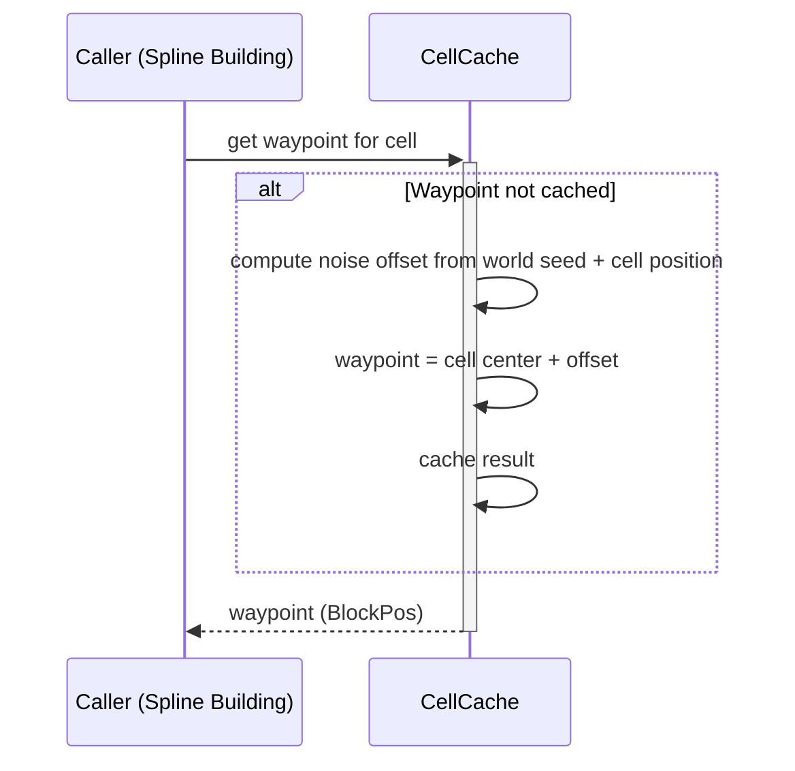
```mermaid
sequenceDiagram
    participant Caller as Caller (Spline Building)
    participant CellCache

    Caller ->>+ CellCache: get waypoint for cell

    alt Waypoint not cached
        CellCache ->> CellCache: compute noise offset from world seed + cell position
        CellCache ->> CellCache: waypoint = cell center + offset
        CellCache ->> CellCache: cache result
    end

    CellCache -->>- Caller: waypoint (BlockPos)
```

### Region Classification

Region Classification determines a region's type (OCEANIC, COASTAL, FLUVIAL, INLAND) based on its cells' ocean status. It runs lazily when RegionCache computes a new region. Results are cached for reuse.

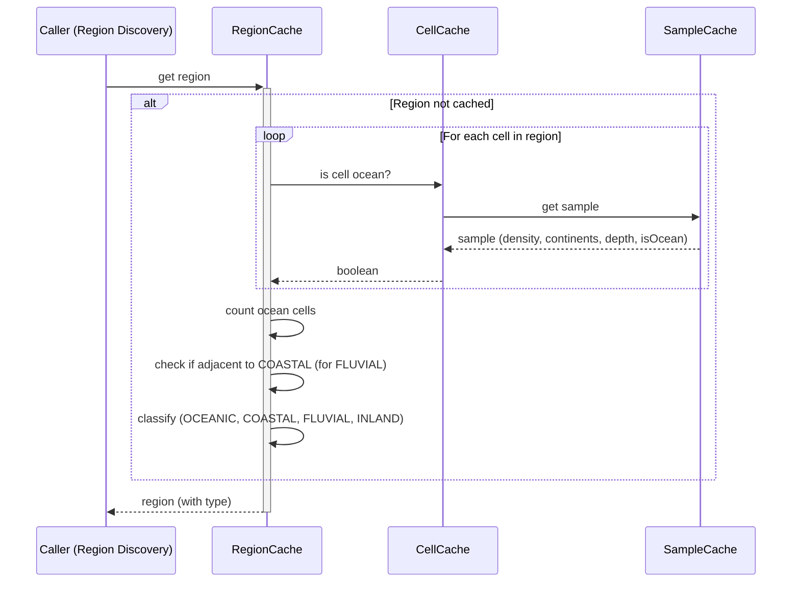
```mermaid
sequenceDiagram
    participant Caller as Caller (Region Discovery)
    participant RegionCache
    participant CellCache
    participant SampleCache

    Caller ->>+ RegionCache: get region

    alt Region not cached
        loop For each cell in region
            RegionCache ->> CellCache: is cell ocean?
            CellCache ->> SampleCache: get sample
            SampleCache -->> CellCache: sample (density, continents, depth, isOcean)
            CellCache -->> RegionCache: boolean
        end

        RegionCache ->> RegionCache: count ocean cells
        RegionCache ->> RegionCache: check if adjacent to COASTAL (for FLUVIAL)
        RegionCache ->> RegionCache: classify (OCEANIC, COASTAL, FLUVIAL, INLAND)
    end

    RegionCache -->>- Caller: region (with type)
```

### Flow Evaluation

Flow Evaluation computes flow directions for a cell by comparing terrain density with neighboring cells. It runs lazily on-demand when any step requests flow data from CellCache. Results are cached for reuse.

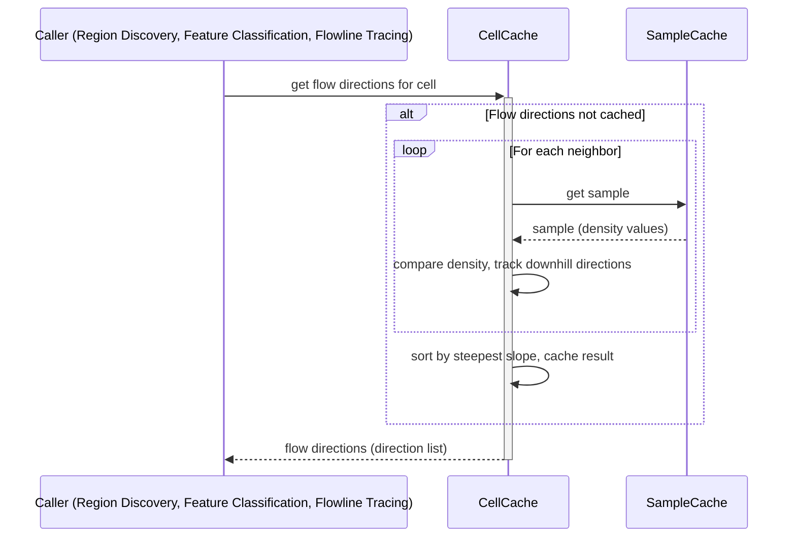
```mermaid
sequenceDiagram
    participant Caller as Caller (Region Discovery, Feature Classification, Flowline Tracing)
    participant CellCache
    participant SampleCache

    Caller ->>+ CellCache: get flow directions for cell

    alt Flow directions not cached
        loop For each neighbor
            CellCache ->> SampleCache: get sample
            SampleCache -->> CellCache: sample (density values)
            CellCache ->> CellCache: compare density, track downhill directions
        end
        CellCache ->> CellCache: sort by steepest slope, cache result
    end

    CellCache -->>- Caller: flow directions (direction list)
```


## Region Discovery

Region Discovery determines which regions need to be processed for a given chunk. Because rivers can only span FLUVIAL → COASTAL (FLUVIAL is defined as adjacent to COASTAL), expansion beyond immediate neighbors is never required.

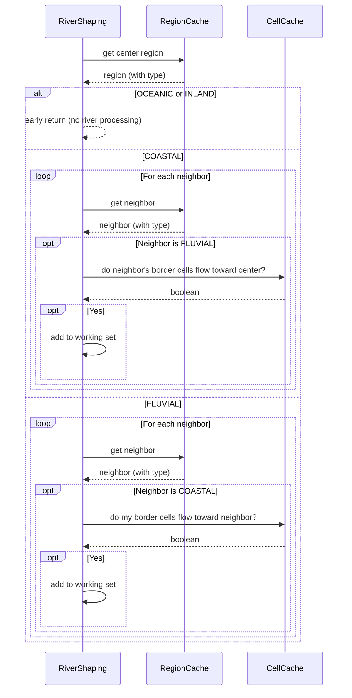
```mermaid
sequenceDiagram
    participant RiverShaping
    participant RegionCache
    participant CellCache

    RiverShaping ->> RegionCache: get center region
    RegionCache -->> RiverShaping: region (with type)

    alt OCEANIC or INLAND
        RiverShaping -->> RiverShaping: early return (no river processing)
    else COASTAL
        loop For each neighbor
            RiverShaping ->> RegionCache: get neighbor
            RegionCache -->> RiverShaping: neighbor (with type)

            opt Neighbor is FLUVIAL
                RiverShaping ->> CellCache: do neighbor's border cells flow toward center?
                CellCache -->> RiverShaping: boolean

                opt Yes
                    RiverShaping ->> RiverShaping: add to working set
                end
            end
        end
    else FLUVIAL
        loop For each neighbor
            RiverShaping ->> RegionCache: get neighbor
            RegionCache -->> RiverShaping: neighbor (with type)

            opt Neighbor is COASTAL
                RiverShaping ->> CellCache: do my border cells flow toward neighbor?
                CellCache -->> RiverShaping: boolean

                opt Yes
                    RiverShaping ->> RiverShaping: add to working set
                end
            end
        end
    end
```


## Per Region

### Boundary Identification

Boundary Identification finds ocean and basin boundaries within each region where rivers can terminate. It uses cached cell data from Region Discovery—no new sampling required.

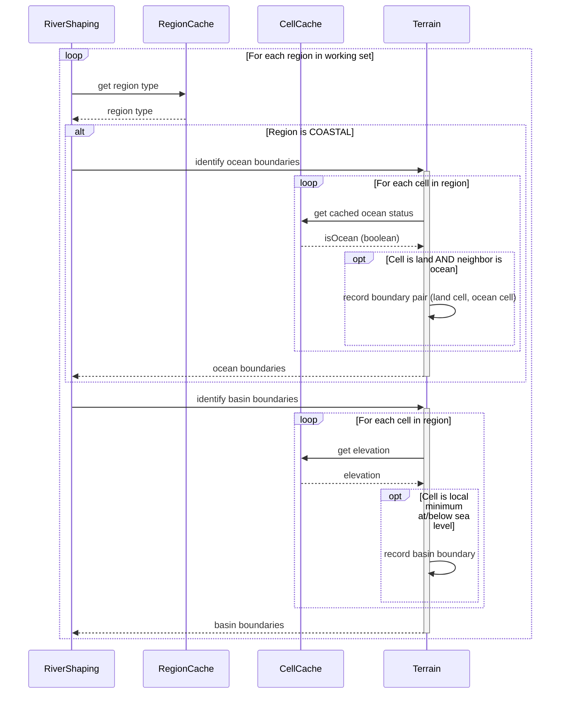
```mermaid
sequenceDiagram
    participant RiverShaping
    participant RegionCache
    participant CellCache
    participant Terrain

    loop For each region in working set
        RiverShaping ->> RegionCache: get region type
        RegionCache -->> RiverShaping: region type

        alt Region is COASTAL
            RiverShaping ->>+ Terrain: identify ocean boundaries

            loop For each cell in region
                Terrain ->> CellCache: get cached ocean status
                CellCache -->> Terrain: isOcean (boolean)
                opt Cell is land AND neighbor is ocean
                    Terrain ->> Terrain: record boundary pair (land cell, ocean cell)
                end
            end

            Terrain -->>- RiverShaping: ocean boundaries
        end

        RiverShaping ->>+ Terrain: identify basin boundaries

        loop For each cell in region
            Terrain ->> CellCache: get elevation
            CellCache -->> Terrain: elevation
            opt Cell is local minimum at/below sea level
                Terrain ->> Terrain: record basin boundary
            end
        end

        Terrain -->>- RiverShaping: basin boundaries
    end
```

### Early Feature Classification

Early Feature Classification identifies SOURCE cells (potential river origins with no upstream flow) and DIVIDE cells (local maxima that water flows away from) before flowlines are traced.

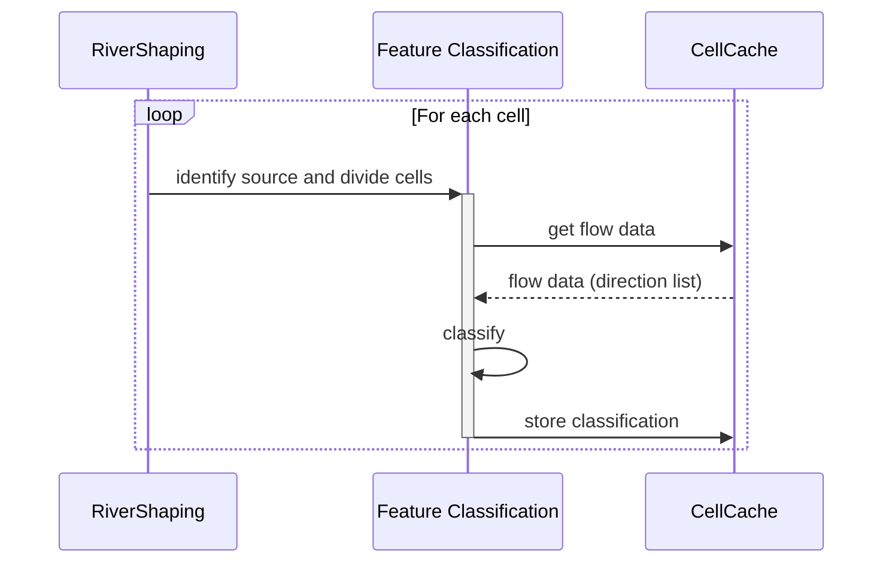
```mermaid
sequenceDiagram
	participant RiverShaping
	participant Features as Feature Classification
	participant CellCache

	loop For each cell
		RiverShaping ->>+ Features: identify source and divide cells
		Features ->> CellCache: get flow data
		CellCache -->> Features: flow data (direction list)
		Features ->> Features: classify
		Features ->>- CellCache: store classification
	end
```

### Flowline Tracing

Flowline Tracing traces each Source cell's flow data until it reaches an ocean cell (via coastal region boundaries) or a basin terminus (a local minimum at or below sea level). Valid flowlines are returned to RiverShaping for aggregation.

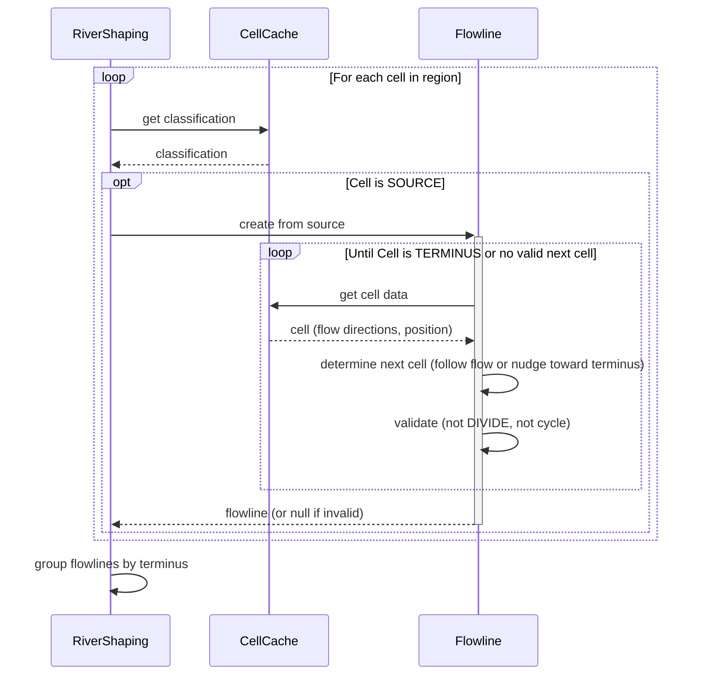
```mermaid
sequenceDiagram
    participant RiverShaping
    participant CellCache
    participant Flowline

    loop For each cell in region
        RiverShaping ->> CellCache: get classification
        CellCache -->> RiverShaping: classification

        opt Cell is SOURCE
            RiverShaping ->>+ Flowline: create from source

            loop Until Cell is TERMINUS or no valid next cell
                Flowline ->> CellCache: get cell data
                CellCache -->> Flowline: cell (flow directions, position)
                Flowline ->> Flowline: determine next cell (follow flow or nudge toward terminus)
                Flowline ->> Flowline: validate (not DIVIDE, not cycle)
            end

            Flowline -->>- RiverShaping: flowline (or null if invalid)
        end
    end

    RiverShaping ->> RiverShaping: group flowlines by terminus
```

Note: Grouped flowlines are held in memory by RiverShaping and passed directly to Watershed Building—no intermediate storage.

## Per Watershed

### Watershed Building

Watershed Building merges flowlines into a single cohesive river system, eliminating duplication and smoothing aberrant behavior within the watershed (such as diagonally crossing segments). This includes merging across region boundaries when a Fluvial region flows through a Coastal region to reach the ocean.

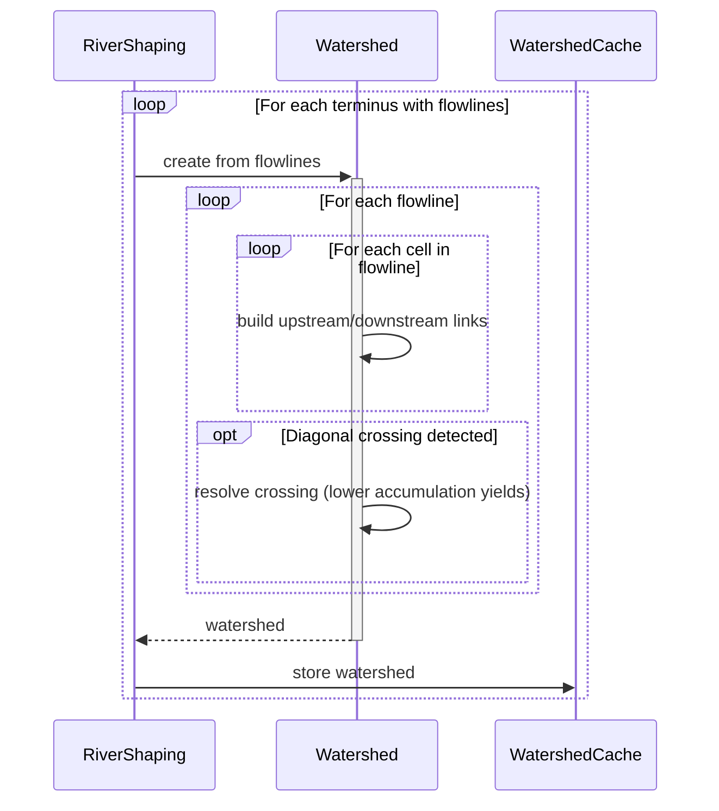
```mermaid
sequenceDiagram
    participant RiverShaping
    participant Watershed
    participant WatershedCache

    loop For each terminus with flowlines
        RiverShaping ->>+ Watershed: create from flowlines

        loop For each flowline
            loop For each cell in flowline
                Watershed ->> Watershed: build upstream/downstream links
            end

            opt Diagonal crossing detected
                Watershed ->> Watershed: resolve crossing (lower accumulation yields)
            end
        end

        Watershed -->>- RiverShaping: watershed

        RiverShaping ->> WatershedCache: store watershed
    end
```

### Validation

Validation prunes river segments that are too short to be meaningful, iterating until no more pruning is needed.

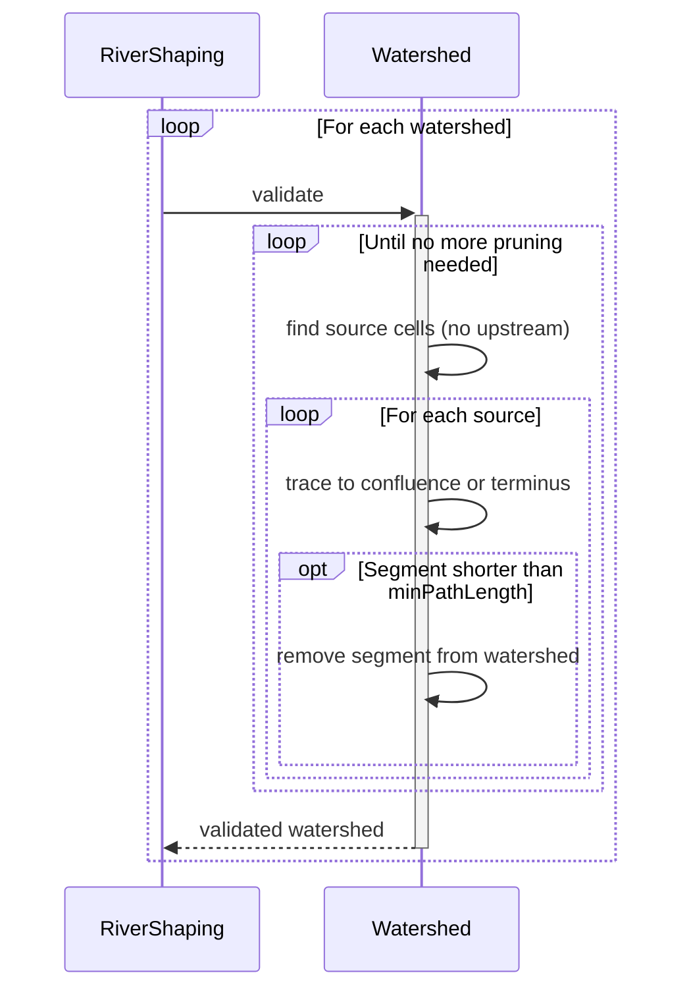
```mermaid
sequenceDiagram
    participant RiverShaping
    participant Watershed

    loop For each watershed
        RiverShaping ->>+ Watershed: validate

        loop Until no more pruning needed
            Watershed ->> Watershed: find source cells (no upstream)
            loop For each source
                Watershed ->> Watershed: trace to confluence or terminus
                opt Segment shorter than minPathLength
                    Watershed ->> Watershed: remove segment from watershed
                end
            end
        end

        Watershed -->>- RiverShaping: validated watershed
    end
```

### Elevation Assignment

Elevation Assignment determines entryY and exitY for each cell in the watershed, ensuring water flows downhill with a minimum slope. Adjacent cells share boundary values (upstream's exitY = downstream's entryY). How the Y profile varies within the cell is feature-specific and handled during terrain shaping.

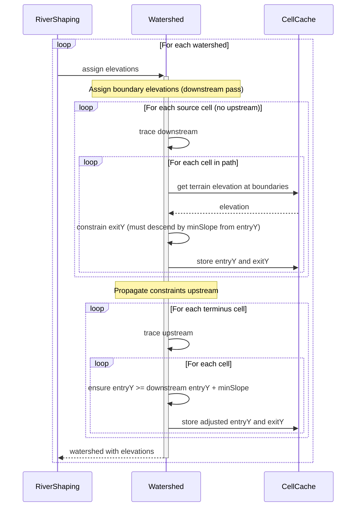
```mermaid
sequenceDiagram
    participant RiverShaping
    participant Watershed
    participant CellCache

    loop For each watershed
        RiverShaping ->>+ Watershed: assign elevations

        Note over Watershed: Assign boundary elevations (downstream pass)
        loop For each source cell (no upstream)
            Watershed ->> Watershed: trace downstream
            loop For each cell in path
                Watershed ->> CellCache: get terrain elevation at boundaries
                CellCache -->> Watershed: elevation
                Watershed ->> Watershed: constrain exitY (must descend by minSlope from entryY)
                Watershed ->> CellCache: store entryY and exitY
            end
        end

        Note over Watershed: Propagate constraints upstream
        loop For each terminus cell
            Watershed ->> Watershed: trace upstream
            loop For each cell
                Watershed ->> Watershed: ensure entryY >= downstream entryY + minSlope
                Watershed ->> CellCache: store adjusted entryY and exitY
            end
        end

        Watershed -->>- RiverShaping: watershed with elevations
    end
```

### Accumulation Determination

Accumulation Determination calculates the depth and width of the river at each cell based on upstream accumulation, and stores topology counts (upstream/downstream) for later feature classification.

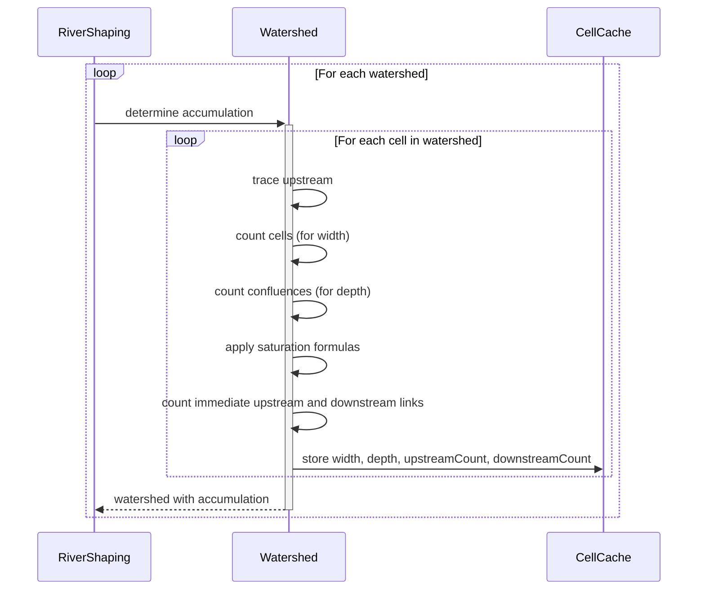
```mermaid
sequenceDiagram
    participant RiverShaping
    participant Watershed
    participant CellCache

    loop For each watershed
        RiverShaping ->>+ Watershed: determine accumulation

        loop For each cell in watershed
            Watershed ->> Watershed: trace upstream
            Watershed ->> Watershed: count cells (for width)
            Watershed ->> Watershed: count confluences (for depth)
            Watershed ->> Watershed: apply saturation formulas
            Watershed ->> Watershed: count immediate upstream and downstream links
            Watershed ->> CellCache: store width, depth, upstreamCount, downstreamCount
        end

        Watershed -->>- RiverShaping: watershed with accumulation
    end
```

### Feature Reclassification

Feature Reclassification re-evaluates all cells in a watershed now that the full river network is known. Cells are processed in topological order (sources to terminus) so upstream neighbors are always classified before downstream cells. This allows features like Plunge Pool to check their upstream neighbor's classification.

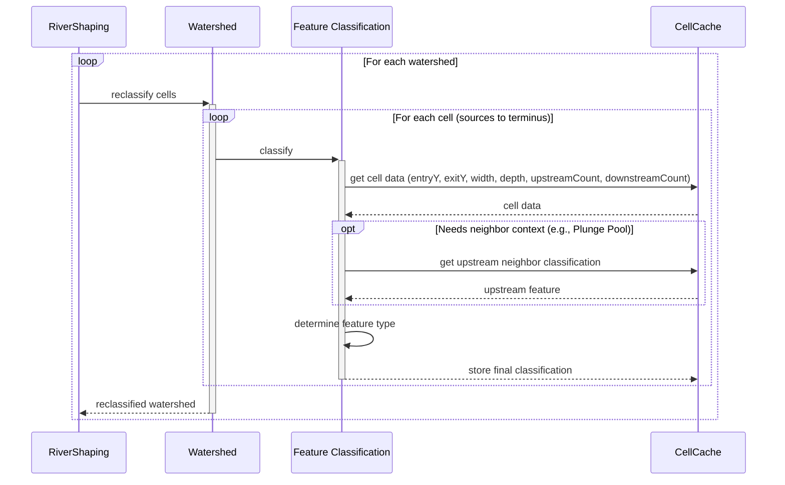
```mermaid
sequenceDiagram
    participant RiverShaping
    participant Watershed
    participant Features as Feature Classification
    participant CellCache

    loop For each watershed
        RiverShaping ->>+ Watershed: reclassify cells

        loop For each cell (sources to terminus)
            Watershed ->>+ Features: classify
            Features ->> CellCache: get cell data (entryY, exitY, width, depth, upstreamCount, downstreamCount)
            CellCache -->> Features: cell data
            opt Needs neighbor context (e.g., Plunge Pool)
                Features ->> CellCache: get upstream neighbor classification
                CellCache -->> Features: upstream feature
            end
            Features ->> Features: determine feature type
            Features -->>- CellCache: store final classification
        end

        Watershed -->>- RiverShaping: reclassified watershed
    end
```

### Spline Building

Spline Building generates smooth curves for river rendering by converting the cell-based watershed graph into continuous splines. Cells are processed in topological order (sources to terminus). Each cell's feature provides its Y profile function (Run interpolates linearly, Waterfall drops at waypoint, etc.), while XZ is interpolated via Catmull-Rom from waypoint to waypoint. Coarse sample points are generated and stored for distance lookups during terrain shaping.

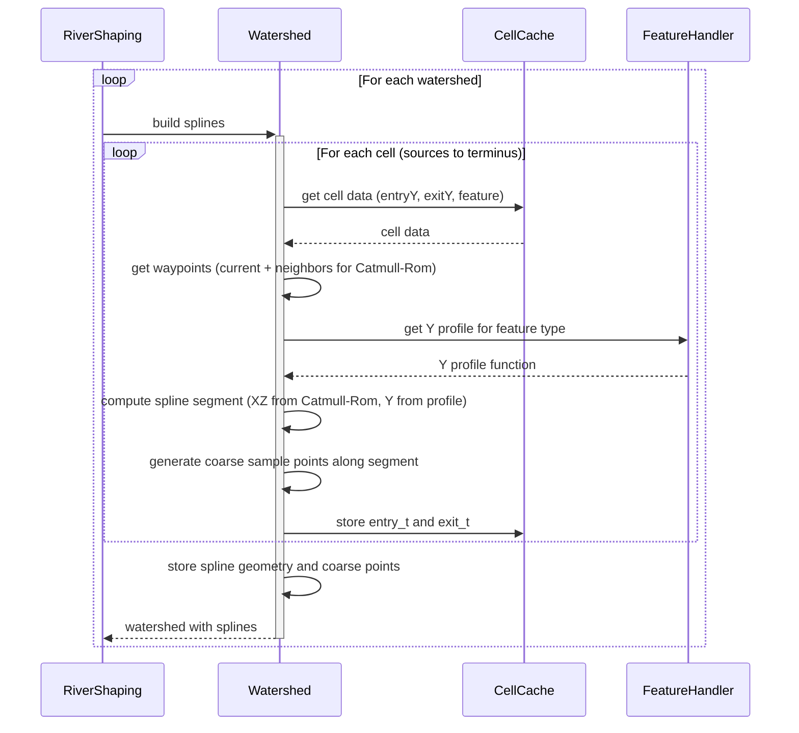
```mermaid
sequenceDiagram
    participant RiverShaping
    participant Watershed
    participant CellCache
    participant Features as FeatureHandler

    loop For each watershed
        RiverShaping ->>+ Watershed: build splines

        loop For each cell (sources to terminus)
            Watershed ->> CellCache: get cell data (entryY, exitY, feature)
            CellCache -->> Watershed: cell data
            Watershed ->> Watershed: get waypoints (current + neighbors for Catmull-Rom)
            Watershed ->> Features: get Y profile for feature type
            Features -->> Watershed: Y profile function
            Watershed ->> Watershed: compute spline segment (XZ from Catmull-Rom, Y from profile)
            Watershed ->> Watershed: generate coarse sample points along segment
            Watershed ->> CellCache: store entry_t and exit_t
        end

        Watershed ->> Watershed: store spline geometry and coarse points

        Watershed -->>- RiverShaping: watershed with splines
    end
```

## Apply to Chunk

### Terrain Shaping

Terrain Shaping modifies chunk terrain to carve river channels based on watershed data. Each contributing cell's feature handler provides shaping opinions that are blended to produce the final terrain.

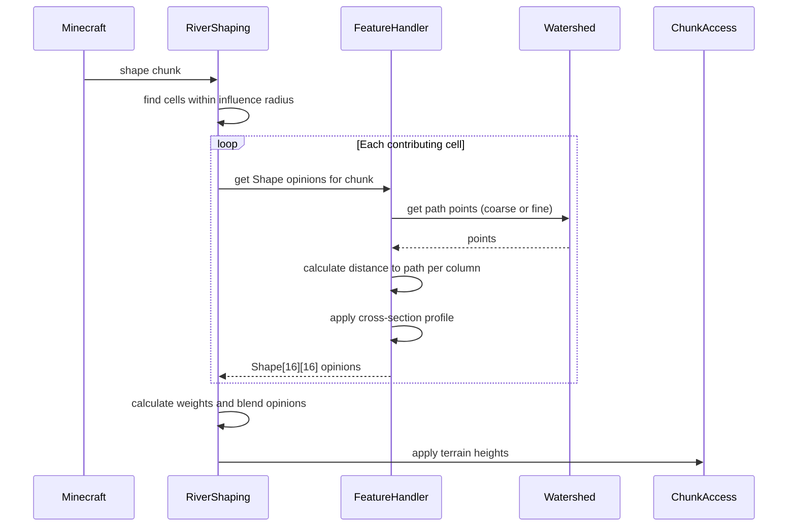
```mermaid
sequenceDiagram
    participant Minecraft
    participant RiverShaping
    participant FeatureHandler
    participant Watershed
    participant ChunkAccess

    Minecraft ->> RiverShaping: shape chunk

    RiverShaping ->> RiverShaping: find cells within influence radius

    loop Each contributing cell
        RiverShaping ->> FeatureHandler: get Shape opinions for chunk
        FeatureHandler ->> Watershed: get path points (coarse or fine)
        Watershed -->> FeatureHandler: points
        FeatureHandler ->> FeatureHandler: calculate distance to path per column
        FeatureHandler ->> FeatureHandler: apply cross-section profile
        FeatureHandler -->> RiverShaping: Shape[16][16] opinions
    end

    RiverShaping ->> RiverShaping: calculate weights and blend opinions
    RiverShaping ->> ChunkAccess: apply terrain heights
```

### Biome Assignment

Biome Assignment updates biome data for river areas, replacing the original biome with the river biome where appropriate. It uses the same Shape opinions collected during Terrain Shaping—each Shape has a `preserveBiome` flag, and weighted consensus determines the outcome.

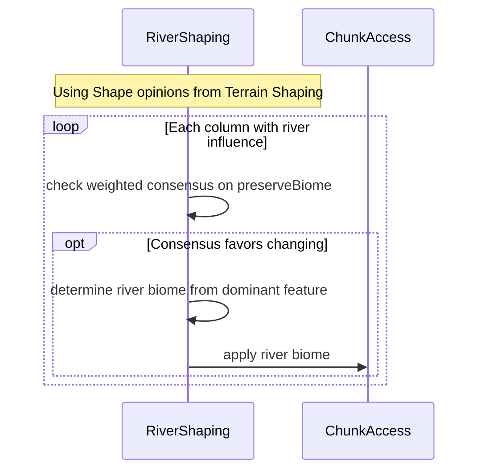
```mermaid
sequenceDiagram
    participant RiverShaping
    participant ChunkAccess

    Note over RiverShaping: Using Shape opinions from Terrain Shaping

    loop Each column with river influence
        RiverShaping ->> RiverShaping: check weighted consensus on preserveBiome
        opt Consensus favors changing
            RiverShaping ->> RiverShaping: determine river biome from dominant feature
            RiverShaping ->> ChunkAccess: apply river biome
        end
    end
```

### Water Placement

Water Placement fills carved river channels with water blocks at the appropriate Y levels. Like Terrain Shaping, it collects opinions from contributing cells' FeatureHandlers—each returns a Fill[16][16] grid with waterY, flowLevel, and flowDirection per column. Course features calculate Fill from the spline (using deltaY to determine flowing vs source blocks); lakes return constant waterY across their basin.

Flow direction is stored per column so the mixin can override Minecraft's flow calculation—this makes water visually and physically flow downstream even in source block troughs.

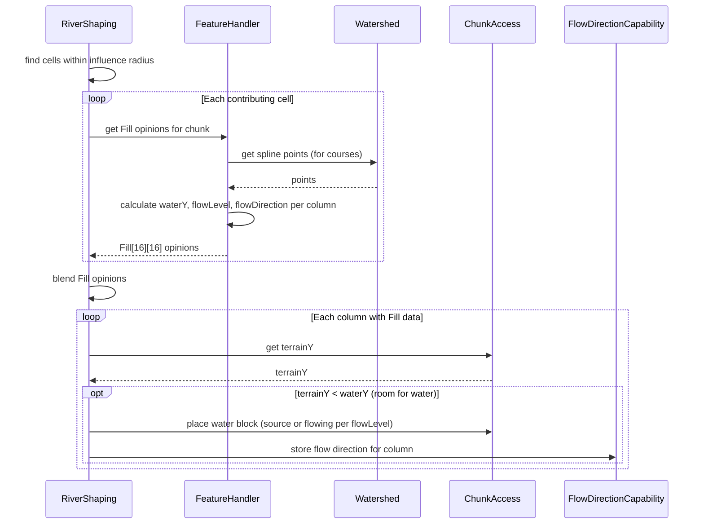
```mermaid
sequenceDiagram
    participant RiverShaping
    participant FeatureHandler
    participant Watershed
    participant ChunkAccess
    participant FlowDirectionCapability

    RiverShaping ->> RiverShaping: find cells within influence radius

    loop Each contributing cell
        RiverShaping ->> FeatureHandler: get Fill opinions for chunk
        FeatureHandler ->> Watershed: get spline points (for courses)
        Watershed -->> FeatureHandler: points
        FeatureHandler ->> FeatureHandler: calculate waterY, flowLevel, flowDirection per column
        FeatureHandler -->> RiverShaping: Fill[16][16] opinions
    end

    RiverShaping ->> RiverShaping: blend Fill opinions

    loop Each column with Fill data
        RiverShaping ->> ChunkAccess: get terrainY
        ChunkAccess -->> RiverShaping: terrainY

        opt terrainY < waterY (room for water)
            RiverShaping ->> ChunkAccess: place water block (source or flowing per flowLevel)
            RiverShaping ->> FlowDirectionCapability: store flow direction for column
        end
    end
```

## Data Structures

Pseudocode definitions for the records implied by these diagrams.

```
enum RegionType { OCEANIC, COASTAL, FLUVIAL, INLAND }

enum FlowDirection { N, NE, E, SE, S, SW, W, NW, NONE }

enum CellType { SOURCE, TERMINUS, JUNCTION, LAKE, COURSE, NONE }

enum Feature {
    // Sources
    SNOWMELT, RESURGENCE, SEEP, CRATER, SPRING,
    // Termini
    DELTA, ESTUARY, WETLAND, MOUTH,
    // Junctions
    CONFLUENCE, BIFURCATION, BRAID,
    // Lakes
    ENDORHEIC, KETTLE, SINKHOLE, LAGOON, TECTONIC,
    // Courses
    PLUNGE_POOL, WATERFALL, CASCADE, RAPIDS, RUN,
    // Fallback
    DIVIDE, DEFAULT
}

record Sample {
    density: double
    continents: double
    depth: double
    isOcean: boolean
}

record Cell {
    pos: CellPos
    flowDirections: List<FlowDirection>  // sorted by steepest slope
    feature: Feature
    waypoint: BlockPos                   // cell center + noise offset

    // Set during Elevation Assignment
    entryY: int
    exitY: int

    // Set during Accumulation Determination
    width: int
    depth: int
    upstreamCount: int
    downstreamCount: int

    // Set during Spline Building
    entry_t: double
    exit_t: double
}

record Region {
    pos: RegionPos
    type: RegionType
    cells: Set<CellPos>
}

record Flowline {
    cells: List<CellPos>  // ordered source to terminus
    terminus: CellPos
    isValid: boolean
}

record Watershed {
    terminus: CellPos
    cells: Set<CellPos>
    upstreamLinks: Map<CellPos, Set<CellPos>>
    downstreamLinks: Map<CellPos, CellPos>
    spline: List<Point>        // coarse sample points
    splineGeometry: SplineCurve  // Catmull-Rom curve data
}

record Point {
    pos: BlockPos   // x, z are world coords; y is bank elevation (riverY)
    t: double       // normalized position along spline (0 = start, 1 = end)
}

record Shape {
    y: int                  // target terrain surface elevation
    weight: double          // confidence 0-1 for blending
    isRiverbed: boolean     // true if underwater channel
    preserveBiome: boolean  // if true, keep original biome
    point: Point            // nearest spline point (for weight calculation)
}

record Fill {
    waterY: int                     // water surface level
    flowLevel: Integer              // Minecraft water level 1-7 (null = source block)
    flowDirection: FlowDirection    // downstream direction for mixin override
    weight: double                  // confidence 0-1 for blending
}

interface FeatureHandler {
    // Classify whether this feature applies to a cell
    classify(cell: Cell, watershed: Watershed?): boolean

    // Terrain shaping opinions for a chunk
    shape(cell: Cell, watershed: Watershed, chunkPos: ChunkPos): Shape[16][16]

    // Water placement opinions for a chunk
    fill(cell: Cell, watershed: Watershed, chunkPos: ChunkPos): Fill[16][16]

    // Y profile function for spline building (how Y varies from entryY to exitY)
    profile(t: double, entryY: int, exitY: int): int
}
```
