River generation has two entry points, which share one build per region. Steps with dashed borders are not built yet.

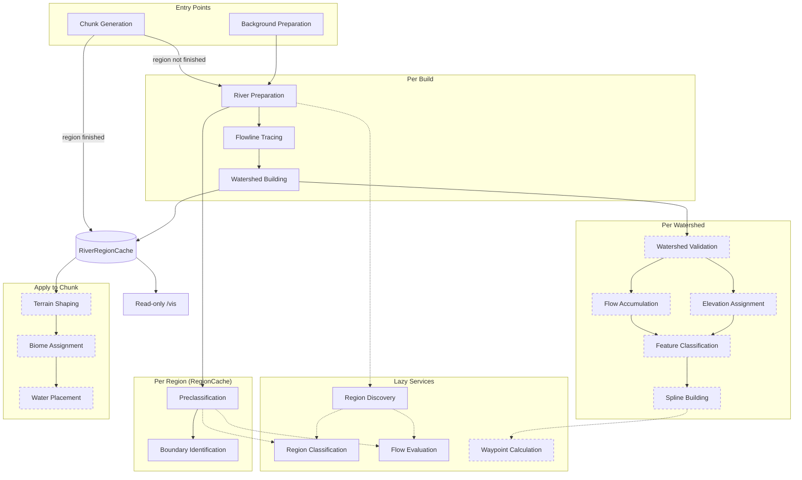
```mermaid
flowchart TD
	classDef planned stroke-dasharray: 5 5

	subgraph "Entry Points"
		BP[Background Preparation]
		CG[Chunk Generation]
	end

	subgraph "Lazy Services"
		RC[Region Classification]
		FE[Flow Evaluation]
		RD[Region Discovery]
		WP[Waypoint Calculation]:::planned
	end

	subgraph "Per Region (RegionCache)"
		R1[Preclassification] --> R2[Boundary Identification]
	end

	subgraph "Per Build"
		B1[River Preparation] --> B2[Flowline Tracing]
		B2 --> B3[Watershed Building]
	end

	subgraph "Per Watershed"
		W1[Watershed Validation]:::planned
		W1 --> W2a[Elevation Assignment]:::planned
		W1 --> W2b[Flow Accumulation]:::planned
		W2a --> W3[Feature Classification]:::planned
		W2b --> W3
		W3 --> W4[Spline Building]:::planned
	end

	WC[(RiverRegionCache)]
	Vis[Read-only /vis]

	subgraph "Apply to Chunk"
		C1[Terrain Shaping]:::planned --> C2[Biome Assignment]:::planned
		C2 --> C3[Water Placement]:::planned
	end

	BP --> B1
	CG -->|region not finished| B1
	B1 --> R1
	B3 --> W1
	B3 --> WC
	CG -->|region finished| WC
	WC --> Vis
	WC --> C1

	R1 -.-> RC
	R1 -.-> FE
	B1 -.-> RD
	RD -.-> RC
	RD -.-> FE
	W4 -.-> WP
```

## Entry Points

### Background Preparation

Background preparation starts when a player logs in or changes regions in the active RTF overworld. It builds the missing regions in the player's 3×3, following any dependencies needed to complete the watersheds touching them.

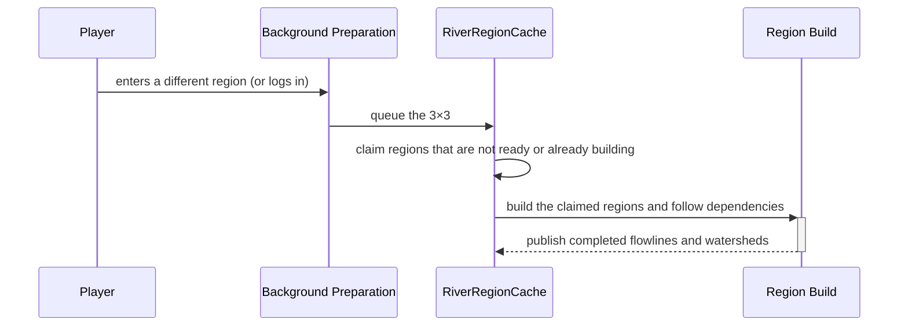
```mermaid
sequenceDiagram
    participant Player
    participant BP as Background Preparation
    participant Cache as RiverRegionCache
    participant Build as Region Build

    Player ->> BP: enters a different region (or logs in)
    BP ->> Cache: queue the 3×3
    Cache ->> Cache: claim regions that are not ready or already building
    Cache ->>+ Build: build the claimed regions and follow dependencies
    Build -->>- Cache: publish completed flowlines and watersheds
```

### Chunk Generation

Chunk Generation runs when Minecraft fills a chunk's noise. Building on the chunk generation thread is the last resort, and its pause (about 3.2 seconds cold) is accepted.

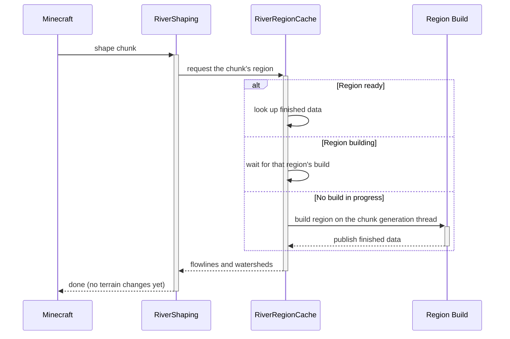
```mermaid
sequenceDiagram
    participant Minecraft
    participant RiverShaping
    participant Cache as RiverRegionCache
    participant Build as Region Build

    Minecraft ->>+ RiverShaping: shape chunk
    RiverShaping ->>+ Cache: request the chunk's region
    alt Region ready
        Cache ->> Cache: look up finished data
    else Region building
        Cache ->> Cache: wait for that region's build
    else No build in progress
        Cache ->>+ Build: build region on the chunk generation thread
        Build -->>- Cache: publish finished data
    end
    Cache -->>- RiverShaping: flowlines and watersheds
    RiverShaping -->>- Minecraft: done (no terrain changes yet)
```

### Visualization

`/vis` does not build river data. It sends whichever regions in the player's 3×3 are ready, immediately on enable or region entry and every 20 server ticks while enabled.

## Region Build

A region build is the same no matter which entry point starts it.

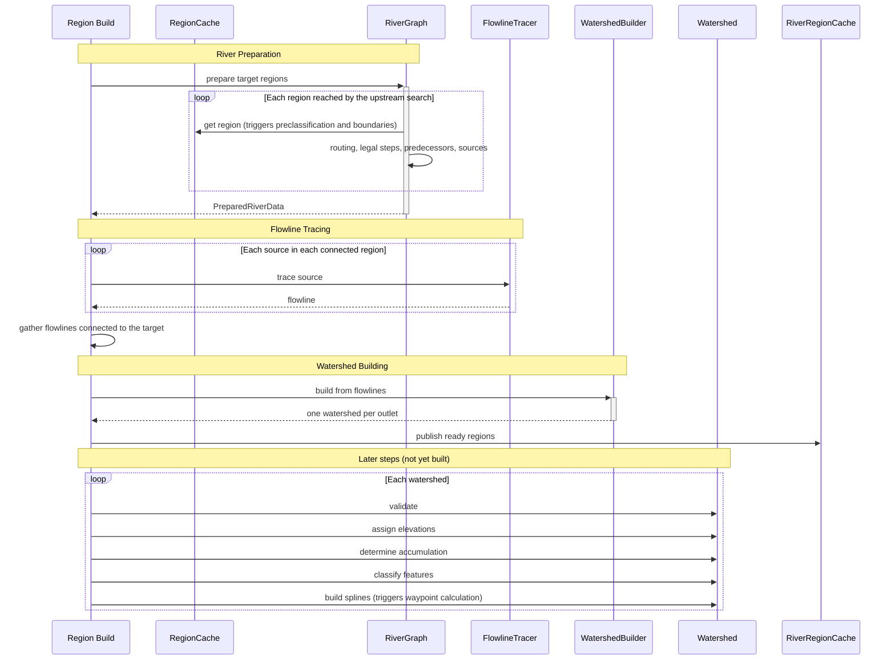
```mermaid
sequenceDiagram
    participant Build as Region Build
    participant RegionCache
    participant RiverGraph
    participant FlowlineTracer
    participant WatershedBuilder
    participant Watershed
    participant RiverRegionCache

    Note over Build,RiverGraph: River Preparation
    Build ->>+ RiverGraph: prepare target regions
    loop Each region reached by the upstream search
        RiverGraph ->> RegionCache: get region (triggers preclassification and boundaries)
        RiverGraph ->> RiverGraph: routing, legal steps, predecessors, sources
    end
    RiverGraph -->>- Build: PreparedRiverData

    Note over Build,FlowlineTracer: Flowline Tracing
    loop Each source in each connected region
        Build ->> FlowlineTracer: trace source
        FlowlineTracer -->> Build: flowline
    end
    Build ->> Build: gather flowlines connected to the target

    Note over Build,WatershedBuilder: Watershed Building
    Build ->>+ WatershedBuilder: build from flowlines
    WatershedBuilder -->>- Build: one watershed per outlet
    Build ->> RiverRegionCache: publish ready regions

    Note over Build,Watershed: Later steps (not yet built)
    loop Each watershed
        Build ->> Watershed: validate
        Build ->> Watershed: assign elevations
        Build ->> Watershed: determine accumulation
        Build ->> Watershed: classify features
        Build ->> Watershed: build splines (triggers waypoint calculation)
    end
```

## Lazy Services

### Waypoint Calculation

Waypoint Calculation determines the meandering offset for a cell's river path. Waypoint = cell center + deterministic noise offset (seeded by world seed + cell position, max offset = cellSize/8). It runs lazily when CellCache is asked for a cell's waypoint. Results are cached for reuse.

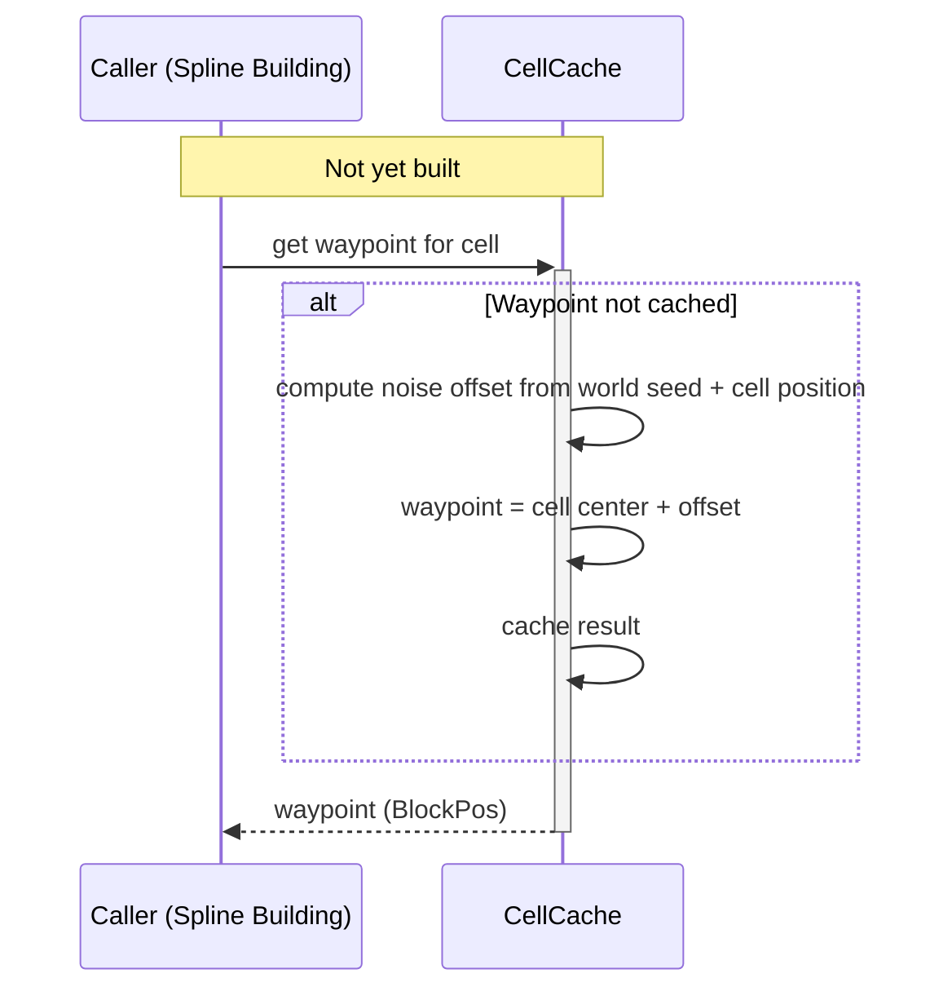
```mermaid
sequenceDiagram
    participant Caller as Caller (Spline Building)
    participant CellCache

    Note over Caller,CellCache: Not yet built

    Caller ->>+ CellCache: get waypoint for cell

    alt Waypoint not cached
        CellCache ->> CellCache: compute noise offset from world seed + cell position
        CellCache ->> CellCache: waypoint = cell center + offset
        CellCache ->> CellCache: cache result
    end

    CellCache -->>- Caller: waypoint (BlockPos)
```

### Region Classification

Region Classification determines a region's type (OCEANIC, COASTAL, FLUVIAL, INLAND) from the ocean status of its cells and its neighbors' cells. Results are cached in RegionTypeCache.

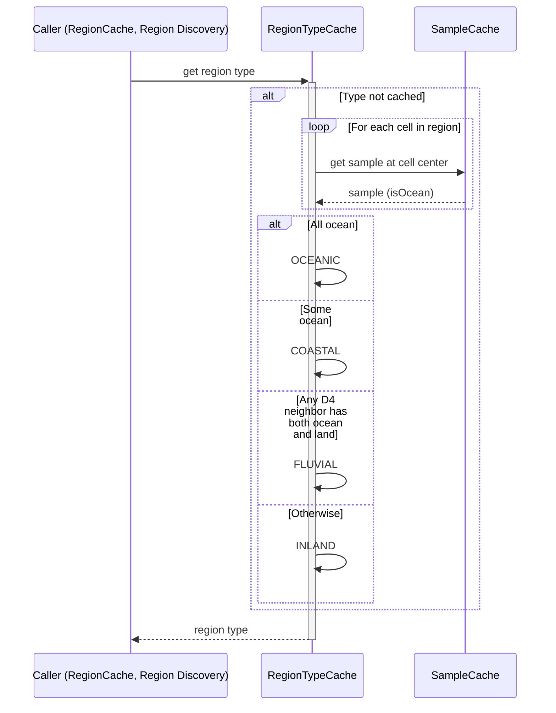
```mermaid
sequenceDiagram
    participant Caller as Caller (RegionCache, Region Discovery)
    participant RegionTypeCache
    participant SampleCache

    Caller ->>+ RegionTypeCache: get region type

    alt Type not cached
        loop For each cell in region
            RegionTypeCache ->> SampleCache: get sample at cell center
            SampleCache -->> RegionTypeCache: sample (isOcean)
        end

        alt All ocean
            RegionTypeCache ->> RegionTypeCache: OCEANIC
        else Some ocean
            RegionTypeCache ->> RegionTypeCache: COASTAL
        else Any D4 neighbor has both ocean and land
            RegionTypeCache ->> RegionTypeCache: FLUVIAL
        else Otherwise
            RegionTypeCache ->> RegionTypeCache: INLAND
        end
    end

    RegionTypeCache -->>- Caller: region type
```

### Flow Evaluation

Flow Evaluation computes flow directions for a cell by comparing its estimated terrain height with its eight neighbors. Ocean cells have no flow directions. Results are cached in CellCache.

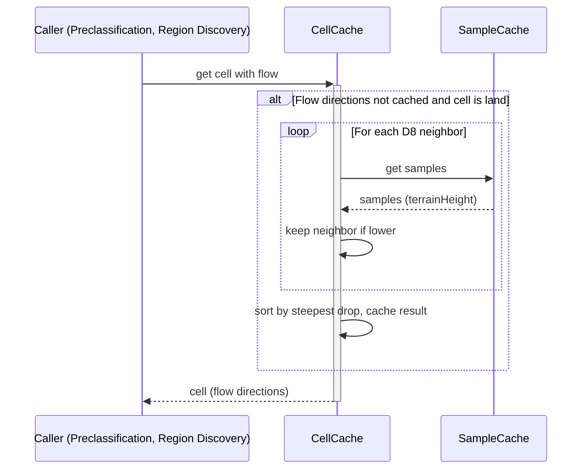
```mermaid
sequenceDiagram
    participant Caller as Caller (Preclassification, Region Discovery)
    participant CellCache
    participant SampleCache

    Caller ->>+ CellCache: get cell with flow

    alt Flow directions not cached and cell is land
        loop For each D8 neighbor
            CellCache ->> SampleCache: get samples
            SampleCache -->> CellCache: samples (terrainHeight)
            CellCache ->> CellCache: keep neighbor if lower
        end
        CellCache ->> CellCache: sort by steepest drop, cache result
    end

    CellCache -->>- Caller: cell (flow directions)
```

### Region Discovery

Region Discovery finds the regions a river starting in a given region may pass through. River Preparation asks for it once per region while building that region's routing. Rivers may only move INLAND → FLUVIAL → COASTAL.

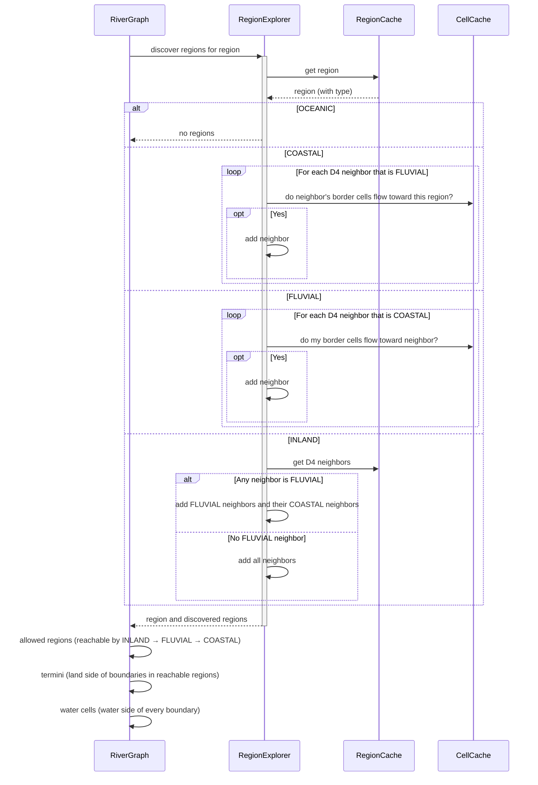
```mermaid
sequenceDiagram
    participant RiverGraph
    participant RegionExplorer
    participant RegionCache
    participant CellCache

    RiverGraph ->>+ RegionExplorer: discover regions for region
    RegionExplorer ->> RegionCache: get region
    RegionCache -->> RegionExplorer: region (with type)

    alt OCEANIC
        RegionExplorer -->> RiverGraph: no regions
    else COASTAL
        loop For each D4 neighbor that is FLUVIAL
            RegionExplorer ->> CellCache: do neighbor's border cells flow toward this region?
            opt Yes
                RegionExplorer ->> RegionExplorer: add neighbor
            end
        end
    else FLUVIAL
        loop For each D4 neighbor that is COASTAL
            RegionExplorer ->> CellCache: do my border cells flow toward neighbor?
            opt Yes
                RegionExplorer ->> RegionExplorer: add neighbor
            end
        end
    else INLAND
        RegionExplorer ->> RegionCache: get D4 neighbors
        alt Any neighbor is FLUVIAL
            RegionExplorer ->> RegionExplorer: add FLUVIAL neighbors and their COASTAL neighbors
        else No FLUVIAL neighbor
            RegionExplorer ->> RegionExplorer: add all neighbors
        end
    end

    RegionExplorer -->>- RiverGraph: region and discovered regions

    RiverGraph ->> RiverGraph: allowed regions (reachable by INLAND → FLUVIAL → COASTAL)
    RiverGraph ->> RiverGraph: termini (land side of boundaries in reachable regions)
    RiverGraph ->> RiverGraph: water cells (water side of every boundary)
```

## Per Region

Both steps run inside RegionCache the first time a region is requested, so every cached region is already preclassified and has its boundaries.

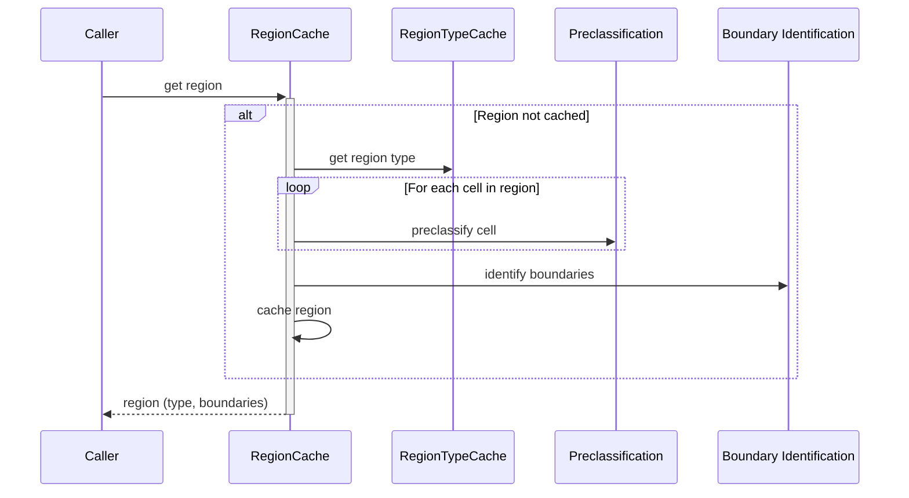
```mermaid
sequenceDiagram
    participant Caller
    participant RegionCache
    participant RegionTypeCache
    participant Preclassification
    participant Boundaries as Boundary Identification

    Caller ->>+ RegionCache: get region

    alt Region not cached
        RegionCache ->> RegionTypeCache: get region type
        loop For each cell in region
            RegionCache ->> Preclassification: preclassify cell
        end
        RegionCache ->> Boundaries: identify boundaries
        RegionCache ->> RegionCache: cache region
    end

    RegionCache -->>- Caller: region (type, boundaries)
```

### Preclassification

Preclassification finds SOURCE cells, which are land cells with no inflowing neighbor that match a source feature's rules. Every other land cell is NONE. It runs with no watershed, so only source features can match.

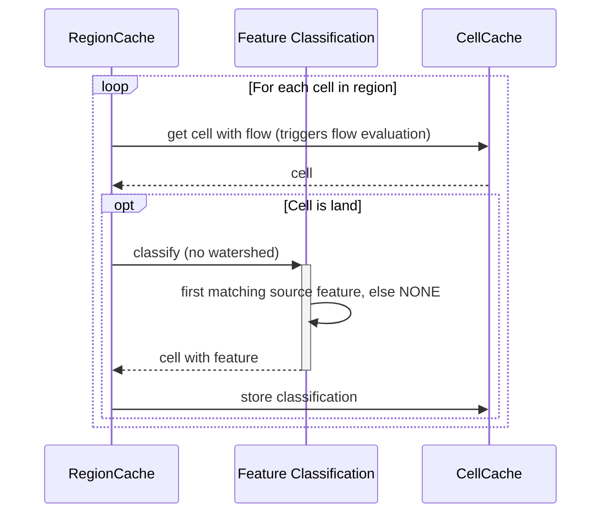
```mermaid
sequenceDiagram
	participant RegionCache
	participant Features as Feature Classification
	participant CellCache

	loop For each cell in region
		RegionCache ->> CellCache: get cell with flow (triggers flow evaluation)
		CellCache -->> RegionCache: cell
		opt Cell is land
			RegionCache ->>+ Features: classify (no watershed)
			Features ->> Features: first matching source feature, else NONE
			Features -->>- RegionCache: cell with feature
			RegionCache ->> CellCache: store classification
		end
	end
```

### Boundary Identification

Boundary Identification finds the land-to-water cell pairs where rivers can terminate. COASTAL regions look for ocean and basin neighbors. FLUVIAL and INLAND regions look only for basin neighbors. OCEANIC regions have none.

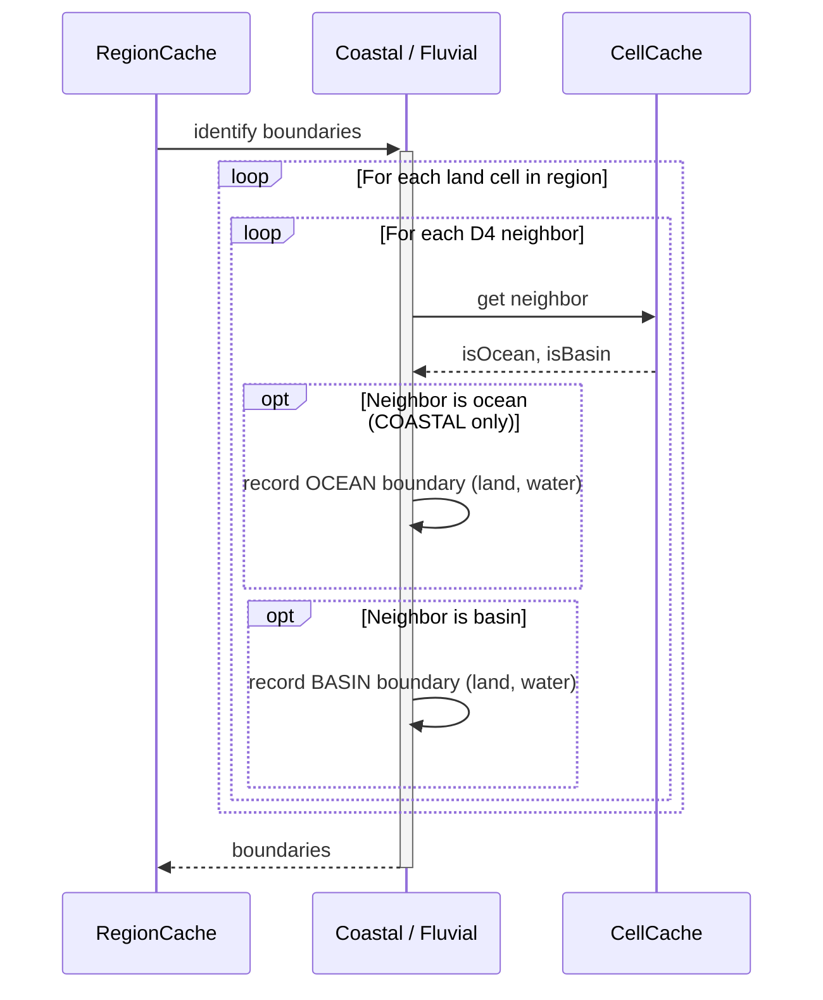
```mermaid
sequenceDiagram
    participant RegionCache
    participant Terrain as Coastal / Fluvial
    participant CellCache

    RegionCache ->>+ Terrain: identify boundaries

    loop For each land cell in region
        loop For each D4 neighbor
            Terrain ->> CellCache: get neighbor
            CellCache -->> Terrain: isOcean, isBasin
            opt Neighbor is ocean (COASTAL only)
                Terrain ->> Terrain: record OCEAN boundary (land, water)
            end
            opt Neighbor is basin
                Terrain ->> Terrain: record BASIN boundary (land, water)
            end
        end
    end

    Terrain -->>- RegionCache: boundaries
```

## Per Build

### River Preparation

River Preparation builds a fixed snapshot of everything tracing needs. It searches upstream from the target region for every region whose rivers can reach it, then forward from those regions' sources, repeating until no new regions appear. Tracing reads only this snapshot.

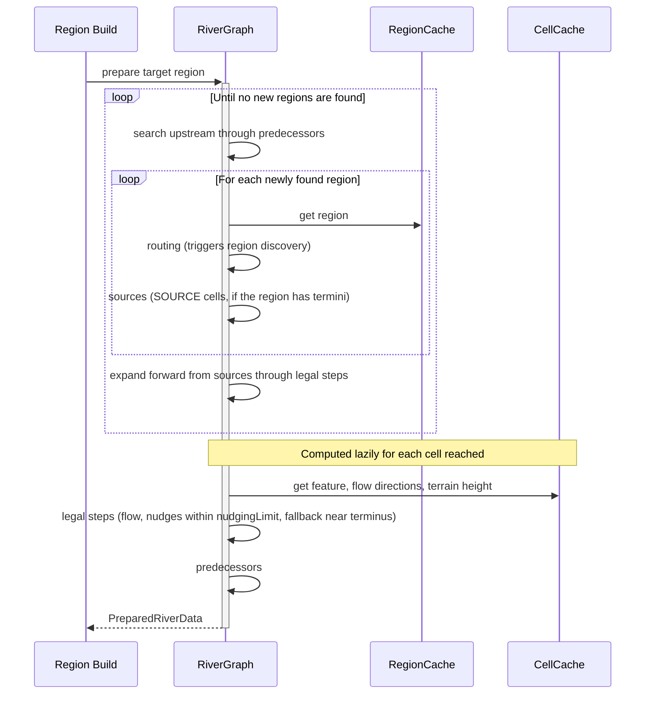
```mermaid
sequenceDiagram
    participant Build as Region Build
    participant RiverGraph
    participant RegionCache
    participant CellCache

    Build ->>+ RiverGraph: prepare target region

    loop Until no new regions are found
        RiverGraph ->> RiverGraph: search upstream through predecessors
        loop For each newly found region
            RiverGraph ->> RegionCache: get region
            RiverGraph ->> RiverGraph: routing (triggers region discovery)
            RiverGraph ->> RiverGraph: sources (SOURCE cells, if the region has termini)
        end
        RiverGraph ->> RiverGraph: expand forward from sources through legal steps
    end

    Note over RiverGraph,CellCache: Computed lazily for each cell reached
    RiverGraph ->> CellCache: get feature, flow directions, terrain height
    RiverGraph ->> RiverGraph: legal steps (flow, nudges within nudgingLimit, fallback near terminus)
    RiverGraph ->> RiverGraph: predecessors

    RiverGraph -->>- Build: PreparedRiverData
```

### Flowline Tracing

Flowline Tracing runs a best-first search from each source over the prepared legal steps until it reaches a terminus or joins a flowline that already reached one. Steps that move away from the target are limited by awayStepAllowance, and a path may not revisit its own cells. The flowlines connected to the target region are then gathered for Watershed Building.

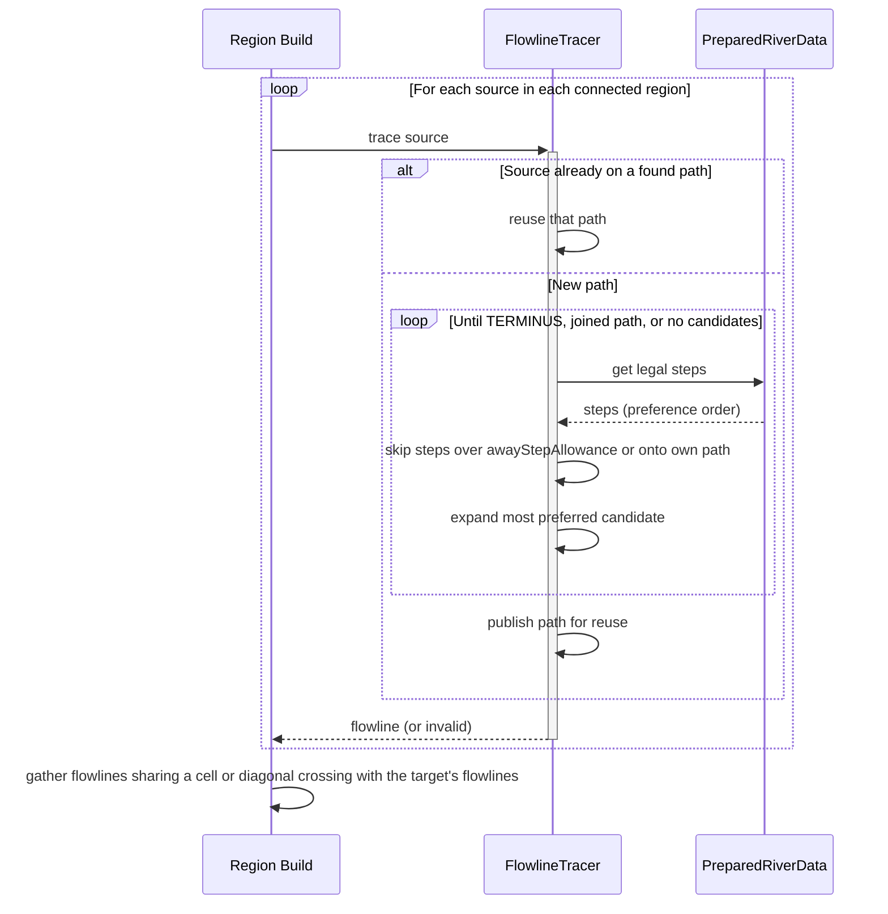
```mermaid
sequenceDiagram
    participant Build as Region Build
    participant FlowlineTracer
    participant PreparedRiverData

    loop For each source in each connected region
        Build ->>+ FlowlineTracer: trace source

        alt Source already on a found path
            FlowlineTracer ->> FlowlineTracer: reuse that path
        else New path
            loop Until TERMINUS, joined path, or no candidates
                FlowlineTracer ->> PreparedRiverData: get legal steps
                PreparedRiverData -->> FlowlineTracer: steps (preference order)
                FlowlineTracer ->> FlowlineTracer: skip steps over awayStepAllowance or onto own path
                FlowlineTracer ->> FlowlineTracer: expand most preferred candidate
            end
            FlowlineTracer ->> FlowlineTracer: publish path for reuse
        end

        FlowlineTracer -->>- Build: flowline (or invalid)
    end

    Build ->> Build: gather flowlines sharing a cell or diagonal crossing with the target's flowlines
```

### Watershed Building

Watershed Building merges the gathered flowlines into one tree per outlet. Diagonal crossings become shared nodes, and a cell with competing downstream links keeps the one supported by the most upstream cells.

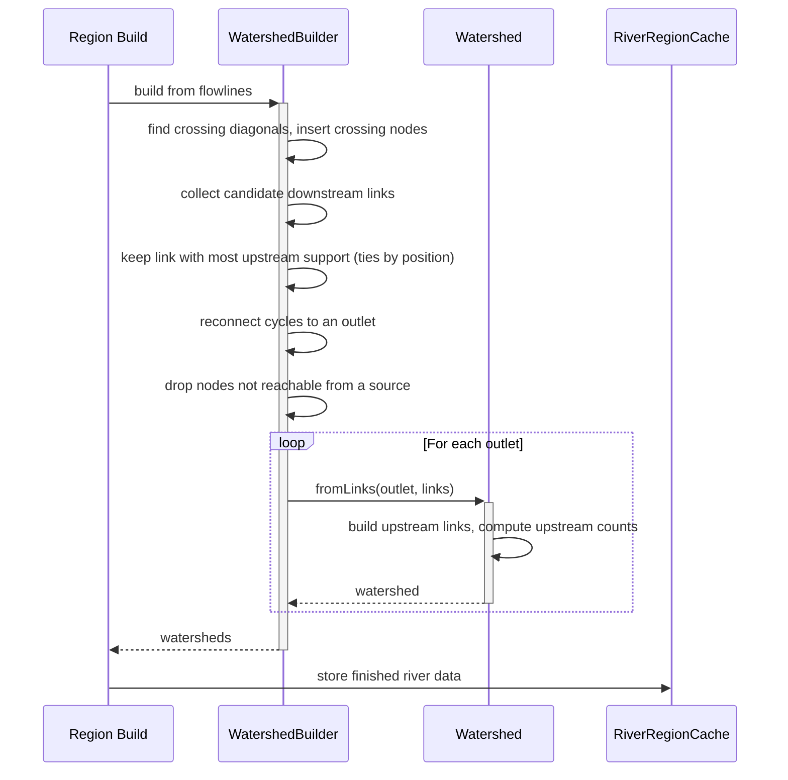
```mermaid
sequenceDiagram
    participant Build as Region Build
    participant WatershedBuilder
    participant Watershed
    participant RiverRegionCache

    Build ->>+ WatershedBuilder: build from flowlines

    WatershedBuilder ->> WatershedBuilder: find crossing diagonals, insert crossing nodes
    WatershedBuilder ->> WatershedBuilder: collect candidate downstream links
    WatershedBuilder ->> WatershedBuilder: keep link with most upstream support (ties by position)
    WatershedBuilder ->> WatershedBuilder: reconnect cycles to an outlet
    WatershedBuilder ->> WatershedBuilder: drop nodes not reachable from a source

    loop For each outlet
        WatershedBuilder ->>+ Watershed: fromLinks(outlet, links)
        Watershed ->> Watershed: build upstream links, compute upstream counts
        Watershed -->>- WatershedBuilder: watershed
    end

    WatershedBuilder -->>- Build: watersheds

    Build ->> RiverRegionCache: store finished river data
```

## Per Watershed

None of these steps are built yet. Their results are stored on the watershed's RiverCells, never in CellCache. Tracing reads CellCache, so writing results there would change the next build's routing.

### Watershed Validation

Watershed Validation prunes river segments that are too short to be meaningful, iterating until no more pruning is needed.

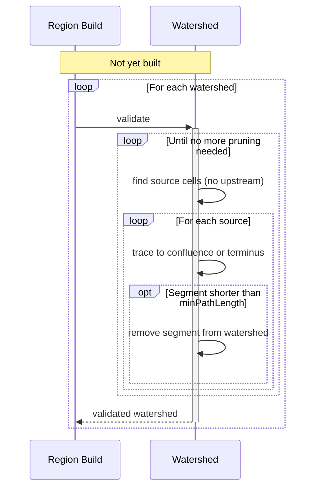
```mermaid
sequenceDiagram
    participant Build as Region Build
    participant Watershed

    Note over Build,Watershed: Not yet built

    loop For each watershed
        Build ->>+ Watershed: validate

        loop Until no more pruning needed
            Watershed ->> Watershed: find source cells (no upstream)
            loop For each source
                Watershed ->> Watershed: trace to confluence or terminus
                opt Segment shorter than minPathLength
                    Watershed ->> Watershed: remove segment from watershed
                end
            end
        end

        Watershed -->>- Build: validated watershed
    end
```

### Elevation Assignment

Elevation Assignment determines entryY and exitY for each cell in the watershed, ensuring water flows downhill with a minimum slope. Adjacent cells share boundary values (upstream's exitY = downstream's entryY). How the Y profile varies within the cell is feature-specific and handled during terrain shaping.

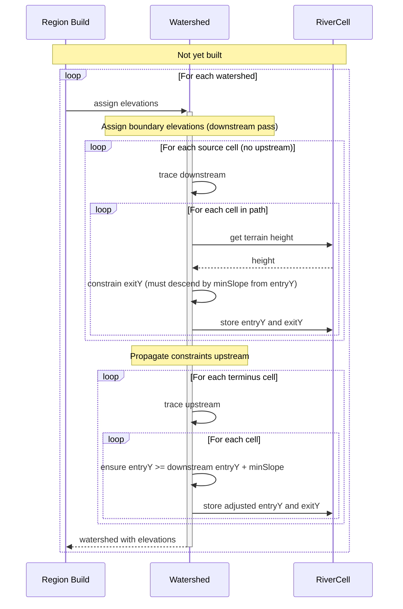
```mermaid
sequenceDiagram
    participant Build as Region Build
    participant Watershed
    participant RiverCell

    Note over Build,RiverCell: Not yet built

    loop For each watershed
        Build ->>+ Watershed: assign elevations

        Note over Watershed: Assign boundary elevations (downstream pass)
        loop For each source cell (no upstream)
            Watershed ->> Watershed: trace downstream
            loop For each cell in path
                Watershed ->> RiverCell: get terrain height
                RiverCell -->> Watershed: height
                Watershed ->> Watershed: constrain exitY (must descend by minSlope from entryY)
                Watershed ->> RiverCell: store entryY and exitY
            end
        end

        Note over Watershed: Propagate constraints upstream
        loop For each terminus cell
            Watershed ->> Watershed: trace upstream
            loop For each cell
                Watershed ->> Watershed: ensure entryY >= downstream entryY + minSlope
                Watershed ->> RiverCell: store adjusted entryY and exitY
            end
        end

        Watershed -->>- Build: watershed with elevations
    end
```

### Flow Accumulation

Flow Accumulation calculates the depth and width of the river at each cell based on upstream accumulation, and stores topology counts (upstream/downstream) for later feature classification. Upstream cell counts already exist on Watershed; width and depth do not.

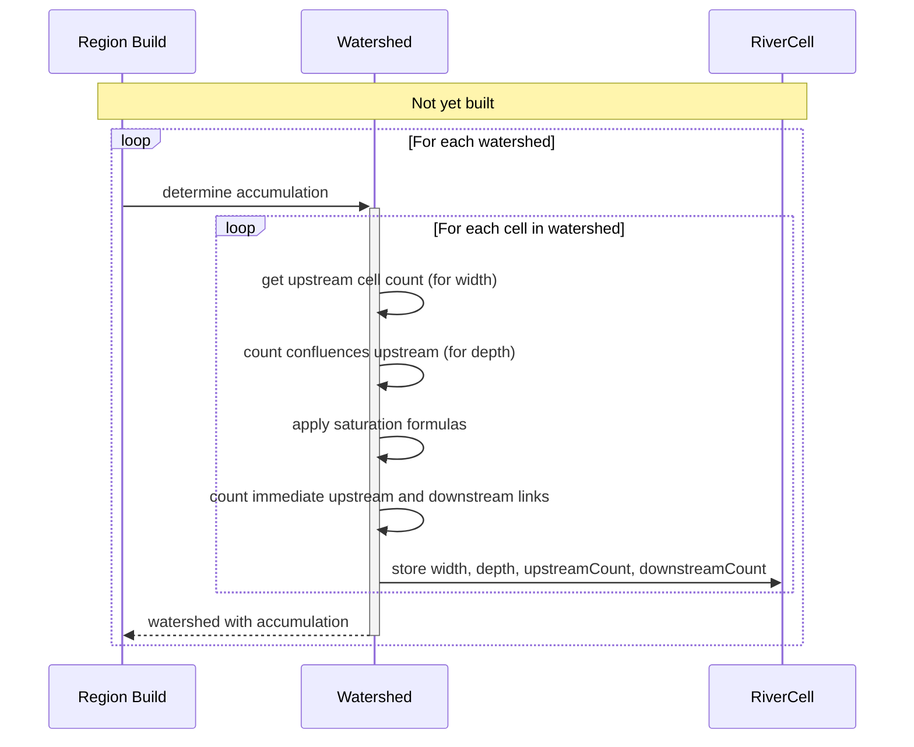
```mermaid
sequenceDiagram
    participant Build as Region Build
    participant Watershed
    participant RiverCell

    Note over Build,RiverCell: Not yet built

    loop For each watershed
        Build ->>+ Watershed: determine accumulation

        loop For each cell in watershed
            Watershed ->> Watershed: get upstream cell count (for width)
            Watershed ->> Watershed: count confluences upstream (for depth)
            Watershed ->> Watershed: apply saturation formulas
            Watershed ->> Watershed: count immediate upstream and downstream links
            Watershed ->> RiverCell: store width, depth, upstreamCount, downstreamCount
        end

        Watershed -->>- Build: watershed with accumulation
    end
```

### Feature Classification

Feature Classification evaluates all cells in a watershed now that the full river network is known. Cells are processed in topological order (sources to terminus) so upstream neighbors are always classified before downstream cells. This allows features like Plunge Pool to check their upstream neighbor's classification.

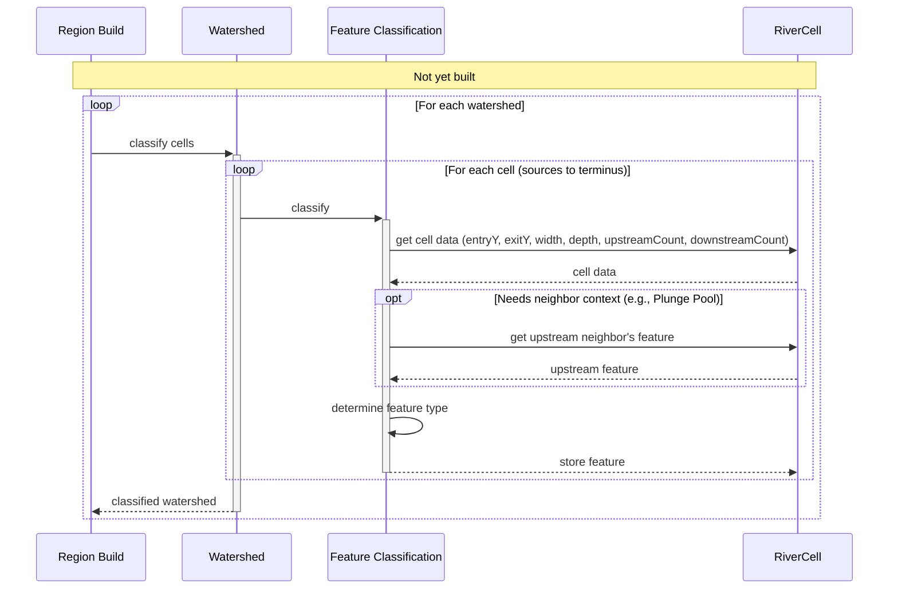
```mermaid
sequenceDiagram
    participant Build as Region Build
    participant Watershed
    participant Features as Feature Classification
    participant RiverCell

    Note over Build,RiverCell: Not yet built

    loop For each watershed
        Build ->>+ Watershed: classify cells

        loop For each cell (sources to terminus)
            Watershed ->>+ Features: classify
            Features ->> RiverCell: get cell data (entryY, exitY, width, depth, upstreamCount, downstreamCount)
            RiverCell -->> Features: cell data
            opt Needs neighbor context (e.g., Plunge Pool)
                Features ->> RiverCell: get upstream neighbor's feature
                RiverCell -->> Features: upstream feature
            end
            Features ->> Features: determine feature type
            Features -->>- RiverCell: store feature
        end

        Watershed -->>- Build: classified watershed
    end
```

### Spline Building

Spline Building generates smooth curves for river rendering by converting the cell-based watershed graph into continuous splines. Cells are processed in topological order (sources to terminus). Each cell's feature provides its Y profile function (Run interpolates linearly, Waterfall drops at waypoint, etc.), while XZ is interpolated via Catmull-Rom from waypoint to waypoint. Coarse sample points are generated and stored for distance lookups during terrain shaping. It does not carve.

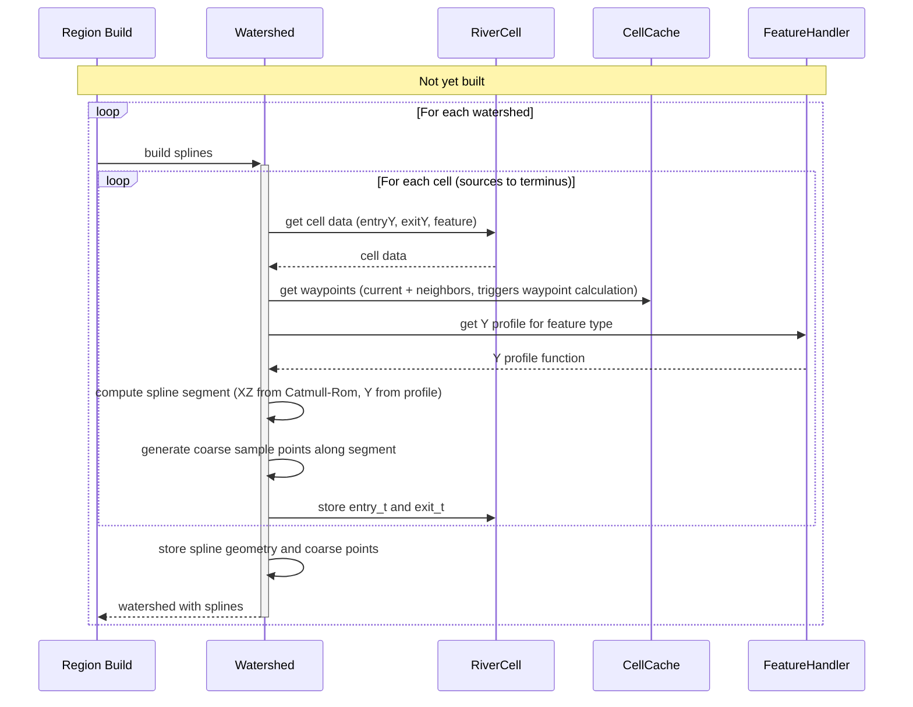
```mermaid
sequenceDiagram
    participant Build as Region Build
    participant Watershed
    participant RiverCell
    participant CellCache
    participant Features as FeatureHandler

    Note over Build,Features: Not yet built

    loop For each watershed
        Build ->>+ Watershed: build splines

        loop For each cell (sources to terminus)
            Watershed ->> RiverCell: get cell data (entryY, exitY, feature)
            RiverCell -->> Watershed: cell data
            Watershed ->> CellCache: get waypoints (current + neighbors, triggers waypoint calculation)
            Watershed ->> Features: get Y profile for feature type
            Features -->> Watershed: Y profile function
            Watershed ->> Watershed: compute spline segment (XZ from Catmull-Rom, Y from profile)
            Watershed ->> Watershed: generate coarse sample points along segment
            Watershed ->> RiverCell: store entry_t and exit_t
        end

        Watershed ->> Watershed: store spline geometry and coarse points

        Watershed -->>- Build: watershed with splines
    end
```

## Apply to Chunk

### Terrain Shaping

Terrain Shaping modifies chunk terrain to carve river channels based on watershed data. Each contributing cell's feature handler provides shaping opinions that are blended to produce the final terrain.

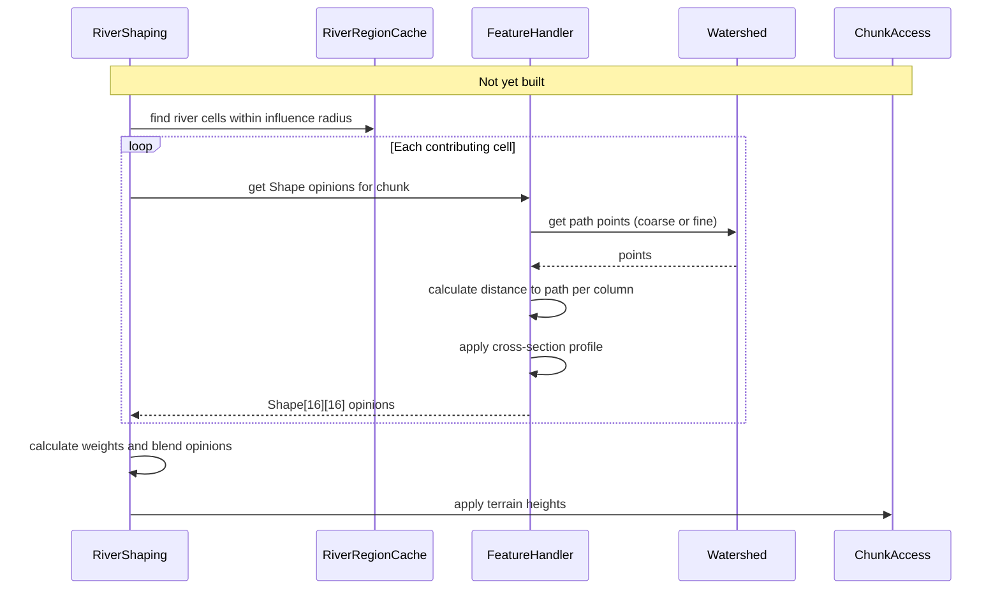
```mermaid
sequenceDiagram
    participant RiverShaping
    participant RiverRegionCache
    participant FeatureHandler
    participant Watershed
    participant ChunkAccess

    Note over RiverShaping,ChunkAccess: Not yet built

    RiverShaping ->> RiverRegionCache: find river cells within influence radius

    loop Each contributing cell
        RiverShaping ->> FeatureHandler: get Shape opinions for chunk
        FeatureHandler ->> Watershed: get path points (coarse or fine)
        Watershed -->> FeatureHandler: points
        FeatureHandler ->> FeatureHandler: calculate distance to path per column
        FeatureHandler ->> FeatureHandler: apply cross-section profile
        FeatureHandler -->> RiverShaping: Shape[16][16] opinions
    end

    RiverShaping ->> RiverShaping: calculate weights and blend opinions
    RiverShaping ->> ChunkAccess: apply terrain heights
```

### Biome Assignment

Biome Assignment replaces the original biome with a river biome where appropriate, so river areas get river noise. It uses the same Shape opinions collected during Terrain Shaping—each Shape has a `preserveBiome` flag, and weighted consensus determines the outcome. Which river biome is chosen is undecided.

```mermaid
sequenceDiagram
    participant RiverShaping
    participant ChunkAccess

    Note over RiverShaping,ChunkAccess: Not yet built

    Note over RiverShaping: Using Shape opinions from Terrain Shaping

    loop Each column with river influence
        RiverShaping ->> RiverShaping: check weighted consensus on preserveBiome
        opt Consensus favors changing
            RiverShaping ->> RiverShaping: choose river biome
            RiverShaping ->> ChunkAccess: apply river biome
        end
    end
```

### Water Placement

Water Placement fills carved river channels with water blocks at the appropriate Y levels. Like Terrain Shaping, it collects opinions from contributing cells' FeatureHandlers—each returns a Fill[16][16] grid with waterY, flowLevel, and flowDirection per column. Course features calculate Fill from the spline (using deltaY to determine flowing vs source blocks); lakes return constant waterY across their basin.

Flow direction is stored per column so the mixin can override Minecraft's flow calculation—this makes water visually and physically flow downstream even in source block troughs.

```mermaid
sequenceDiagram
    participant RiverShaping
    participant FeatureHandler
    participant Watershed
    participant ChunkAccess
    participant FlowDirectionCapability

    Note over RiverShaping,FlowDirectionCapability: Not yet built

    RiverShaping ->> RiverShaping: find river cells within influence radius

    loop Each contributing cell
        RiverShaping ->> FeatureHandler: get Fill opinions for chunk
        FeatureHandler ->> Watershed: get spline points (for courses)
        Watershed -->> FeatureHandler: points
        FeatureHandler ->> FeatureHandler: calculate waterY, flowLevel, flowDirection per column
        FeatureHandler -->> RiverShaping: Fill[16][16] opinions
    end

    RiverShaping ->> RiverShaping: blend Fill opinions

    loop Each column with Fill data
        RiverShaping ->> ChunkAccess: get terrainY
        ChunkAccess -->> RiverShaping: terrainY

        opt terrainY < waterY (room for water)
            RiverShaping ->> ChunkAccess: place water block (source or flowing per flowLevel)
            RiverShaping ->> FlowDirectionCapability: store flow direction for column
        end
    end
```

## Data Structures

Pseudocode definitions for the records implied by these diagrams. Fields and records marked `planned` do not exist yet.

```
enum RegionType { OCEANIC, COASTAL, FLUVIAL, INLAND }

enum FlowDirection { N, NE, E, SE, S, SW, W, NW, NONE }

enum BoundaryType { OCEAN, BASIN }

enum CellType { SOURCE, TERMINUS, JUNCTION, LAKE, COURSE, NONE }

enum Feature {
    // Sources
    SNOWMELT, RESURGENCE, SEEP, CRATER, SPRING,
    // Termini
    DELTA, ESTUARY, WETLAND, MOUTH,
    // Junctions
    CONFLUENCE, BIFURCATION, BRAID,
    // Lakes
    ENDORHEIC, KETTLE, SINKHOLE, LAGOON, TECTONIC,
    // Courses
    PLUNGE_POOL, WATERFALL, CASCADE, RAPIDS, RUN,
    // Fallback
    NONE
}

record Sample {
    continents: double
    terrainHeight: int
    isOcean: boolean
    erosion: double
    ridges: double
    temperature: double
    vegetation: double
}

record Cell {
    pos: CellPos
    samplePositions: Set<ChunkPos>       // height, ocean, and basin are derived from these samples
    flowDirections: List<FlowDirection>  // sorted by steepest drop
    feature: Feature                     // set by Preclassification: a source feature or NONE
    waypoint: BlockPos                   // planned: cell center + noise offset
}

record Region {
    pos: RegionPos
    type: RegionType
    boundaries: List<Boundary>
}

record Boundary {
    land: CellPos   // D4 adjacent to water
    water: CellPos
    type: BoundaryType
}

record PreparedRiverData {
    regions: Map<RegionPos, Region>
    cells: Map<CellPos, CellData>              // feature, flowDirections, height
    routing: Map<RegionPos, Routing>           // allowedRegions, termini, waterCells
    moves: Map<CellPos, List<Step>>            // legal steps in preference order
    incoming: Map<CellPos, List<CellPos>>      // predecessors
    sources: Map<RegionPos, List<CellPos>>
}

record Step {
    pos: CellPos
    nudgingRise: long     // blocks climbed by a nudge, 0 otherwise
    approaching: boolean  // false if the step moves away from the nearest terminus
}

record Flowline {
    cells: List<CellPos>  // ordered source to terminus
    terminus: CellPos?
    isValid: boolean
}

record Watershed {
    downstream: Map<CellPos, CellPos?>     // terminus maps to null
    upstream: Map<CellPos, Set<CellPos>>
    accumulation: Map<CellPos, int>        // upstream cell count
    cells: Map<CellPos, RiverCell>         // planned
    spline: List<SplinePoint>              // planned: coarse sample points
    splineGeometry: SplineCurve            // planned: Catmull-Rom curve data
}

record RiverCell {                // planned: Cell values plus watershed results
    pos: CellPos
    flowDirections: List<FlowDirection>
    height: int
    preclassified: Feature        // copied from Cell.feature

    // Set during Elevation Assignment
    entryY: int
    exitY: int

    // Set during Flow Accumulation
    width: int
    depth: int
    upstreamCount: int
    downstreamCount: int

    // Set during Feature Classification
    feature: Feature

    // Set during Spline Building
    entry_t: double
    exit_t: double
}

record SplinePoint {
    pos: BlockPos   // x, z from Catmull-Rom; y from profile(t, entryY, exitY)
    t: double       // normalized position along spline (0 = cell entry, 1 = cell exit)
}

record Shape {
    y: int                  // target terrain surface elevation
    weight: double          // confidence 0-1 for blending
    isRiverbed: boolean     // true if underwater channel
    preserveBiome: boolean  // if true, keep original biome
    point: SplinePoint      // nearest spline point (for weight calculation)
}

record Fill {
    waterY: int                     // water surface level
    flowLevel: Integer              // Minecraft water level 1-7 (null = source block)
    flowDirection: FlowDirection    // downstream direction for mixin override
    weight: double                  // confidence 0-1 for blending
}

interface FeatureHandler {
    // Classify whether this feature applies to a cell
    classify(cell: Cell, watershed: Watershed?): boolean

    // planned: Terrain shaping opinions for a chunk
    shape(cell: RiverCell, watershed: Watershed, chunkPos: ChunkPos): Shape[16][16]?

    // planned: Water placement opinions for a chunk
    fill(cell: RiverCell, watershed: Watershed, chunkPos: ChunkPos): Fill[16][16]?

    // planned: Y profile function for spline building (how Y varies from entryY to exitY)
    profile(t: double, entryY: int, exitY: int): int
}
```
