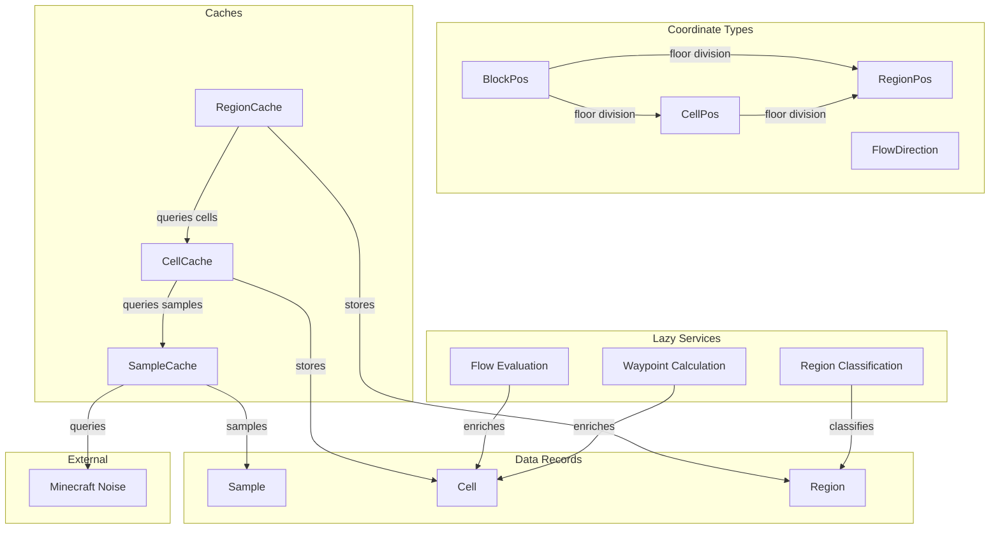
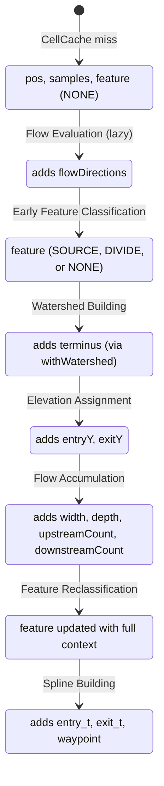

# Spatial Infrastructure

The data layer everything else builds on. Cells, Regions, Samples, and the caching strategy that makes river computation efficient.

## Overview

Spatial Infrastructure provides the coordinate systems and data structures that all other river systems depend on. It defines:

- **Coordinate types** for navigating cell-space and region-space
- **Data records** for storing terrain and river information
- **Caches** for efficient access to computed values
- **Lazy services** that compute expensive data on-demand

All river computation happens in cell-space, not block-space. Cells are the fundamental unit of river planning. Regions group cells into larger units for ocean boundary detection and region-type classification.

**Scope:** Data structures, coordinate systems, and caching. Classification logic, flow computation, and boundary detection happen here but are triggered by downstream consumers.

## Configuration

These parameters live in CommonConfig and control the spatial grid dimensions and sampling behavior.

| Parameter      | Type   | Default | Range       | Description                                                  |
| -------------- | ------ | ------- | ----------- | ------------------------------------------------------------ |
| CellSize       | int    | 3       | 1-8         | Chunks per side of a cell. Cell area = CellSize² chunks.     |
| RegionSize     | int    | 32      | 8-64        | Cells per side of a region. Region area = RegionSize² cells. |
| SamplesPerCell | int    | 1       | 1-CellSize² | Chunks to sample per cell. Higher = more accurate, slower.   |
| OceanThreshold | double | -0.17   | -1.0 to 0.0 | Continents value below which a sample is considered ocean.   |

**Derived values (not configurable):**

- Cell blocks = CellSize × 16
- Region blocks = RegionSize × CellSize × 16
- Chunks per cell = CellSize²
- Cells per region = RegionSize²

## Structure and Ownership



### SampleCache

**Purpose:** Caches terrain density samples from Minecraft's noise functions.

**Owns:**

- Noise function queries (continents, depth, erosion, ridges, temperature, vegetation)
- Two-tier sampling strategy (core fields vs. source classification fields)
- Chunk-level sample storage

**Does:**

- Queries Minecraft noise at chunk center on cache miss
- Returns Sample with core fields populated, source classification fields null
- Supports lazy enrichment via `Sample.withFullDensities()`

**Does not:**

- Aggregate samples across cells (that's CellCache's responsibility)
- Interpret sample values (that's consumers' responsibility)
- Know about regions or flow (that's upstream)

### CellCache

**Purpose:** Caches Cell objects with flow directions and feature classification.

**Owns:**

- Cell creation from position
- Sample position selection (greedy farthest-point algorithm)
- Flow direction computation (via Flow Evaluation)
- Cell enrichment lifecycle

**Does:**

- Computes sample positions on cache miss
- Fetches samples from SampleCache for selected positions
- Creates Cell with samples on cache miss
- Triggers Flow Evaluation when flow directions are first requested
- Stores enriched cells via `put()`

**Does not:**

- Classify features (that's Feature Classification in downstream specs)
- Know about regions (that's RegionCache)
- Compute waypoints until requested (that's lazy)

### RegionCache

**Purpose:** Caches Region objects with type classification.

**Owns:**

- Region creation and classification
- Ocean boundary identification for COASTAL regions
- D4 neighbor queries for FLUVIAL classification

**Does:**

- Creates skeleton Region on cache miss
- Classifies region type via Region Classification
- Identifies ocean boundaries for COASTAL regions
- Returns fully classified Region

**Does not:**

- Know about working sets (that's Region Discovery)
- Trace flowlines (that's Flowline Tracing)
- Build or store watersheds (that's Watershed Building)

## Grid Geometry

### Cell Grid

Cells are square areas in block-space, sized to balance river detail against computational cost.

| Property          | Default             | Rationale                                                                 |
| ----------------- | ------------------- | ------------------------------------------------------------------------- |
| CellSize          | 3 chunks per side   | 3×3 = 9 chunks; fine enough for meandering, coarse enough for performance |
| Cell blocks       | CellSize × 16       | 48 blocks at default; clean alignment with Minecraft's chunk grid         |
| Coordinate origin | World origin (0, 0) | CellPos(0, 0) contains BlockPos(0, y, 0)                                  |

CellSize is configurable (range 1-8 chunks per side).

### Sampling Strategy

Not every chunk in a cell needs to be sampled. SamplesPerCell controls the tradeoff between accuracy and performance.

| Property       | Default        | Rationale                                               |
| -------------- | -------------- | ------------------------------------------------------- |
| SamplesPerCell | 1              | Center only; fast default for most players              |
| Valid range    | 1 to CellSize² | More samples = more accurate, but sampling is expensive |

**Sample position selection** uses greedy farthest-point sampling:

```
selectSamplePositions(cellSize, samplesPerCell):
    center = (cellSize / 2, cellSize / 2)  // integer division
    selected = [center]

    while selected.size < samplesPerCell:
        bestPos = null
        bestMinDist = -1

        for each unselected chunk position (x, z):
            minDistToSelected = min(distance(x, z, s) for s in selected)
            if minDistToSelected > bestMinDist:
                bestMinDist = minDistToSelected
                bestPos = (x, z)

        selected.add(bestPos)

    return selected
```

This naturally produces well-distributed sample positions:

- N=1: center
- N=2: center + farthest corner
- N=3: center + 2 opposite corners
- N=5: center + 4 corners
- N=9: center + 4 corners + 4 edge midpoints (all chunks in a 3×3 cell)

Sample positions are computed once per cell and cached.

### Region Grid

Regions group cells for higher-level classification. Region type (OCEANIC, COASTAL, FLUVIAL, INLAND) determines whether river planning is needed.

| Property          | Default                    | Rationale                                                |
| ----------------- | -------------------------- | -------------------------------------------------------- |
| RegionSize        | 32 cells/side              | 32×32 = 1024 cells; large enough for meaningful drainage |
| Region blocks     | RegionSize × CellSize × 16 | 1536 blocks at default (96 chunks)                       |
| Coordinate origin | World origin               | RegionPos(0, 0) contains CellPos(0, 0)                   |

RegionSize is configurable (range 8-64 cells per side).

### Coordinate Conversions

```
cellBlocks = CellSize * 16
regionBlocks = RegionSize * cellBlocks

BlockPos → CellPos:   floor(blockX / cellBlocks), floor(blockZ / cellBlocks)
BlockPos → RegionPos: floor(blockX / regionBlocks), floor(blockZ / regionBlocks)
CellPos → RegionPos:  floor(cellX / RegionSize), floor(cellZ / RegionSize)

CellPos → BlockPos (southwest corner): cellX * cellBlocks, cellZ * cellBlocks
CellPos → BlockPos (center): cellX * cellBlocks + cellBlocks/2, cellZ * cellBlocks + cellBlocks/2
RegionPos → CellPos (southwest corner): regionX * RegionSize, regionZ * RegionSize
```

## Data Structures

### FlowDirection

```
enum FlowDirection {
    NORTH(0, -1), SOUTH(0, 1), EAST(1, 0), WEST(-1, 0),
    NORTHEAST(1, -1), NORTHWEST(-1, -1), SOUTHEAST(1, 1), SOUTHWEST(-1, 1),
    NONE(0, 0)

    dx: int                      // cell-space delta X
    dz: int                      // cell-space delta Z

    D4: FlowDirection[]          // cardinal directions (N, E, S, W)
    D8: FlowDirection[]          // all compass directions

    opposite(): FlowDirection
    rotateToward(target): FlowDirection  // rotates toward target direction
    static toward(from: CellPos, to: CellPos): FlowDirection  // D8 direction closest to target
}
```

### CellPos

```
record CellPos {
    x: int                       // cell X coordinate
    z: int                       // cell Z coordinate

    // Constructors
    CellPos(blockPos: BlockPos)  // floor division by cellSize
    CellPos(packed: long)        // unpack from 64-bit long

    // Coordinate operations
    toLong(): long               // pack for map keys
    relative(dir: FlowDirection): CellPos
    getRegion(): RegionPos

    // Block-space conversions
    getMinBlockX(): int          // southwest corner
    getMinBlockZ(): int
    getMaxBlockX(): int          // northeast corner
    getMaxBlockZ(): int
    getMiddleBlockX(): int       // center point
    getMiddleBlockZ(): int
    getMiddleBlockPosition(y: int): BlockPos
    contains(pos: BlockPos): boolean
}
```

### RegionPos

```
record RegionPos {
    x: int                       // region X coordinate
    z: int                       // region Z coordinate

    // Constructors
    RegionPos(blockPos: BlockPos)   // floor division by regionSize
    RegionPos(cellPos: CellPos)     // floor division by cellsPerRegion
    RegionPos(packed: long)         // unpack from 64-bit long

    // Coordinate operations
    toLong(): long
    relative(dir: FlowDirection): RegionPos
    contains(cell: CellPos): boolean
    contains(pos: BlockPos): boolean
    containsOutOfBoundsCells(): boolean  // true if any cell would be outside world limits

    // Cell-space conversions
    getMinCell(): CellPos        // southwest corner cell
    getMaxCell(): CellPos        // northeast corner cell
    getBorderCells(dir: FlowDirection): List<CellPos>  // cells along cardinal edge

    // Block-space conversions
    getMinBlockX(): int
    getMinBlockZ(): int
    getMaxBlockX(): int
    getMaxBlockZ(): int
    getMiddleBlockX(): int
    getMiddleBlockZ(): int
}
```

**getBorderCells algorithm:**

```
getBorderCells(edgeDirection):
    minCell = this.getMinCell()

    switch edgeDirection:
        NORTH:  return cells from (minCell.x, minCell.z) to (minCell.x + RegionSize - 1, minCell.z)
        SOUTH:  return cells from (minCell.x, minCell.z + RegionSize - 1) to (minCell.x + RegionSize - 1, minCell.z + RegionSize - 1)
        WEST:   return cells from (minCell.x, minCell.z) to (minCell.x, minCell.z + RegionSize - 1)
        EAST:   return cells from (minCell.x + RegionSize - 1, minCell.z) to (minCell.x + RegionSize - 1, minCell.z + RegionSize - 1)
        else:   error "Edge direction must be cardinal"
```

Returns exactly `RegionSize` cells along the specified edge. Only accepts cardinal directions (N/S/E/W).

### Sample

```
record Sample {
    chunkPos: ChunkPos            // which chunk this sample represents

    // Core fields (always sampled)
    continents: double            // land vs ocean (-1.0 to 1.0)
    depth: double                 // terrain height factor

    // Source classification fields (sampled on demand)
    erosion: double?              // terrain roughness factor
    ridges: double?               // ridge/valley pattern
    temperature: double?          // climate data
    vegetation: double?           // vegetation density

    // Computed properties
    isOcean(): boolean            // continents < oceanThreshold
    estimatedTerrainHeight(): int // 70 + 144 * depth

    // Enrichment
    hasFullDensities(): boolean
    withFullDensities(): Sample   // samples erosion, ridges, temperature, vegetation
}
```

**Two-tier sampling:** Core fields (continents, depth) are sampled on cache miss—sufficient for ocean detection and height estimation. Source classification fields are sampled lazily via `withFullDensities()` only when classifying river headwaters. This reduces sampling cost by ~2/3 for most cells.

### RegionType

```
enum RegionType {
    OCEANIC,    // all cells are ocean
    COASTAL,    // mix of land and ocean
    FLUVIAL,    // all land, D4-adjacent to COASTAL
    INLAND      // all land, not adjacent to COASTAL
}
```

**Classification rules:**

1. Count ocean cells in region
2. If all cells are ocean: OCEANIC
3. If some cells are ocean: COASTAL
4. If no ocean cells but D4-neighbor is COASTAL: FLUVIAL
5. Otherwise: INLAND

Rivers only flow in FLUVIAL and COASTAL regions. OCEANIC and INLAND regions early-exit from river processing.

### Boundary

```
record Boundary {
    cells: List<CellPos>         // ordered list of cells along the boundary
    type: BoundaryType           // OCEAN or BASIN
}

enum BoundaryType {
    OCEAN,   // boundary between land and ocean
    BASIN    // boundary around an internal drainage basin
}
```

Boundaries represent the edges where rivers terminate. A COASTAL region may have one or more OCEAN boundaries. A region with an internal lake may have BASIN boundaries.

**Note:** Boundary _identification_—how cells are detected and ordered—is defined in [[Boundary Identification]]. This record just stores the result.

### Region

```
record Region {
    pos: RegionPos
    type: RegionType
    boundaries: Set<Boundary>    // ocean boundaries for COASTAL; basin boundaries for COASTAL and FLUVIAL
    watersheds: Set<Watershed>   // watersheds whose terminus is in this region

    cells(): List<CellPos>       // computed on demand, not stored
}
```

### Cell

```
record Cell {
    pos: CellPos
    samples: Set<Sample>                 // sampled chunks (1 to CellSize² samples)
    flowDirections: List<FlowDirection>  // sorted by steepest descent
    feature: Feature

    // Lazy (computed on first access)
    waypoint: BlockPos                   // cell center + noise offset

    // Set during Elevation Assignment
    entryY: int
    exitY: int

    // Set during Flow Accumulation
    width: int
    depth: int
    upstreamCount: int
    downstreamCount: int

    // Set during Watershed Building
    terminus: CellPos                // lookup key for WatershedCache (null if not in a watershed)

    // Set during Spline Building
    entry_t: double
    exit_t: double

    // Computed from samples (core fields)
    averageContinents(): double          // average of samples' continents
    averageDepth(): double               // average of samples' depth
    averageEstimatedTerrainHeight(): int // 70 + 144 * averageDepth()
    isOcean(): boolean                   // true only if ALL samples are ocean
    isBasin(): boolean                   // true if below sea level but not ocean

    // Computed from samples (source classification fields, requires enriched samples)
    averageErosion(): double             // average of samples' erosion
    averageRidges(): double              // average of samples' ridges
    averageTemperature(): double         // average of samples' temperature
    averageVegetation(): double          // average of samples' vegetation

    // Mutation (returns new instance)
    withFlowDirections(flowDirections: List<FlowDirection>): Cell
    withFeature(feature: Feature): Cell
    withWaypoint(waypoint: BlockPos): Cell
    withWatershed(watershed: Watershed): Cell  // stores watershed.terminus as lookup key
    withElevations(entryY: int, exitY: int): Cell
    withAccumulation(width: int, depth: int, upstreamCount: int, downstreamCount: int): Cell
    withSplineParams(entry_t: double, exit_t: double): Cell
}
```

**Lifecycle:**



Waypoint is computed lazily on first access (typically during Spline Building).

Cell is a record—mutation returns new instances via `withFeature()`, `withElevations()`, etc.

**Note:** After Spline Building, cells are used by Terrain Shaping and Water Placement to generate Shape and Fill opinions for chunks. These phases read cell data but don't modify the Cell record.

**Computed property implementations:**

```
isOcean():
    for sample in samples:
        if not sample.isOcean():
            return false
    return true

isBasin():
    if isOcean():
        return false
    seaLevel = WorldSettings.get().seaLevel()
    for sample in samples:
        if sample.estimatedTerrainHeight() >= seaLevel:
            return false
    return true
```

Basin cells are valid river termini because Minecraft automatically fills terrain below sea level with water. Rivers ending at basin cells will naturally connect to the standing water Minecraft places there.

## Lazy Services

Three services compute expensive data on-demand and cache results.

### Waypoint Calculation

Waypoint = cell center + deterministic noise offset. The offset adds natural meandering to river paths.

**Trigger:** First request for a cell's waypoint (typically during Spline Building)

**Algorithm:**

```
offset_x = noise(worldSeed, cellPos) * (cellSize / 8)
offset_z = noise(worldSeed, cellPos, different_seed) * (cellSize / 8)
waypoint = BlockPos(cellCenterX + offset_x, 0, cellCenterZ + offset_z)
```

**Constraints:**

- Max offset is cellSize/8 in each direction
- Noise is seeded from world seed + cell position for determinism

**Note:** The waypoint is a 2D control point for Catmull-Rom curve generation. The Y value (0) is a placeholder and is not used. Actual river Y at any point along the spline is computed by the feature's `profile(t, entryY, exitY)` function using the cell's entry and exit elevations. The result is cached on the Cell.

### Flow Evaluation

Computes flow directions for a cell by comparing terrain height with D8 neighbors.

**Trigger:** First request for a cell's flow directions (typically during Region Discovery or Feature Classification)

**Algorithm:**

```
thisHeight = thisCell.averageEstimatedTerrainHeight()

for each neighbor in D8:
    neighborCell = CellCache.get().getOrCompute(neighbor)
    neighborHeight = neighborCell.averageEstimatedTerrainHeight()

    if neighborHeight < thisHeight:
        slope = thisHeight - neighborHeight
        record (direction, slope)

sort by slope (steepest first)
return sorted directions
```

**Result:** List of FlowDirection sorted by steepness (greatest height difference first). Empty list means local minimum (potential terminus).

### Region Classification

Determines a region's RegionType based on ocean cell distribution.

**Trigger:** First request for a region (typically during Region Discovery)

**Algorithm:**

```
oceanCount = 0
for each cellPos in region:
    cell = CellCache.get().getOrCompute(cellPos)
    if cell.isOcean():
        oceanCount++

if oceanCount == RegionSize²: return OCEANIC
if oceanCount > 0: return COASTAL

for each D4 neighbor region:
    neighbor = RegionCache.get().getOrCompute(neighborPos)
    if neighbor.type == COASTAL: return FLUVIAL

return INLAND
```

**Note:** A cell is ocean only if ALL its samples are ocean. FLUVIAL classification requires checking neighbors, which may trigger recursive region classification. The cache prevents infinite loops.

## Caching Strategy

All spatial data is accessed through caches that compute on miss and evict on memory pressure.

### Cache Architecture

```
┌─────────────────┐     ┌─────────────────┐     ┌─────────────────┐
│   RegionCache   │────▶│    CellCache    │────▶│   SampleCache   │
│                 │     │                 │     │                 │
└─────────────────┘     └─────────────────┘     └─────────────────┘
        │                       │                       │
        ▼                       ▼                       ▼
    Region                    Cell                   Sample
   (with type)         (with flow data)      (by ChunkPos key)
```

### Cache Interface

```
interface Cache<V> {
    get(): Cache<V>              // singleton accessor
    getOrCompute(x: int, z: int): V
    getIfPresent(pos): V?        // returns null on miss, no computation
    put(value: V): void          // for updating enriched values
    clear(): void
}
```

Caches are singletons accessed via `.get()`. Downstream consumers do not inject caches; they call `SampleCache.get().getOrCompute(...)` directly.

### SampleCache

Samples terrain density from Minecraft's noise functions. Caches by ChunkPos—one sample per chunk.

**Cache key:** `ChunkPos.toLong()`

**On cache miss:**

1. Query Minecraft's noise functions at chunk center
2. Sample core fields only (continents, depth)
3. Return Sample with `chunkPos` set, source classification fields null

Source classification fields are sampled lazily via `Sample.withFullDensities()` when needed.

**Capacity:** 1,000,000 entries

**Eviction:** LRU (least recently used)

### CellCache

The primary cache for river computation.

**Capacity:** 50,000 entries

**On cache miss:**

1. Compute sample positions using greedy farthest-point algorithm
2. Get Sample from SampleCache for each selected chunk position
3. Return new Cell (pos, samples, feature = NONE)

Flow directions, feature classification, and other enrichment happen lazily when requested.

**Eviction:** LRU

**Update pattern:** When Cell is enriched (flow directions, feature, elevation, etc.), call `put()` with the new Cell instance.

### RegionCache

Caches Region objects including type classification.

**Capacity:** 100 entries

**On cache miss:**

1. Create skeleton Region
2. Classify via Region Classification
3. If COASTAL, identify ocean boundaries
4. Return Region

**Eviction:** LRU

## Edge Cases

### Negative Coordinates

**Cause:** Minecraft allows negative X and Z coordinates.

**Detection:** `CellPos.x < 0` or `CellPos.z < 0`

**Response:** Floor division handles negatives correctly. CellPos(-1, -1) contains blocks from (-cellSize, -cellSize) to (-1, -1). No special handling needed.

### Chunk Boundaries

**Cause:** A chunk may overlap multiple cells when cell size doesn't divide chunk position evenly.

**Detection:** Chunk's block range spans multiple cells.

**Response:** When shaping a chunk, identify all cells that influence the chunk (cells within influence radius). Each column's terrain comes from blended contributions of overlapping cells.

### Region Boundaries

**Cause:** A cell at a region boundary may have flow directions pointing into adjacent regions.

**Detection:** `cell.flowDirections` contains direction pointing outside `cell.getRegion()`.

**Response:** Cell belongs to exactly one region (determined by floor division). Flowlines can cross region boundaries when tracing from FLUVIAL into COASTAL. The cell's region assignment doesn't change.

### World Boundaries

**Cause:** Positions near Minecraft's coordinate limits.

**Detection:** `RegionPos.containsOutOfBoundsCells()` returns true.

**Response:** Region Discovery skips out-of-bounds regions entirely. No samples or cells are created for positions outside world limits. See [[Region Discovery]] for boundary handling.

### Cache Eviction During Processing

**Cause:** Cache capacity exceeded during river pipeline execution.

**Detection:** Enriched cell retrieved from cache lacks expected data (e.g., flowDirections is null when it should be populated).

**Response:** If a Cell is evicted mid-pipeline, its enriched data is lost. Next access recomputes from scratch. Enrichment must be re-applied. Current cache sizes are tuned to prevent mid-pipeline eviction during normal chunk generation.

### Local Minimum (No Flow Directions)

**Cause:** Cell has no D8 neighbors with lower terrain height.

**Detection:** `cell.flowDirections.isEmpty()`

**Response:** Cell is a potential terminus (lake or internal basin). Feature Classification marks it appropriately. Flowline Tracing handles termination.

### FLUVIAL Classification Loop

**Cause:** Region Classification for FLUVIAL requires checking D4 neighbors, which may themselves need classification.

**Detection:** Recursive call to `RegionCache.get().getOrCompute()` during classification.

**Response:** Cache prevents infinite loops. First region to complete classification caches its result; subsequent queries hit the cache.

## Validation Criteria

### Unit Tests

| Test Case                          | Setup                                             | Expected Result                                        |
| ---------------------------------- | ------------------------------------------------- | ------------------------------------------------------ |
| CellPos round-trip                 | Create CellPos, convert to BlockPos, convert back | Same CellPos                                           |
| CellPos packing                    | Create CellPos, pack to long, unpack              | Same CellPos                                           |
| RegionPos containment              | Create RegionPos, iterate all cells               | Exactly RegionSize² cells return true for `contains()` |
| Negative coordinate floor          | CellPos from BlockPos(-1, y, -1)                  | CellPos(-1, -1) not CellPos(0, 0)                      |
| Border cells NORTH                 | Get border cells for NORTH edge                   | RegionSize cells, all with same Z (minCell.z)          |
| Border cells count                 | Get border cells for any cardinal direction       | Exactly RegionSize cells                               |
| Flow direction opposite            | NORTH.opposite()                                  | SOUTH                                                  |
| Flow direction D8                  | FlowDirection.D8                                  | Contains all 8 compass directions, excludes NONE       |
| Flow direction rotateToward        | NORTH.rotateToward(EAST)                          | NORTHEAST or EAST (rotates toward target)              |
| Flow direction toward              | FlowDirection.toward(CellPos(0,0), CellPos(1,1))  | SOUTHEAST (D8 direction closest to target)             |
| Sample ocean detection             | Sample with continents < threshold                | isOcean() returns true                                 |
| Sample enrichment                  | Sample.withFullDensities()                        | All source classification fields populated             |
| Cell mutation                      | cell.withFeature(RIVER)                           | New Cell with updated feature, original unchanged      |
| Region type OCEANIC                | Region with 100% ocean cells                      | type == OCEANIC                                        |
| Region type COASTAL                | Region with 50% ocean cells                       | type == COASTAL                                        |
| Region type FLUVIAL                | All-land region D4-adjacent to COASTAL            | type == FLUVIAL                                        |
| Region type INLAND                 | All-land region with no COASTAL neighbors         | type == INLAND                                         |
| Sample positions N=1               | selectSamplePositions(3, 1)                       | Center only: [(1,1)]                                   |
| Sample positions N=5               | selectSamplePositions(3, 5)                       | Center + 4 corners                                     |
| Sample positions N=9               | selectSamplePositions(3, 9)                       | All 9 chunks                                           |
| Cell.isOcean all ocean             | Cell with 5 samples, all ocean                    | isOcean() returns true                                 |
| Cell.isOcean mixed                 | Cell with 5 samples, 4 ocean + 1 land             | isOcean() returns false                                |
| Cell.averageEstimatedTerrainHeight | Cell with samples at depths 0.5, 0.6, 0.7         | Average of (70+72), (70+86.4), (70+100.8)              |
| Flow evaluation downhill           | Cell at height 100, neighbor at height 80         | Neighbor direction in flowDirections                   |
| Flow evaluation uphill             | Cell at height 80, neighbor at height 100         | Neighbor direction NOT in flowDirections               |

### Diagnostic Commands

All <x> <z> values represent a worldX, worldZ block position.

| Command                     | Output                                         | Purpose                |
| --------------------------- | ---------------------------------------------- | ---------------------- |
| `/rivertale metrics`        | Cache sizes, hit ratios, average compute times | Performance monitoring |
| `/rivertale sample <x> <z>` | Sample values at position                      | Verify noise sampling  |
| `/rivertale cell <x> <z>`   | Cell details including flow directions         | Debug cell state       |
| `/rivertale region <x> <z>` | Region type and ocean cell count               | Debug classification   |
| `/rivertale vis flow`       | Particle arrows showing flow directions        | Visual verification    |
| `/rivertale vis regions`    | Color-coded region types                       | Visual verification    |

### Performance Verification

**Metrics to observe:**

- Cache hit ratios (SampleCache, CellCache, RegionCache)
- Cache sizes and eviction counts
- Average compute times per cache miss

**Expected patterns:**

- SampleCache: High hit ratio (samples reused across cells)
- CellCache: High hit ratio (cells reused across chunks)
- RegionCache: High hit ratio (regions are large, many chunks share a region)

Low hit ratios suggest eviction issues or access pattern problems. Compare across builds to detect regressions.

## Key Decisions

| Decision                                  | Choice                                            | Rationale                                                                               |
| ----------------------------------------- | ------------------------------------------------- | --------------------------------------------------------------------------------------- |
| CellSize in chunks                        | 3 chunks per side (default)                       | Clean alignment with Minecraft chunks. Configurable for performance tuning.             |
| RegionSize in cells                       | 32 cells per side (default)                       | Large enough for meaningful drainage, small enough for reasonable classification cost.  |
| SamplesPerCell                            | 1 (default), configurable 1 to CellSize²          | Performance tuning: more samples = more accurate but slower. Default is fast.           |
| Greedy farthest-point sampling            | Select samples that maximize spatial coverage     | Simple algorithm, good distribution for any N. Always includes center.                  |
| Cell.isOcean()                            | All samples must be ocean                         | Conservative: any land sample means the cell has land. Important for river termination. |
| Flow comparison metric                    | averageEstimatedTerrainHeight()                   | Terrain height (Y coordinate) is physically meaningful. Water flows downhill.           |
| Two-tier sampling                         | Core fields on miss, classification fields lazy   | Most cells never need full samples. Reduces sampling cost by ~2/3.                      |
| Cell as immutable record                  | Mutation returns new instances                    | Thread-safe enrichment. Cache update via explicit `put()`.                              |
| Singleton caches                          | `Cache.get().getOrCompute()`                      | No DI complexity. Caches are global resources with well-defined lifecycles.             |
| LRU eviction                              | Evict least recently used                         | Simple, effective. Spatial locality means recently used data is likely needed again.    |
| Flow directions as list                   | Sorted by steepness                               | Primary flow is steepest. Secondary flows enable branching/alternative paths.           |
| D8 for cell flow, D4 for region traversal | Cells flow diagonally, regions connect cardinally | Rivers meander within regions but cross boundaries cleanly.                             |
| Lazy waypoint computation                 | Computed on first access                          | Most cells never need waypoints. Only river cells use them.                             |
| WatershedCache keyed by terminus          | `WatershedCache.get().getOrCompute(terminus)`     | Watersheds are first-class entities used throughout shaping. Cells store terminus via `withWatershed()` for lookup. |
