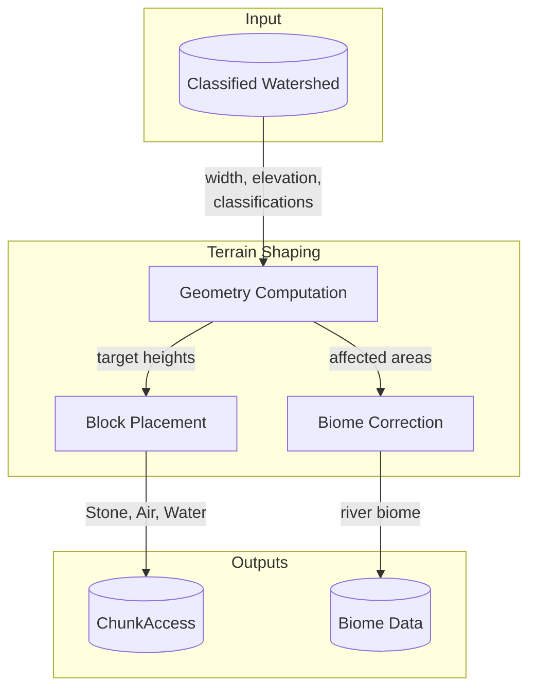

Terrain Shaping transforms the classified watershed from Network Planning into physical terrain. It places Stone, Air, and Water blocks to create river channels, valleys, and embankments, then corrects biomes to match the new river locations.

## System Diagram

All subsystems run during Minecraft's noise generation phase.

## Subsystems

### Geometry Computation

Translates classified watershed data into target terrain geometry. Each classification produces a characteristic shape—target solid surface heights, water surface level, and which columns are affected.

**Owns:**

- Shaping strategies for each feature classification
- Target surface computation

**Does not:**

- Place blocks
- Access chunk data directly
- Assign biomes

**Outputs:**

- Target geometry (solid surface heights, water surface level, affected area)

### Block Placement

Modifies chunk blocks to match computed geometry. Places Stone where terrain needs to rise, Air where terrain needs to lower, and Water from riverbed up to water surface level.

**Owns:**

- Block modification logic
- Material selection (Stone for fill, Air for carve, Water for rivers)

**Does not:**

- Compute what the terrain should look like
- Assign biomes
- Run surface rules (those run after, applied by Minecraft)

**Outputs:**

- Modified chunk blocks

### Biome Correction

Assigns appropriate river biome to shaped terrain. Identifies which areas were shaped as rivers and selects biome based on feature classification.

**Owns:**

- Biome assignment for river areas

**Does not:**

- Modify blocks
- Compute geometry

**Outputs:**

- Corrected biome assignments

## Key Decisions

| Decision | Choice | Rationale |
|----------|--------|-----------|
| All shaping during noise phase | Single injection point | Terrain exists when we modify; surface rules run after and decorate our changes |
| Single pass for Stone/Air/Water | Place all block types together | Matches Minecraft's approach for rivers and oceans |
| Biome from classification | Select biome based on feature classification | Classifications already encode river type; reuse that information |
| Stone for embankments | Use Stone when filling | Surface rules only decorate stone; other blocks would look wrong |
| Air for carving | Remove blocks above target | Creates channels and valleys that surface rules will finish |

## Integration Points

**Depends on:**

- Network Planning: Classified watershed with segment data (width, elevation, classifications)
- Minecraft chunk generation: Mixin injection point during noise phase

**Provides to:**

- ChunkAccess: Modified terrain blocks (Stone, Air, Water)
- Biome data: Corrected biome assignments for river areas
- Debug rendering: Visualization of shaped areas

**Potential conflicts:**

- Must run after noise generation but before surface rules
- Chunk boundaries don't align with river segments; geometry must handle partial coverage

## Emergent Behaviors

**Surface decoration:** Minecraft's surface rules run after block placement, automatically decorating our modifications with appropriate materials (grass on banks, sand in deserts, snow in cold biomes).

**Terrain integration:** Rivers carve into existing terrain rather than replacing it, preserving the character of the landscape while adding river features.

**Determinism:** All computation derives from the classified watershed, which derives from world seed. Same seed produces identical river terrain regardless of exploration order.
