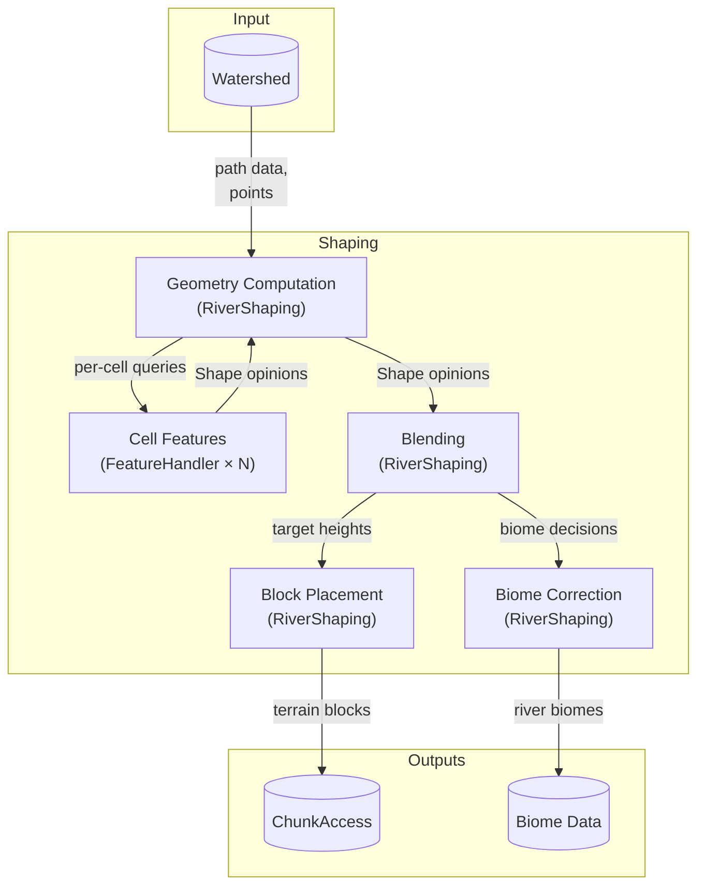
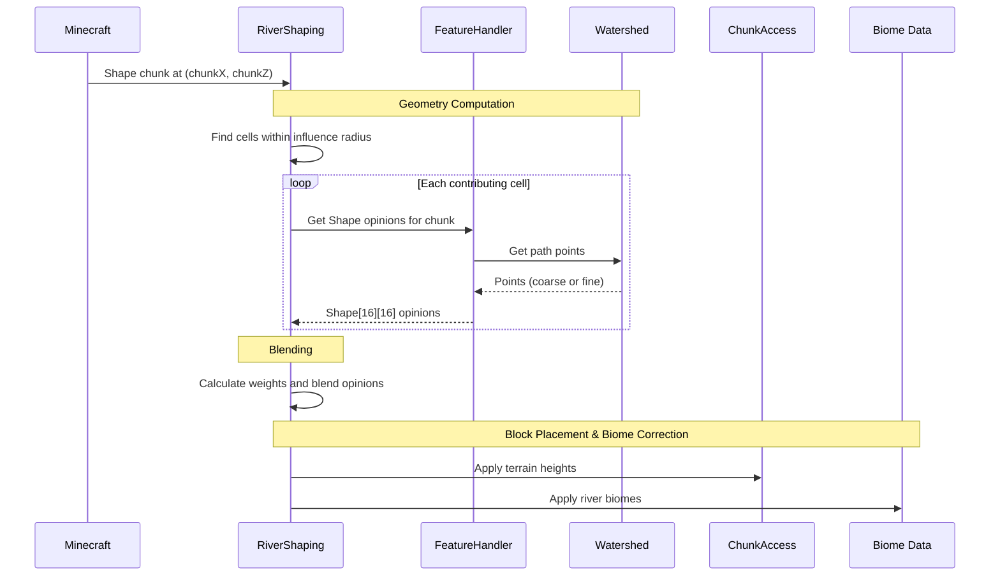

# Catmull-Rom Terrain Shaping — Design

## Overview

This system shapes terrain to form river channels using Catmull-Rom splines. It replaces the current two-segment path system, which creates hard corners at cell centers and has complex cross-segment logic.

The system takes river path data from the Watershed and produces terrain height opinions for each column in a chunk. Multiple cells contribute opinions; RiverShaping blends them into final terrain.

**Scope:** Terrain shaping only. Water placement and flow level calculation are separate concerns handled elsewhere.

## Codebase Context

The current shaping code (AbstractCourseHandler and related classes) is deprecated. This design describes a complete replacement, not a modification.

Upstream of shaping, the Watershed already stores river paths as sequences of CellPos with upstream/downstream links. This data is valid and unchanged. The shaping system consumes it.

Downstream of shaping, RiverShaping already implements the conceptual blending architecture—collecting opinions from multiple cells and combining them. The blending logic needs adjustment to own weight calculation, but the structure exists.

## Structure and Ownership



### Watershed

**Purpose:** Stores river topology and provides path geometry for shaping.

**Owns:**
- River path as CellPos sequences with upstream/downstream links
- Catmull-Rom spline geometry (computed at init from path data)
- Coarse path points (every 8-16 blocks along spline)
- Per-cell t-ranges (which portion of the spline each cell owns)

**Does:**
- Computes Catmull-Rom spline from cell center waypoints at initialization
- Generates and stores coarse points for distant-cell lookups
- Provides neighbor cell data for local spline computation

**Does not:**
- Calculate terrain heights (that's FeatureHandler)
- Decide how to blend opinions (that's RiverShaping)
- Store fine-grained points (computed on-the-fly by handlers)

### FeatureHandler

**Purpose:** Computes terrain shaping opinions for a single cell.

**Owns:**
- Y profile function (how bank elevation changes along the path)
- Cross-section profile calculation (how terrain slopes from centerline)
- Biome decision for columns within its influence (preserve original or assign river biome)

**Does:**
- Generates fine path points (block-by-block) for its cell
- Calculates perpendicular distance from each column to the path
- Applies the appropriate cross-section profile (steep or flat banks)
- Decides whether each column should preserve its biome or receive a river biome
- Returns Shape opinions for each column in the queried chunk

**Does not:**
- Own the spline geometry (that's Watershed)
- Calculate blending weights (that's RiverShaping)
- Decide final terrain heights or apply final biomes (that's RiverShaping after blending)

### RiverShaping

**Purpose:** Collects opinions from all contributing cells and blends them into final terrain.

**Owns:**
- Weight calculation formula
- Blending algorithm
- Final terrain height decisions
- Biome correction (applying the winning biome decision)

**Does:**
- Identifies all cells within influence radius of a chunk
- Collects Shape opinions from each cell's handler
- Calculates weight for each opinion based on distance from waypoint to column
- Blends opinions into final terrain heights
- Resolves biome decisions across contributing cells and applies corrections
- Handles transitions between river and vanilla terrain

**Does not:**
- Compute individual cell opinions (that's FeatureHandler)
- Own path geometry (that's Watershed)

## Data Flow

For each chunk being shaped:

1. **Geometry Computation:** RiverShaping identifies all river cells within influence radius (configurable `smoothingRadius`, default 6 cells; replaces `embankmentRadius` which was in blocks). For each contributing cell, FeatureHandler retrieves path data from Watershed and calculates Shape opinions for each column.
2. **Blending:** RiverShaping collects all opinions, calculates weights, and blends them into target geometry.
3. **Block Placement:** Target heights are applied to ChunkAccess as terrain blocks.
4. **Biome Correction:** Biome decisions are resolved and applied to Biome Data.



## Data Structures

### Point

Represents a point along the Catmull-Rom spline.

**Contains:**
- BlockPos — position on the path, where x/z are world coordinates and y is the bank peak elevation (riverY)
- t (double) — normalized position along path (0 = cell entry, 1 = cell exit)

The BlockPos.y() is `floor(entryY + t * (exitY - entryY))` — linear interpolation between the cell's entry and exit elevations. Adjacent cells share boundary elevations: upstream cell's exitY equals current cell's entryY.

**t-value boundaries:**
- t=0 is at the cell's entry boundary (where the path enters the cell)
- t=0.5 is approximately at the waypoint
- t=1 is at the cell's exit boundary (where the path exits the cell)

The boundary between adjacent cells is on the spline, not at a fixed grid position. Both cells compute the same Catmull-Rom spline from the same waypoints, so they agree on where t=1 of cell N equals t=0 of cell N+1. No overlap, no gap.

**Invariants:**
- Points are ordered by increasing t
- Adjacent points are spaced consistently (8-16 blocks for coarse, 1 block for fine)

### Shape

An opinion about what terrain should look like at a single column.

**Contains:**
- y — target terrain surface elevation
- isRiverbed — whether this column is underwater channel
- waterY — water surface level (nullable, not used in terrain-only pass)
- flowLevel — flow state (nullable, not used in terrain-only pass)
- flowDirection — downstream direction (nullable, not used in terrain-only pass)
- preserveBiome — whether to preserve original biome (feature-specific decision; typically false for riverbeds, true for banks)
- point — the nearest Point used for this opinion (provides weight calculation and path context)

**Invariants:**
- Every Shape has a point (required for weight calculation)
- y is always set (cells have an opinion on every column in their influence range)

**Note:** waterY, flowLevel, and flowDirection are legacy fields from the deprecated system. They are not populated in the terrain-only pass and may be removed entirely if Flow moves to its own step separate from Shaping.

## Algorithms

### Catmull-Rom Spline Generation

The watershed stores river paths as CellPos sequences. Each cell has a **waypoint** — the cell center offset by deterministic noise for meandering. A Catmull-Rom spline through these waypoints produces smooth curves.

**Waypoint calculation:** Waypoint = cell center + noise offset. The offset uses deterministic noise seeded with world seed and cell position. Maximum offset is `cellSize / 8` — this scales with cell size so smaller cells don't get absurd meanders, and waypoints never get dangerously close (minimum cell size is 16 blocks, so minimum separation after worst-case offsets is still 12 blocks).

**Spline formula:** Standard centripetal Catmull-Rom (alpha = 0.5). Given four consecutive waypoints P0, P1, P2, P3, the spline segment between P1 and P2 is computed using the standard Catmull-Rom interpolation formula.

**Endpoint handling:** Rivers have sources (no upstream waypoint) and mouths (no downstream waypoint). Create phantom waypoints by reflection:
- Source: P_{-1} = 2·P_0 - P_1 (extends the tangent direction backward)
- Mouth: P_{n+1} = 2·P_n - P_{n-1} (extends the tangent direction forward)

### Point Generation

**Coarse points** (stored on Watershed): Every 8-16 blocks along the entire spline. Generated at Watershed initialization. Used for distance lookups from distant cells where precision doesn't matter.

**Fine points** (computed on-the-fly): Block-by-block points for the current cell and its 8 adjacent neighbors (the 3×3 grid). Computed per-chunk as needed. Used where precision matters — these cells have high blending weight. Cells beyond the 3×3 use coarse points; their weight is already ~0.33 or less, so approximate distances are acceptable.

**Tangent derivation:** Tangent at point i is derived from adjacent points: `tangent = normalize(point[i+1].pos - point[i-1].pos)`. At endpoints, use one-sided difference.

### Distance to Path

For each column position, find the perpendicular distance to the path:

1. Find the nearest point to the column position
2. Get the tangent direction at that point
3. Calculate the signed perpendicular distance using that tangent
4. The parallel component (distance along the path) is used only for t-value lookup, not for profile calculation

**Critical:** The perpendicular distance must be calculated consistently regardless of which cell computes it. This is guaranteed because:
- Same waypoints (from Watershed)
- Same spline formula (Catmull-Rom with alpha = 0.5)
- Same sampling algorithm
- Deterministic math

### Cross-Section Profile Application

The profile determines how terrain slopes from the river centerline outward. Two profile types exist, selected based on surrounding terrain:

**Steep banks** (when vanilla terrain is elevated above riverY + 1):
```
n = width / depth
y = depth * ((2 * |x| / width)^n - 1)
```
Creates canyon-like walls with flatter bottom. Used when carving into hillsides.

**Flat banks** (when vanilla terrain is at or below riverY + 1):
```
if |x| > width / 2: return 0
p = 0.3 * width / depth
y = -depth/2 * (1 + cos(pi * (2 * |x| / width)^p))
```
Creates gentler U-shaped channel. Used in flat or low-lying areas.

**Reference point:** riverY is the bank peak elevation (where surrounding terrain should be). The river carves DOWN from there.

**Key behaviors:**

*Steep banks (vanillaY > riverY):*
- At x=0 (centerline): y = -depth (full depth below bank)
- At x=±width/2 (edge): y = 0 (bank level)
- Beyond width/2: the power curve continues rising, creating walls that naturally meet the hillside
- Once profileY >= vanillaY, vanilla takes over: `y = min(riverY + profileOffset, vanillaY)`

*Flat banks (vanillaY <= riverY):*
- At x=0 (centerline): y = -depth (full depth, same as steep banks)
- At x=±width/2 (edge): y = 0 (bank level, which may be above vanilla)
- Beyond width/2: profile returns 0 (bank level); vanilla blending handles the transition back down to vanilla terrain

**Rounding:** Always use floor(). No conditional rounding.

### Y Profile (Per-Feature)

Each feature type defines how bank elevation changes along the path. The default (Run) uses linear interpolation:

```
riverY = floor(entryY + t * (exitY - entryY))
```

Other feature types override this. Waterfalls have sharp drops. Rapids have steps. The profile function signature is `profileY(t, entryY, exitY) -> riverY`.

### Dynamic Width and Depth

Width and depth scale based on upstream accumulation using saturation curves:

```
width = maxWidth * upstreamCells / (upstreamCells + kWidth)
depth = maxDepth * upstreamTributaries / (upstreamTributaries + kDepth)
```

Where:
- upstreamCells = total cells upstream of this point
- upstreamTributaries = number of merging rivers (confluences), not total cells
- maxWidth, maxDepth, kWidth, kDepth are configuration values

**Defaults:**
- maxWidth = 40 (maximum river width in blocks)
- maxDepth = 16 (maximum river depth in blocks)
- kWidth = 15 (half-saturation for width — at 15 upstream cells, width = maxWidth/2)
- kDepth = 2 (half-saturation for depth — at 2 tributaries, depth = maxDepth/2)

### Weight Calculation

Each cell calculates its weight for a given column based on distance to its nearest point:

```
weight = 1 / (1 + d / cellSize)
```

Where d is the Euclidean distance from the column to a path point.

If multiple points are equidistant (or nearly so) — such as at a tight river bend where a column is equally close to upstream and downstream legs — the cell averages them internally before returning a single opinion. One opinion per cell per column keeps the model simple.

This means:
- Columns close to a cell's path get high weight from that cell
- Columns far from the path get low weight
- At confluences, both tributaries have nearby points, so both contribute with similar weights — natural blending
- Fine points (for nearby cells) give precise weights; coarse points (for distant cells) give approximate weights, which is acceptable since distant cells have low weight anyway

**Important distinction:**
- Distance to point (for weight): Euclidean distance from column to nearest point on this cell's path
- Perpendicular distance to path (for profile): used to determine cross-section offset for terrain height calculation

| Distance to nearest point | Weight |
|----------------------------|--------|
| 0 (on the path) | 1.0 |
| 0.5 cells | ~0.67 |
| 1 cell | 0.5 |
| 2 cells | 0.33 |
| smoothingRadius (default 6) | ~0.14 |

### Blending

For each column, RiverShaping collects all Shape opinions and blends them:

**Riverbed blending:** Uses power-weighted average (weight cubed) to give closer cells sharper control. This ensures water containment—the closest cell's opinion dominates.

**Embankment blending:** Uses standard weighted average. Smoother transitions are acceptable for banks.

**Vanilla blending:** Vanilla terrain participates as an implicit opinion in the blend. Its weight is `max(0, 1 - totalRiverWeight)` where `totalRiverWeight` is the sum of all river cell weights for that column. When river cells have strong influence, vanilla has no say. At the edges of influence, vanilla fills the gap. This means cells don't need to lerp toward vanilla — they just compute their profile, and RiverShaping handles the transition automatically.

*Note: This approach needs validation during implementation to confirm smooth transitions.*

### Biome Correction

After terrain blending, RiverShaping resolves biome decisions for each column:

1. Collect all `preserveBiome` opinions from contributing cells
2. Apply the same weighting used for terrain blending
3. If weighted consensus favors changing the biome, assign river biome based on the dominant cell's feature classification
4. If weighted consensus favors preserving, leave the original biome

The feature classification determines which river biome to assign (standard river, frozen river, etc.). Each cell has a feature classification (~24 types across several categories: Course types like Run/Rapids/Waterfall, Lake types, Source types, Terminus types, Junction types, and None). Course and Lake features extend Run and inherit its behavior until their individual implementations are defined. Source, Terminus, Junction, and None features have their own distinct behavior. Feature-specific biome selection is future work.

## Edge Cases and Failure Modes

### No Contributing Cells

**Cause:** Chunk is outside influence radius of all river cells.

**Detection:** Cell list is empty after filtering.

**Response:** Return null/no-op. Vanilla terrain is unchanged.

### Single Cell Contribution

**Cause:** Chunk is only within influence radius of one cell.

**Detection:** Only one Shape array returned.

**Response:** Use that cell's opinion with distance-based vanilla blending at edges. No multi-cell blending needed.

### Confluence (Multiple Rivers Meet)

**Cause:** Two or more rivers merge at a cell.

**Detection:** Cell has multiple upstream links (handled during path calculation, not shaping).

**Response:** Both tributaries produce points in the confluence area. Each cell calculates its weight based on distance to its own nearest point. Since both paths are nearby, both cells contribute opinions with similar weights. The blending model combines them naturally — no special confluence logic needed. The smooth merge emerges from the weight-based blending.

### Source Cell (No Upstream)

**Cause:** River originates at this cell.

**Detection:** No upstream link in Watershed.

**Response:** Phantom waypoint by reflection extends the spline naturally. The source feature handler may have special Y profile behavior.

### Mouth Cell (No Downstream)

**Cause:** River terminates at this cell (ocean/lake).

**Detection:** No downstream link in Watershed.

**Response:** Phantom waypoint by reflection extends the spline. The mouth feature handler manages terrain taper toward the target water body.

### Column Outside River Width

**Cause:** Column is beyond width/2 from the path centerline.

**Detection:** Perpendicular distance > width/2.

**Response:** For steep banks (elevated terrain), the profile formula continues to apply — it produces walls that naturally meet the terrain. For flat banks (low terrain), the profile returns 0 (bank level = riverY). In both cases, vanilla blending handles the transition: the cell's weight decreases with distance, and vanilla terrain fills the gap via `vanillaWeight = max(0, 1 - totalRiverWeight)`.

### Steep/Flat Bank Boundary

**Cause:** Terrain transitions from elevated to flat along the river.

**Detection:** vanillaY crosses riverY + 1 threshold.

**Response:** Profile type switches between steep and flat. The transition happens per-column based on local vanilla terrain. Adjacent columns have similar vanillaY values (terrain is smooth), so they typically use the same profile. Where terrain *actually* transitions (hillside to plain), the profile change matches the terrain change — this is intentional. If discontinuities appear in practice, they indicate upstream issues in Network Planning or can be addressed during implementation.

## Validation Criteria

**Curve smoothness:** Rivers have no visible hard corners. Curves are visually smooth through cell boundaries.

**Cross-section consistency:** The river channel has consistent U-shape or canyon-shape along its length. No bowl-shaped depressions at cell centers.

**Boundary continuity:** No visible discontinuities at cell boundaries. Adjacent cells produce identical geometry at shared edges.

**Water containment:** Terrain always rises to contain water. No leaks at banks or transitions.

**Confluence smoothness:** Where rivers meet, terrain blends naturally. No sharp ridges or artifacts.

**Meandering appearance:** Straight stretches of river have subtle curves from waypoint offsets. Rivers don't look artificially straight.

**Profile consistency:** Steep banks appear in elevated terrain; flat banks appear in low-lying terrain. The transition looks natural.

## Key Decisions

| Decision | Choice | Rationale |
|----------|--------|-----------|
| Spline type | Catmull-Rom (alpha=0.5) | Waypoints are on the curve. Tangents are automatic. Determinism is built in. No control point coordination needed. |
| Sampling strategy | Two-tier (coarse stored, fine computed) | Close cells need precision; distant cells don't. Saves memory without sacrificing quality where it matters. |
| Weight ownership | RiverShaping, not handlers | Consistent weight calculation. Handlers return opinions; orchestrator decides trust levels. |
| Weight formula | 1 / (1 + d / cellSize) | Smooth falloff. Nearby cells dominate. Distant cells contribute but don't override. |
| Riverbed vs embankment blending | Power-weighted (w³) vs linear | Riverbeds need sharp control for water containment. Banks can transition more gradually. |
| Profile reference point | Bank peak (riverY) | River carves down from bank level. Fixes "levees on flat terrain" problem from previous approach. |
| Meandering | Deterministic waypoint offset | Creates natural curves even in straight cell sequences. Reproducible from world seed. |
| Endpoint handling | Phantom waypoint by reflection | Extends tangent direction naturally. No special-case spline math at sources/mouths. |

## Outstanding Questions

The following questions were raised during design review and require resolution before this document is complete.

### Architectural Boundary: Watershed Needs Its Own Design

This document currently describes Watershed's responsibilities (spline computation, point generation, entry/exit Y calculation) without fully specifying how Watershed accomplishes them. During review, it became clear that Watershed is complex enough to warrant its own design document. Key Watershed concerns that bleed into this document:

- How are entry/exit Y values calculated? They depend on feature types (Runs are flat; Waterfalls drop at the waypoint), but the logic isn't specified here.
- How does Watershed handle cross-region paths? Watershed is region-scoped, but rivers cross regions.
- What exactly does Watershed provide vs. what does Shaping compute?

**Decision needed:** Separate Watershed design document, with this document treating Watershed as a black box that provides specific outputs.

### Entry/Exit Elevation Source

The document uses `entryY` and `exitY` throughout but never specifies their source. Current code computes boundary Y as the average of adjacent cells' Y values. With Catmull-Rom splines, this could change.

The realization: entry/exit Y isn't just "spline Y at t=0/t=1" because Y profile is feature-aware. A Run should be relatively flat (entry/exit Y within ~0.5 of waypoint Y), while a Waterfall's drop happens at the waypoint, not spread across the cell. This logic belongs in Watershed, not Shaping.

**Decision needed:** Confirm Watershed owns entry/exit Y calculation; this document just consumes them.

### Shape.y Semantics

The Shape record says `y` is "target terrain surface elevation." The cross-section profile algorithm produces an *offset* from riverY. Is Shape.y:
- The final absolute terrain elevation (riverY + profileOffset)?
- Just the offset, with RiverShaping adding riverY later?

The blending algorithm needs to know which it is.

**Decision needed:** Clarify whether Shape.y is absolute or offset.

### Waypoint Offset Noise Function

The document says waypoint = cell center + "deterministic noise seeded with world seed and cell position." It doesn't specify which noise function. Options include Perlin, Simplex, or a simple hash. This matters for reproducibility.

**Decision needed:** Is this a design concern (specify the algorithm) or a spec concern (let Claire pick)?

### Coarse Point Spacing

The document says coarse points are "every 8-16 blocks." Which is it? 8? 16? Adaptive based on curvature? Claire can't implement "8-16."

**Decision needed:** Specify exact spacing or the adaptive formula.

### Nearest Point Lookup Algorithm

Distance-to-path calculation says "find the nearest point to the column position." For fine points across 9 cells, that could be 36,000+ points per column. The lookup strategy matters for performance.

**Decision needed:** Is this a design concern or a spec/optimization concern?

### Cross-Section Profile Selection Scope

The document says profile type (steep vs flat) is selected "per-column based on local vanilla terrain." But it also describes steep vs flat as properties of stretches of river. Is the decision made:
- Per column being shaped?
- Per point along the path?
- Per cell?

If per-column, is vanillaY sampled at the column position or at the nearest path point?

**Decision needed:** Clarify the scope of profile selection.

### Steep Bank Profile Termination

For steep banks, the formula "continues rising" beyond width/2, "creating walls that naturally meet the hillside." But what if the profile never reaches vanillaY? Does it extend infinitely? The document says "Once profileY >= vanillaY, vanilla takes over" but that's a height comparison, not a distance cutoff.

**Decision needed:** Clarify termination condition for steep bank profile.

### Width/Depth Calculation Timing and Scope

Width and depth scale with upstream accumulation. Questions:
- Calculated once per cell, or does it vary along the path as t changes?
- At cell boundaries, do width/depth snap to new values or interpolate?
- Does `upstreamCells` include the current cell?
- Where do `upstreamTributaries` come from? Watershed has `accumulation()` for cells but not tributaries.

**Decision needed:** Clarify calculation timing, boundary behavior, and data source.

### Fine Points Generation Ownership

The document says FeatureHandler "generates fine path points (block-by-block) for its cell" and that fine points are computed "for the current cell and its 8 adjacent neighbors." But each handler only handles one cell. Who generates fine points for neighboring cells when a handler needs them for distance calculations?

**Decision needed:** Clarify whether handlers generate only their own cell's points (and query neighbors), or generate points for the full 3x3 grid.

### Watershed Caching Fine Points

Watershed "does not store fine-grained points." But what if Watershed *caches* fine points for performance? Is caching "storing"? Could lead to scope creep where Watershed starts owning fine point generation.

**Decision needed:** Clarify whether caching is permitted and who owns that decision.

### Variable cellSize in Weight Formula

The weight formula uses `d / cellSize`. If cells can have different sizes, whose cellSize? The contributing cell's? A global config? If cells vary, weight calculations could be inconsistent.

**Decision needed:** Clarify cellSize source. (Or confirm cells are always uniform size.)

### Biome Correction Threshold

The document says biome changes when "weighted consensus favors changing." What's the threshold? 51%? 70%? Any non-zero river weight? This affects behavior at river edges.

**Decision needed:** Specify the threshold for biome change.

### Vanilla Blending Validation

The vanilla blending approach (`vanillaWeight = max(0, 1 - totalRiverWeight)`) has a note: "This approach needs validation during implementation to confirm smooth transitions."

This is a red flag. If it doesn't work, what's the fallback? Is Claire supposed to stop and ask, or try alternatives? If alternatives, what are they?

**Decision needed:** Either validate the approach before implementation, define "smooth" quantitatively so it's testable, or specify the fallback plan.

### Validation Criteria Need Teeth

The validation criteria are subjective:
- "No visible hard corners" — visible to whom?
- "Blends naturally" — not testable
- "Don't look artificially straight" — compared to what?

Only "water containment" is actually verifiable.

**Decision needed:** Add quantifiable criteria. Examples: "angle between consecutive 4-block segments never exceeds 15 degrees," "height difference across cell boundaries <= 1 block."

### Floating-Point Precision at t Boundaries

Adjacent cells should agree on boundary elevations. But with floating-point math, cell A computing t=1.0 might get y=47.00001 while cell B computing t=0.0 gets y=46.99999. After floor(), that's a 1-block discontinuity.

**Decision needed:** Specify tolerance or require cells to use a shared boundary computation.

### Zero-Length Cells

What if a cell's entry and exit points are the same (or nearly the same)? The tangent derivation uses `point[i+1].pos - point[i-1].pos`. If points are coincident, that's a zero vector. Normalizing a zero vector produces NaN.

**Decision needed:** Specify handling for degenerate cases.

### Spline Self-Intersection Risk

Maximum waypoint offset is `cellSize / 8`. With minimum cell size of 16, worst-case adjacent waypoint separation is 12 blocks. But what about three cells in a row where the middle waypoint gets pushed hard in one direction? Could the spline loop back on itself?

**Decision needed:** Either prove this can't happen geometrically, or specify handling if it does.

### Cross-Region Path Consistency

Watershed is region-scoped. If a river path crosses a region boundary, cells in Region A consult a different Watershed than cells in Region B. For spline computation to be consistent, both cells need access to the same waypoints. The current architecture might not support this cleanly.

**Decision needed:** Address in Watershed design, but flag here as a dependency.

### Chunk Boundary Handling

What if a chunk straddles a cell boundary? The document doesn't address whether both cells are queried, or what happens if a column is in Cell A's chunk but Cell B has a closer path point.

**Decision needed:** Clarify chunk-to-cell query behavior.

### Confluence Multi-Upstream Handling

At confluences, a cell has multiple upstream links. Current code picks one arbitrarily (`.iterator().next()`). The design says "both tributaries produce points in the confluence area" and blending handles it. But does a confluence cell produce one path or two? Does it have one set of points or multiple?

**Decision needed:** Clarify whether confluence cells have special handling or rely purely on multi-cell blending.

### Error States for Invalid Data

What happens if Watershed returns garbage? Empty path? Self-intersecting path? Null cell references? The edge cases section covers "normal weird" but not "something is broken weird."

**Decision needed:** Specify error handling or explicitly declare it out of scope (let it crash).
