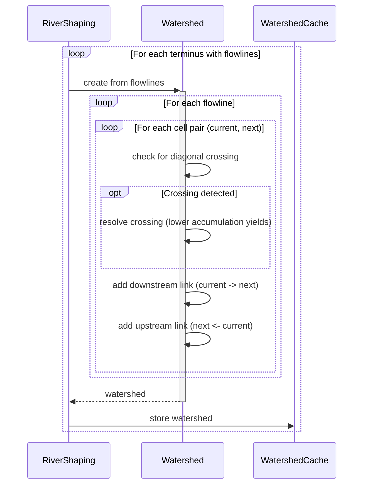
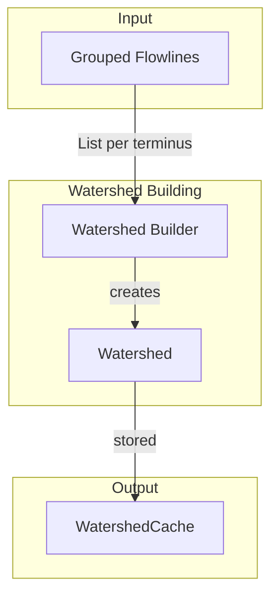

# Watershed Building

Merges flowlines into unified drainage networks. Handles diagonal crossing resolution and builds the upstream/downstream link graph that subsequent steps use for elevation assignment, flow accumulation, and spline building.

## Overview

Watershed Building runs once per terminus cell after flowlines have been grouped. It transforms a collection of independent paths into a single graph structure representing the complete drainage network.

**Scope:** Flowline merging, diagonal crossing resolution, upstream/downstream link construction. Does not validate path lengths (that's [[Watershed Validation]]), compute elevations (that's [[Elevation Assignment]]), or generate geometry (that's [[Spline Building]]).

**Inputs:**

- Flowlines grouped by terminus (from [[Flowline Tracing]])
- Each flowline is an ordered list of CellPos from source to terminus

**Outputs:**

- Watershed with upstream/downstream links, passed to Watershed Validation
- Cells that were removed during crossing resolution are not present in the watershed

## Sequence Diagram



## Structure and Ownership



### WatershedCache

**Purpose:** Stores built watersheds for lookup during downstream phases (Elevation Assignment, Flow Accumulation, Spline Building, Terrain Shaping, Water Placement).

**Implements:** `Cache<Watershed>`

**Cache key:** Terminus cell position (`CellPos.toLong()`)

**Behavior:**

- `get()` — singleton accessor
- `getOrCompute(x, z)` — returns watershed for terminus at (x, z); **throws if not found** (watersheds are not computed on demand)
- `getIfPresent(x, z)` — returns watershed or null
- `put(watershed)` — stores watershed keyed by its terminus
- `clear()` — evicts all watersheds

**Usage pattern:**

```
// During Watershed Building
watershed = buildWatershed(terminus, flowlines)
WatershedCache.get().put(watershed)

// During downstream phases (cell already marked via withWatershed)
cell = CellCache.get().getOrCompute(x, z)
if cell.terminus != null:
    watershed = WatershedCache.get().getOrCompute(cell.terminus.x, cell.terminus.z)
```

### Watershed Builder

**Purpose:** Constructs a Watershed from a collection of flowlines sharing a terminus.

**Owns:**

- Flowline iteration order
- Delegation to Watershed for path addition

**Does:**

- Accepts flowlines grouped by terminus
- Creates new Watershed for the terminus
- Adds each flowline to the watershed in order

**Does not:**

- Trace flowlines (that's upstream)
- Validate path lengths (that's downstream)
- Compute elevations or accumulation (those are downstream)

### Watershed

**Purpose:** Stores the merged river network graph for a single drainage basin.

**Owns:**

- Downstream links (cell to downstream neighbor)
- Upstream links (cell to set of upstream neighbors)
- Diagonal crossing detection and resolution
- Accumulation counting (for crossing resolution)

**Does:**

- Adds flowline paths to the graph
- Detects diagonal crossings when adding edges
- Resolves crossings by comparing accumulation
- Prunes losing paths when crossings occur

**Does not:**

- Validate path lengths
- Assign elevations
- Build splines

## Data Structures

### Watershed Record

```
record Watershed {
    terminus: CellPos                         // final cell (ocean or basin)
    downstream: Map<CellPos, CellPos>         // cell -> downstream neighbor (null for terminus)
    upstream: Map<CellPos, Set<CellPos>>      // cell -> cells that flow into it
}
```

**terminus:** The cell where all paths in this watershed converge. Stored explicitly for identification.

**downstream:** Maps each cell to its single downstream neighbor. Terminus cell maps to null. A cell not in this map is not part of the watershed.

**upstream:** Maps each cell to the set of cells that flow into it. Source cells have empty or absent entries. Used for traversal and accumulation counting.

### Derived Properties

```
allCells(): Set<CellPos>
    return downstream.keySet()

contains(cell: CellPos): boolean
    return downstream.containsKey(cell)

accumulation(cell: CellPos): int
    // Recursive count of all upstream cells
    count = 0
    for tributary in upstream.getOrDefault(cell, empty):
        count += 1 + accumulation(tributary)
    return count
```

## Algorithm

### Building from Flowlines

```
buildWatershed(terminus, flowlines):
    watershed = new Watershed(terminus)

    for flowline in flowlines:
        addFlowline(watershed, flowline)

    return watershed
```

Flowlines are processed in the order received. Earlier flowlines establish the graph; later flowlines merge into existing paths where they overlap.

Note: Cell membership marking happens during [[Watershed Validation]], not here. Building constructs the graph; validation finalizes membership after pruning.

### Adding a Flowline

```
addFlowline(watershed, flowline):
    cells = flowline.cells

    for i in 0 to cells.size - 2:
        current = cells[i]
        next = cells[i + 1]

        // Check for diagonal crossing with existing edges
        crossingTarget = detectDiagonalCrossing(watershed, current, next)

        if crossingTarget != null:
            resolved = resolveCrossing(watershed, current, next, crossingTarget, i)
            if not resolved:
                // Current path was pruned; stop adding this flowline
                return

        // Add edge to graph
        watershed.downstream.put(current, next)
        watershed.upstream.computeIfAbsent(next, k -> new HashSet()).add(current)

    // Mark terminus (last cell has no downstream)
    lastCell = cells.last()
    watershed.downstream.put(lastCell, null)
```

When a diagonal crossing is detected, the path with lower accumulation yields. If the current path loses, we stop adding it and let it merge into the existing path at the crossing point.

### Detecting Diagonal Crossings

Two diagonal paths cross when they share the same two orthogonal neighbors but traverse them in opposite diagonal directions.

```
detectDiagonalCrossing(watershed, current, next):
    dx = next.x - current.x
    dz = next.z - current.z

    // Only diagonal moves can cause crossings
    if dx == 0 or dz == 0:
        return null

    // Check the two orthogonal neighbors
    neighborX = CellPos(current.x + dx, current.z)
    neighborZ = CellPos(current.x, current.z + dz)

    // Does neighborX have a downstream edge to neighborZ?
    if watershed.downstream.get(neighborX) == neighborZ:
        return neighborX

    // Does neighborZ have a downstream edge to neighborX?
    if watershed.downstream.get(neighborZ) == neighborX:
        return neighborZ

    return null
```

**Example:** Current path goes from (0,0) to (1,1) (diagonal SE). If an existing edge goes from (1,0) to (0,1), those paths cross. The algorithm detects this by checking if either orthogonal neighbor has a downstream edge to the other.

```
     (0,0) ─────▶ (1,0)
       │  ╲         │
       │    ╲       │ existing
       ▼      ╲     ▼
     (0,1) ◀───── (1,1)
              current (crossing detected)
```

### Resolving Crossings

When a crossing is detected, the path with lower accumulation yields to the path with higher accumulation.

```
resolveCrossing(watershed, current, next, crossingTarget, currentIndex):
    currentAccumulation = currentIndex  // position in path = proxy for upstream cell count
    existingAccumulation = watershed.accumulation(crossingTarget)
    crossingDownstream = watershed.downstream.get(crossingTarget)

    if currentAccumulation <= existingAccumulation:
        // Current path loses: redirect to existing path's downstream
        watershed.downstream.put(current, crossingDownstream)
        watershed.upstream.computeIfAbsent(crossingDownstream, k -> new HashSet()).add(current)
        return false  // signal to stop adding this flowline

    else:
        // Existing path loses: prune its downstream and redirect
        pruneDownstream(watershed, crossingTarget)
        watershed.downstream.put(crossingTarget, next)
        watershed.upstream.computeIfAbsent(next, k -> new HashSet()).add(crossingTarget)
        return true  // continue adding current flowline
```

**Why accumulation?** A path with more upstream tributaries represents a larger drainage area. Larger drainages have priority—they've "claimed" more territory. This matches natural river behavior where larger rivers absorb smaller streams.

**Using index as proxy:** During flowline addition, we don't yet have the full accumulation count for the current path (since it's still being added). The index in the current path serves as a reasonable proxy—cells near the source have low index/accumulation, cells near the terminus have high index/accumulation.

### Pruning Downstream

When an existing path loses a crossing, its downstream cells are pruned from the watershed. Pruning stops at confluences where other paths join.

```
pruneDownstream(watershed, start):
    current = watershed.downstream.get(start)

    while current != null:
        upstreamSet = watershed.upstream.get(current)

        // Stop at confluences (multiple upstream paths)
        if upstreamSet != null and upstreamSet.size > 1:
            upstreamSet.remove(start)
            break

        // Remove this cell from the watershed
        next = watershed.downstream.get(current)
        watershed.downstream.remove(current)
        watershed.upstream.remove(current)

        start = current
        current = next
```

Pruning preserves the rest of the network. Only the segment from the losing crossing point to the next confluence is removed.

## Configuration

Watershed Building has no configuration parameters. Its behavior is fully determined by the input flowlines and the crossing resolution rules.

## Edge Cases

### Single Flowline

**Cause:** Only one path reaches this terminus.

**Detection:** `flowlines.size == 1`

**Response:** Watershed is built normally. No merging or crossing resolution occurs. The watershed is a simple linear path.

### Identical Flowlines

**Cause:** Two flowlines trace the exact same path.

**Detection:** All cells match during addition.

**Response:** Second flowline adds edges that already exist. `downstream.put` overwrites with same value; `upstream.add` is idempotent for sets. No harm done.

### Flowlines Meeting at Confluence

**Cause:** Two flowlines share a common suffix (both reach the terminus through the same cells).

**Detection:** Adding an edge where `downstream.get(current) == next` already.

**Response:** Edge already exists. Addition is idempotent. The upstream set gains a new entry (the other flowline's previous cell).

### Multiple Crossings Same Flowline

**Cause:** A single flowline crosses multiple existing paths.

**Detection:** `detectDiagonalCrossing` finds a crossing on multiple iterations.

**Response:** Each crossing is resolved independently. If the current flowline wins all crossings, it's added completely. If it loses any crossing, it merges at that point and stops.

### Crossing at Terminus

**Cause:** Diagonal crossing detected where next cell is the terminus.

**Detection:** `next == watershed.terminus`

**Response:** Resolution proceeds normally. The terminus has null downstream, so pruning stops immediately if the existing path loses.

### Empty Flowline

**Cause:** Flowline with zero or one cell.

**Detection:** `flowline.cells.size <= 1`

**Response:** Loop doesn't execute (no pairs). Single-cell flowline marks that cell as terminus (downstream = null). This shouldn't happen in practice—Flowline Tracing validates paths.

### Orphaned Cells After Pruning

**Cause:** Pruning removes cells that had upstream tributaries.

**Detection:** After pruning, some cells in `upstream` map have no corresponding entry in `downstream`.

**Response:** This won't happen. Pruning stops at confluences, so any cell with multiple upstream paths is preserved. Cells that are pruned have at most one upstream path (which was from the losing flowline and is being removed anyway).

## Validation Criteria

### Unit Tests

| Test Case | Setup | Expected Result |
|-----------|-------|-----------------|
| Single flowline | One path: A -> B -> C (terminus) | downstream: {A:B, B:C, C:null}, upstream: {B:[A], C:[B]} |
| Two parallel flowlines | A->B->D, C->B->D | B has two upstream (A, C) |
| Diagonal crossing current loses | Existing: (1,0)->(0,1), Current: (0,0)->(1,1), current has lower accumulation | Current merges at (0,1) |
| Diagonal crossing current wins | Same as above but current has higher accumulation | Existing pruned, current continues |
| Crossing at confluence | Crossing where existing path has multiple upstream | Pruning stops at confluence |
| Multiple flowlines same terminus | Three flowlines to same ocean cell | All merge into single watershed |
| Identical flowlines | Same path added twice | Single watershed, no duplication |

### Diagnostic Commands

| Command | Output | Purpose |
|---------|--------|---------|
| `/rivertale watershed <x> <z>` | Watershed containing cell, shows terminus and cell count | Debug specific watershed |
| `/rivertale vis watershed` | Particles showing upstream/downstream links | Visual verification |
| `/rivertale metrics watershed` | Build times, crossing resolution counts | Performance monitoring |

### Performance Verification

Instrumented via `Store.getTimer()`:

- `Store.getTimer(Watershed.class, "build")` — total watershed construction time
- `Store.getTimer(Watershed.class, "addFlowline")` — time per flowline addition
- `Store.getTimer(Watershed.class, "detectDiagonalCrossing")` — crossing detection time
- `Store.getTimer(Watershed.class, "resolveCrossing")` — crossing resolution time

**What matters:**

- Consistent results across seeds (same inputs produce same watershed)
- No perceptible lag during chunk generation
- Crossing resolution doesn't produce visually broken river networks

## Key Decisions

| Decision | Choice | Rationale |
|----------|--------|-----------|
| Single map per link direction | downstream: Map<Cell, Cell>, upstream: Map<Cell, Set<Cell>> | Clean semantics. Each cell has one downstream, potentially many upstream. |
| Accumulation for crossing resolution | Higher accumulation wins | Larger drainages absorb smaller ones. Matches natural river behavior. |
| Index as accumulation proxy | Current flowline index approximates upstream count | True accumulation unknown during addition. Index is monotonic and correlated. |
| Prune to confluence | Stop pruning when multiple upstream paths exist | Preserve network structure. Don't orphan other tributaries. |
| Process flowlines in order | First flowline establishes, later merge in | Deterministic behavior. Order comes from Flowline Tracing. |
| No explicit terminus storage | Store terminus in Watershed for identification | Simplifies cache keying and lookup. Derivable from graph but useful to store. |
| Idempotent edge addition | Overwrite downstream, add to upstream set | Safe handling of overlapping flowlines. No special cases needed. |
