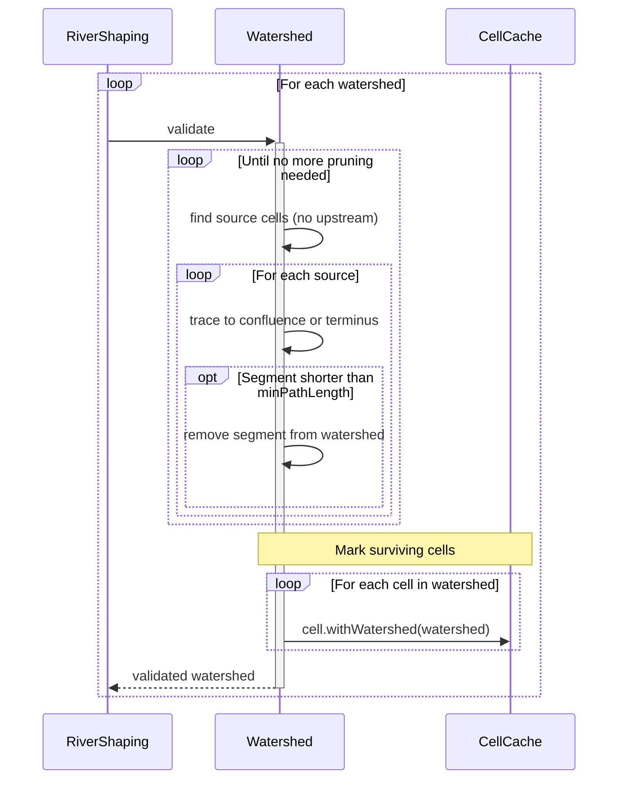
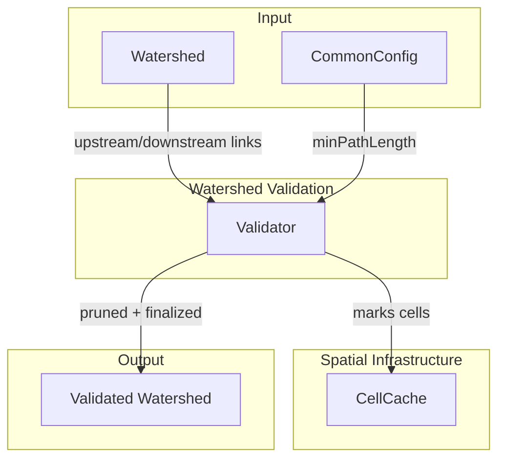

# Watershed Validation

Prunes river segments that are too short to be meaningful. Short tributaries clutter the network without adding navigational value, so they're removed before elevation and accumulation are computed.

## Overview

Watershed Validation runs once per watershed after building, before elevation assignment. It iteratively removes short segments until the watershed stabilizes.

**Scope:** Minimum path length enforcement, iterative pruning. Does not build the watershed (that's [[Watershed Building]]), compute elevations (that's [[Elevation Assignment]]), or determine accumulation (that's [[Flow Accumulation]]).

**Inputs:**

- Watershed with upstream/downstream links (from [[Watershed Building]])
- `minPathLength` configuration parameter

**Outputs:**

- Validated watershed with short segments removed
- Surviving cells marked with watershed membership (via `cell.withWatershed()`)
- Pruned cells are not marked and retain no watershed reference

## Sequence Diagram



## Structure and Ownership



### Validator

**Purpose:** Prunes short segments and finalizes cell membership.

**Owns:**

- Source cell identification
- Segment tracing (source to confluence/terminus)
- Segment length evaluation
- Segment removal
- Iteration until stable
- Cell membership marking

**Does:**

- Finds all source cells (cells with no upstream neighbors)
- Traces each source to its first confluence or terminus
- Removes segments shorter than `minPathLength`
- Repeats until no segments are pruned
- Marks all surviving cells with watershed membership

**Does not:**

- Compute elevations or accumulation
- Build splines

## Algorithm

### Main Validation Loop

```
validate(watershed, minPathLength):
    pruned = true

    while pruned:
        pruned = false
        sources = findSources(watershed)

        for source in sources:
            segment = traceToConfluenceOrTerminus(watershed, source)

            if segment.size < minPathLength:
                pruneSegment(watershed, segment)
                pruned = true

    // Mark surviving cells as members of this watershed
    for cellPos in watershed.allCells():
        cell = CellCache.get().getOrCompute(cellPos)
        CellCache.get().put(cell.withWatershed(watershed))

    return watershed
```

Validation iterates until no segments are pruned, then marks all surviving cells with watershed membership. This handles cascading effects—pruning one segment may create new sources that are themselves too short. Only cells that survive the full pruning process get marked.

### Finding Sources

A source is any cell in the watershed with no upstream neighbors.

```
findSources(watershed):
    sources = new Set<CellPos>()

    for cell in watershed.allCells():
        upstream = watershed.upstream(cell)
        if upstream == null or upstream.isEmpty():
            sources.add(cell)

    return sources
```

After Watershed Building, sources are the original flowline sources. After pruning, new sources may appear where tributaries were removed.

### Tracing to Confluence or Terminus

A segment is the path from a source to either:
- A **confluence** — a cell where multiple upstream paths join
- A **terminus** — a cell with no downstream neighbor

```
traceToConfluenceOrTerminus(watershed, source):
    segment = new List<CellPos>()
    current = source

    while current != null:
        segment.add(current)

        next = watershed.downstream(current)

        // Reached terminus
        if next == null:
            break

        // Reached confluence (next cell has multiple upstream)
        nextUpstream = watershed.upstream(next)
        if nextUpstream != null and nextUpstream.size > 1:
            break

        current = next

    return segment
```

The segment includes the source but excludes the confluence cell (if any). This means the confluence remains in the watershed even if the tributary feeding it is pruned.

### Pruning a Segment

Removes all cells in the segment from the watershed and updates the downstream cell's upstream set.

```
pruneSegment(watershed, segment):
    if segment.isEmpty():
        return

    // Disconnect from downstream
    lastInSegment = segment.last()
    afterSegment = watershed.downstream(lastInSegment)

    if afterSegment != null:
        upstreamSet = watershed.upstream(afterSegment)
        if upstreamSet != null:
            upstreamSet.remove(lastInSegment)

    // Remove all cells in segment
    for cell in segment:
        watershed.downstream.remove(cell)
        watershed.upstream.remove(cell)
```

Pruning preserves the rest of the network. The confluence cell (if any) loses one upstream entry but remains in the watershed with its other tributaries intact.

## Configuration

| Parameter     | Type | Default | Range | Description                                      |
|---------------|------|---------|-------|--------------------------------------------------|
| minPathLength | int  | 5       | 1-32  | Minimum cells from source to confluence/terminus |

**minPathLength:** Segments shorter than this are pruned. Higher values produce cleaner networks with fewer tiny streams. Lower values preserve more detail but may create visual clutter.

A value of 1 effectively disables pruning (single-cell segments are still valid). A value of 32 would aggressively prune all but the longest tributaries.

## Edge Cases

### No Sources After Building

**Cause:** Watershed is a closed loop (theoretically impossible given flowline construction).

**Detection:** `findSources()` returns empty set.

**Response:** Validation completes immediately. No pruning occurs. This shouldn't happen—flowlines always start at SOURCE cells and end at termini.

### All Segments Too Short

**Cause:** Every segment in the watershed is shorter than `minPathLength`.

**Detection:** After pruning, `watershed.allCells()` is empty.

**Response:** Watershed is now empty and should be discarded. Downstream steps should check for empty watersheds and skip them.

### Single Linear Path

**Cause:** Watershed has no confluences—just one path from source to terminus.

**Detection:** Only one source exists, and its segment reaches the terminus.

**Response:** If the entire path is shorter than `minPathLength`, the whole watershed is pruned. Otherwise, the watershed survives intact.

### Cascading Pruning

**Cause:** Pruning segment A creates a new source B that is also too short.

**Detection:** Inner loop prunes a segment, sets `pruned = true`, outer loop repeats.

**Response:** Iteration continues until no more pruning occurs. The algorithm naturally handles arbitrary cascade depth.

**Example:**
```
Before:  A -> B -> C -> D -> E (terminus)
                   ^
                   F -> G

If minPathLength = 3:
- Segment F->G (length 2) is pruned
- C is now a source (no upstream after G removed)
- Wait, C still has B upstream, so C is not a source
- Actually this example doesn't cascade...

Better example:
Before:  A -> B -> C (confluence) -> D -> E (terminus)
              ^
              F

If minPathLength = 3:
- Segment F (length 1) is pruned
- Segment A->B (length 2) is now source-to-confluence
- Wait, A->B->C is length 3, which equals minPathLength
- If minPathLength = 4, then A->B->C (length 3) would also be pruned
- Now only D->E remains, with D as a source
- D->E (length 2) is also pruned
- Watershed is empty
```

### Pruning at Terminus

**Cause:** A short segment connects directly to the terminus.

**Detection:** `traceToConfluenceOrTerminus` reaches terminus before confluence.

**Response:** Segment is pruned normally. The terminus cell is removed if it's part of the segment (when there's only one path to it). If multiple paths reach the terminus, the terminus remains with its other upstream entries intact.

### Confluence Becomes Source

**Cause:** All upstream tributaries of a confluence are pruned.

**Detection:** After pruning, a former confluence has empty upstream set.

**Response:** Next iteration's `findSources()` will find this cell. If its segment to the next confluence/terminus is too short, it will also be pruned.

## Validation Criteria

### Unit Tests

| Test Case | Setup | Expected Result |
|-----------|-------|-----------------|
| No pruning needed | All segments >= minPathLength | Watershed unchanged |
| Single short tributary | Main path + 2-cell tributary, minPathLength=3 | Tributary pruned, main path intact |
| Cascade pruning | Nested short tributaries | All short segments removed |
| Entire watershed too short | 3-cell linear path, minPathLength=5 | Empty watershed |
| Multiple short tributaries | Three 2-cell tributaries, minPathLength=3 | All three pruned |
| Terminus segment short | 2-cell path to terminus, minPathLength=3 | Segment pruned |
| Confluence preserved | Short tributary to confluence with other tributaries | Confluence remains, short tributary gone |
| Surviving cells marked | 5-cell path after validation | All 5 cells have terminus set via withWatershed() |
| Pruned cells not marked | Short tributary pruned | Pruned cells have no terminus reference |

### Diagnostic Commands

| Command | Output | Purpose |
|---------|--------|---------|
| `/rivertale watershed <x> <z>` | Watershed cell count before/after validation | Debug pruning impact |
| `/rivertale metrics validation` | Pruning counts, iteration counts, timing | Performance monitoring |

### Performance Verification

Instrumented via `Store.getTimer()`:

- `Store.getTimer(Watershed.class, "validate")` — total validation time
- `Store.getTimer(Watershed.class, "findSources")` — source identification time
- `Store.getTimer(Watershed.class, "traceToConfluenceOrTerminus")` — segment tracing time
- `Store.getTimer(Watershed.class, "pruneSegment")` — segment removal time

**What matters:**

- Pruning produces cleaner networks without removing meaningful rivers
- Iteration always terminates (no infinite loops)
- No perceptible lag during chunk generation

## Key Decisions

| Decision | Choice | Rationale |
|----------|--------|-----------|
| Iterative until stable | Loop until no pruning occurs | Handles cascading effects naturally. Simple termination condition. |
| Source-to-confluence segments | Don't trace past confluences | Preserves main river structure. Only removes isolated tributaries. |
| Exclude confluence from segment | Segment ends before confluence cell | Confluence may have other tributaries. Don't remove shared infrastructure. |
| Prune after building, before elevation | Clean network before computing properties | Elevation/accumulation would be wasted on pruned cells. |
| Configurable minPathLength | User can tune aggressiveness | Different worlds need different detail levels. |
| Empty watershed valid outcome | Don't error on complete pruning | Rare but possible. Downstream steps skip empty watersheds. |
| Mark cells after pruning, not during building | Validation marks surviving cells | Cells marked during building would include cells that get pruned. Marking after pruning ensures only finalized members are marked. |
